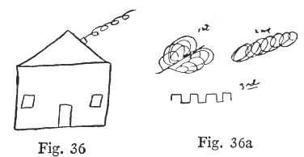
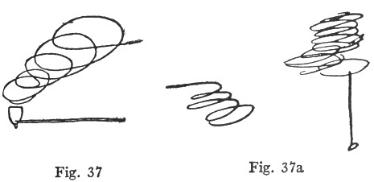
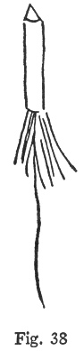
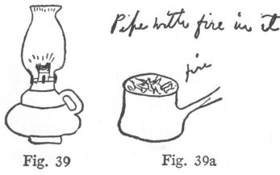
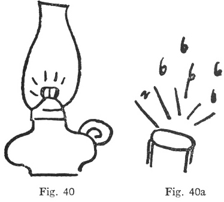
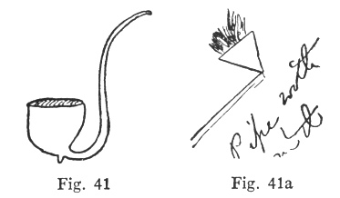
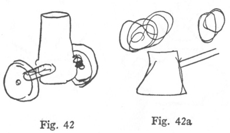
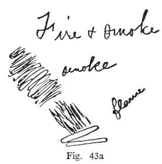
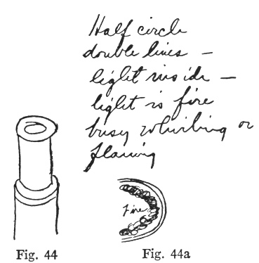
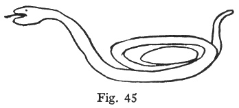

  
[Intangible Textual Heritage](../../index)  [Parapsychology](../index) 
[Index](index)  [Previous](mrad12)  [Next](mrad14) 

------------------------------------------------------------------------

[Buy this Book at
Amazon.com](https://www.amazon.com/exec/obidos/ASIN/B002FGTN5A/internetsacredte)

------------------------------------------------------------------------

  
*Mental Radio*, by Upton Sinclair, \[1930\], at Intangible Textual
Heritage

------------------------------------------------------------------------

p. 95

### XII

These drawing tests afford a basis for
psychoanalysis, and it is interesting to note some of the facts thus
brought up from the childhood of my wife. For example, fires! She was
raised in the "black belt," where there are nine Negroes to one white,
and the former are still close to Africa. When Craig was a girl, a nurse
in the family, having been discharged, set fire to the home while the
adults were away, and the children asleep. Another servant, jealous of
an unfaithful husband, put her two babies into a barrel full of feathers
and burned them alive. Other fires occurred; so now, in her home, Craig
keeps an uneasy eye out for greasy rags, or overheated stoves, or
whatever else her fears suggest. When in these drawing tests there has
been anything indicating fire or smoke, she has "got" it, with only one
or two failures out of more than a dozen cases. Sometimes she "got" the
fire or smoke without the object; sometimes she supplied fire or smoke
to an object which might properly have it—a pipe, for example. The
results are so curious

p. 96

that I assemble them together—a series of fire-alarms, as it were.

You recall the fact that in one of the early drawing tests—those in
which, instead of giving the drawings to my wife, I sat in my study and
concentrated upon them—I drew a lighted cigarette, and thought of the
curls of smoke. Craig filled up her drawing with curves, and wrote: "I
can't draw it, but curls of some sort." At this time the convention that
"curls" stood for smoke had not been established. But now, in the series
drawn by my secretary, appeared a little house with smoking chimney, and
you will see that my wife got the smoke better than the house ([figs.
36, 36a](#img_fig036)):

 

This apparently established in her mind the association of curls with
smoke. So when, in series six, I drew a pipe with smoke-curls, my wife
first drew an ellipse, and then wrote: "Now

p. 97

it begins to spin, round and round, and is attached to a stick." She
then drew ([figs. 37, 37a](#img_fig037)):

 

In series eight I drew a sky-rocket going up. My first impulse had been
to draw a bursting rocket, with a shower of stars, but I realized that
would be difficult, so I drew this instead ([fig. 38](#img_fig038)):

 

p. 98

My wife apparently took my first thought, rather than my drawing.
Anyhow, she made half a dozen sketches of whirligigs and light ([figs.
38a, 38b, 38c](#img_fig038a)):

 

And here in series twenty-two is a burning lamp ([figs. 39,
39a](#img_fig039)):

 

p. 99

And in series thirty-four another, with comment: "flame and sparks"
([figs. 40, 40a](#img_fig040)):

 

I drew another pipe in series twenty-two, with the usual curls of smoke;
and Craig wrote: "Smoke stack." I drew another in series thirty-three
with the result that, five drawings in advance of the correct one, Craig
drew a pipe with smoke. Of course, this may have been a coincidence; but
wait till you see how often such coincidences happen! ([figs. 41,
41a](#img_fig041)):

 

p. 100

In series twenty-one I drew a chimney, and Craig drew a chimney, and
added smoke. In thirty-four I drew an old-fashioned trench-mortar; and
here again she supplied the smoke ([figs. 42, 42a](#img_fig042)):

 

Cannons are especially horrible things to her, as you may note again and
again in her published war-sonnets:

The sharpened steel whips round, the black guns blaze,  
    Waste are the harvests, mute the songs of birds.

So when, in series eleven, I drew the muzzle half of an old-style
cannon, Craig's imagination got to work one drawing ahead of time. She
wrote: "Fire and smoke—smoke—flame," and then drew as follows ([fig.
43a](#img_fig043)):

p. 101

 

The next drawing was the cannon, and I give it, along with the drawing
Craig made to go with it. The comment she wrote was: "Half circle
—double lines—light inside—light is fire busy whirling or flaming"
([figs. 44, 44a](#img_fig044)):

 

p. 102

So much for fires, and things associated with fire. Now consider another
detail about life in the Yazoo delta, brought out in the course of our
psychoanalysis. In the days of Craig's childhood, poisonous snakes were
an ever-present menace, and fear of them had to be taught to children,
and could hardly be taught too early. There is a family story of a
little tot crawling under the house and coming back to report, "I see
nuffin wiv a tail to it!" In the swamps back of Craig's summer home on
the Mississippi Sound I have counted a dozen copperheads and moccasins
in the course of a half hour's walk. Also, her father has some childhood
complex buried in his mind, which causes him to have a spell of nausea
at the sight of a snake. All this, of course, strongly affected the
child's early days, and now it is in her mental depths. So when I drew a
hissing snake, just see the uproar I caused! She made no drawing, but
wrote a little essay. I give my drawing, and her essay following ([fig.
45](#img_fig045)):

 

p. 103

"See something like kitten with tail and saucer of milk. Now it leaps
into action and runs away to outdoors. Turns to fleeing animal outdoors.
Great activity among outdoor creatures. Know it's some outdoor thing,
not indoor object—see trees, and a frightened bird on the wing (turned
sidewise). It's outdoor thing, but none of above seems to be *it*."

In other words, little Mary Craig Kimbrough is back on the plantation,
seeing terror among birds and poultry, and not knowing what causes it!
Study the drawing, and you see that I got the action of the snake, but
didn't get the coils very well, so they might be a "saucer of milk" —and
a sure-enough kitten's tail sticking out from it. Another childhood
horror here! Craig was a fat little thing, and she slipped and plumped
down on her favorite pet kitten, and exploded it.

------------------------------------------------------------------------

[Next: Chapter XIII](mrad14)
