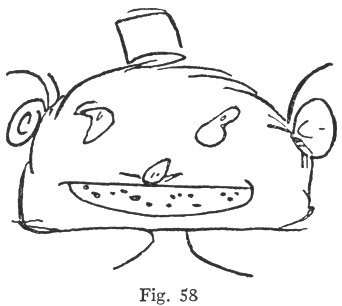
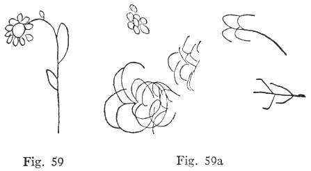
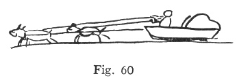
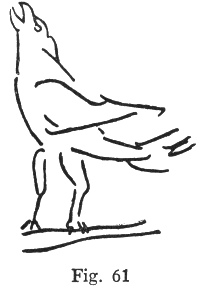
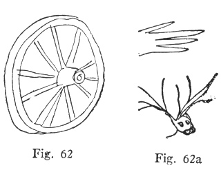

  
[Intangible Textual Heritage](../../index)  [Parapsychology](../index) 
[Index](index)  [Previous](mrad14)  [Next](mrad16) 

------------------------------------------------------------------------

[Buy this Book at
Amazon.com](https://www.amazon.com/exec/obidos/ASIN/B002FGTN5A/internetsacredte)

------------------------------------------------------------------------

  
*Mental Radio*, by Upton Sinclair, \[1930\], at Intangible Textual
Heritage

------------------------------------------------------------------------

p. 113

### XIV

An extraordinary incident occurred in
connection with the fourth series of drawings. While my secretary, E. M.
Hart, was making the drawings, there came into the office his
brother-in-law, R. H. Craig, Jr., a teller of the Security First
National Bank of Long Beach, a person entirely unknown to my wife. He
heard what was going on, and said, "I'll give her some that'll stump
her." He took a pen and drew two pictures, which were duly wrapped in
sheets of green paper and sealed in envelopes, and put with the rest of
the series. I was not at the office, and nothing was said to me about
Mr. Craig having taken part in the matter.

My wife did this series under my eyes; and when she came to the first of
Mr. Craig's two drawings, she wrote, "Some sort of grinning monster,"
and added an elaborate description. Then she opened the envelope, and
found a roller skate with a foot and leg attached. This, naturally, was
called a failure; but seven drawings

p. 114

later in the same series came Mr. Craig's other drawing, which was as
follows ([fig. 58](#img_fig058)):

 

Now read the amazing description which my wife had written, seven
drawings back, when the first of Mr. Craig's drawings had come under her
hand:

"Some sort of grinning monster—see only the face and a vague idea of
deformed neck and shoulders. It is a man, but it looks like a cat's
face, cat eyes and whiskers. Don't know just how I know it is a man—it
is a deformity. Not a cat. See color of skin which is deep, flat pink,
as of a colored picture. The face of the creature is broad and weird.
The flesh of neck, or somewhere, gives effect of rolls or creases."

I asked my secretary what this drawing was meant to be, and he said "a
Happy Hooligan."

p. 115

\[paragraph continues\] My cultural
backwardness is such that I wasn't sure just what a "Happy Hooligan"
might be, but my secretary told me it is a comic supplement figure, and
I then looked it up in the paper, and found that the face of the figure
as printed is a very pale pink, and the little cap on top is a bright
red. I called Mr. Craig on the phone and asked him this question: "If
you were to think of a color in connection with a 'Happy Hooligan,' what
color would it be?" He answered, "Red."

Now I ask you, what chance do you think there is of a person's writing a
description such as the above by guess work? To be sure, my wife had
eight guesses; but do you think that eight million guesses would
suffice? And if we call it telepathy, do we say that my wife's mind has
the power to dip into the mind of a young man whom she has never seen,
nor even heard of? Or shall we say that his mind affected his
brother-in-law's, the brother-in-law's affected mine, and mine affected
my wife's? Or, if we decide to call it clairvoyance, or psychometry,
then are we going to say there is some kind of vibration or emanation
from Mr. Craig's drawing, so powerful that when one of his drawings is
handed to my wife, she gets what is in another

p. 116

drawing which has been done at the same time?

Whatever may be the explanation, here is the fact: Again and again we
find Craig getting, not the drawing she is holding under her hand, but
the next one, which she has not yet touched. When she picks up the first
drawing, she will say, or write: "There is a little man in this series";
or: "There is a snow scene with sled"; or: "An elephant, also a
rooster." I am going to show you these particular cases; but first a
word as to how I have counted such "anticipations."

Manifestly, if I grant the right to more than one guess, I am increasing
the chances of guesswork, and correspondingly reducing the significance
of the totals. What I have done is this: where such cases have occurred,
I have called them total failures, except in a few cases, where the
description was so detailed and exact as to be overwhelming—as in the
case of this "Happy Hooligan." Even so, I have not called it a complete
success, only a partial success. In order to be classified as a complete
success, my wife's drawing must have been made for the particular
drawing of mine which she had in her hand at that time; and throughout
this account, the reader is to understand that every

p. 117

drawing presented was made in connection with the particular drawing
printed alongside it—except in cases where I expressly state otherwise.

Now for a few of the "anticipations." In the course of series six, drawn
by me on Feb. 8, 1929, drawing number two was a daisy, and Craig got the
elements of it, as you see ([figs. 59. 59a](#img_fig059)):

 

Her mind then went ahead, and she wrote, "May be snow scene on hill and
sled." The next drawing was an axe, which I give later ([fig.
145](mrad20.htm#img_fig145)); she got the elements of this very well,
and then added, on the back: "I get a feeling again of a snow scene to
come in this series—a sled in the snow." That was number three; and when
number five came Craig made this annotation: "Opened it by mistake,
without concentrating.

p. 118

\[paragraph continues\] It's my expected
sled and snow scene." Here is the drawing ([fig. 60](#img_fig060)):

 

Series number eight, on Feb. 10, brought even stranger results. This is
the series in which the laced-up football was turned into a calf wearing
a belly-band ([figs. 15, 15a](mrad07.htm#img_fig015)). But even while I
was engaged in making the drawings, sitting in my study apart, and with
the door closed, Craig's busy magic, whatever it is, was bringing her
messages. She called out: "I see a rooster!" I had actually drawn a
rooster; but of course I made no reply to her words. She at once drew a
rooster and several other things, and after I had brought my drawings
into the room, but before she had started co work with them, she wrote
as follows:

"While Upton was making these drawings I sat before the fire thinking
how to dry felt slippers which I had washed. I had my mind on them. Hung
them on grating to see if they would hang there without burning.
Suddenly saw rooster crowing. Then thought, 'Can U be drawing rooster?'
Decided to make note of this.

p. 119

\[paragraph continues\] Did so. Then
saw"—and she draws a circle with eight radiating lines, like spokes of a
wheel.

In due course came drawing number eight, and before looking at it, Craig
wrote: "Rooster." Then she added, "But no—it looks like a picture of
coffee-pot—see spout and handle." This is hard on me as an artist, but I
give the drawing and let you judge for yourself ([fig.
61](#img_fig061)):

 

What about the circle and the radiating spokes? That was, apparently, a
fore-glimpse of drawing number five. I give you that, together with what
Craig drew for that particular test when it came. Her effort suggests
the kind of humor with which the newspaper artists used to delight my
childhood; a series of drawings in which one thing turns into some other
and quite unexpected thing by gradual changes. You will

p. 120

see here how the hub of a wagon-wheel may turn into the muzzle of a
deer! ([figs. 62, 62a](#img_fig062)):

 

------------------------------------------------------------------------

[Next: Chapter XV](mrad16)
