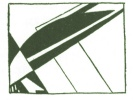

  
[Intangible Textual Heritage](../../index)  [Parapsychology](../index.md) 
[Index](index)  [Previous](mrad15)  [Next](mrad17.md) 

------------------------------------------------------------------------

[Buy this Book at
Amazon.com](https://www.amazon.com/exec/obidos/ASIN/B002FGTN5A/internetsacredte.md)

------------------------------------------------------------------------

  
*Mental Radio*, by Upton Sinclair, \[1930\], at Intangible Textual
Heritage

------------------------------------------------------------------------

p. 121

### XV

What are the principles upon which I have
classified the drawings, as between successes, partial successes, and
failures? I will use this series, number eight, to illustrate. There are
eight drawings, and I have set them down as one success, six partial
successes, one failure. The success is the rooster ([fig.
61](mrad15.htm#img_fig061).md), called "a rooster," even though it "looks
like a coffee pot." The partial successes are, first, an electric light
bulb, very crudely imitated as to shape in three drawings. Perhaps this
was hardly good enough to be counted; it was a border-line case, and
probably the poorest that I admitted to the classification of "partial
successes" ([fig. 63a](#img_fig063).md).

Second, the ascending sky-rocket, already printed as [fig.
38](mrad13.htm#img_fig038.md), giving rise to six different drawings of
whirligigs and light. Third, the following drawing, for which Craig
wrote: "See spider, or some sort of legged pest. If this is

p. 122

 

not a spider, there is a spider in the lot somewhere! This I know!"
([fig. 64](#img_fig064).md):

 

The fourth partial success was a drawn bow, with arrow fitted, ready to
be launched. Craig

p. 123

wrote as follows: "Picked this up and saw inside as it dropped on
floor—so did not try it. Suddenly recall I have already 'seen' it
earlier." Before starting the tests, along with her written mention of
"a rooster," she had drawn a bow and crude arrow, and the resemblance is
so exact that it seems to me entitled to be called a partial success
([figs. 65, 65a](#img_fig065).md):

 

Fifth, the wagon hub ([fig. 60](mrad15.htm#img_fig060).md), which became
the deer's muzzle. And finally the laced-up football ([fig.
15](mrad07.htm#img_fig015).md) which became a belly-band on a calf ([fig.
15a](mrad07.htm#img_fig015).md).

As for the failure in this series, it is a cake of soap, which was
called "whirls." There are a couple of other drawings in the series,
marked: "Too tired to see it," and "Tired now and excited and keep
seeing old things"—meaning, of course, the preceding drawings.

p. 124

I tried to avoid drawing the same object more than once, but now and
then I slipped up. In series eleven I drew another rooster, and there
followed, not one "anticipation," but several. Drawing number one was a
tooth; Craig wrote: "First see rooster. Then elephant." Drawing number
two was an elephant; and Craig wrote: "Elephant came again. I try to
suppress it, and see lines, and a spike sticking some way into
something." She drew it, and it seems clear that the "spike" is the
elephant's tusk, and the head of the "spike" is the elephant's eye
([figs. 66, 66a](#img_fig066).md):

 

Next, number three, was the rooster. But Craig had set "rooster" down in
her mind as a blunder, so now she wrote: "I don't know what, see a
bunch, or tuft clearly. Also a crooked arm

p. 125

on a body. But don't feel that I'm right." Here are the drawings, and
you can see that she was somewhat right ([figs. 67, 67a](#img_fig067).md):

 

This series eleven, containing fourteen drawings, is marked: "Did this
lot rapidly, without holding (mind) blank. The chicken and elephant came
*at once*, on a very earnest request to my mind to 'come across.'" I
have classified in this series two successes, five partial, and five
failures: throwing out numbers twelve and fourteen, because Craig wrote:
"Nothing except all the preceding ones come—too many at once—all past
ones crowding in memory"; and again, "Nothing but everything in the
preceding. Too many of them in my mind."

The anticipations run all through this series in a quite fascinating
way. Thus, for number

p. 126

four Craig wrote: "Flower. This is a very vivid one. Green spine—leaves
like century plant." She drew figure [68a](#img_fig068.md):

 

And then again, for drawing number seven, she did more flowers, with
this comment: "This is a *real* flower, I've seen it before. It's vivid
and returns. Century plant? Now it turns into candle stick. See a
candle" ([fig. 69a](#img_fig069).md).

All this was wrong—so far. Number four was a table, and number seven was
the rear half of a cow. But now we come to number eleven, the plant
known as a "cat-tail," which seems to resemble rather surprisingly the
lower of the two

p. 127

 

drawings in figure [69a](#img_fig069.md). My drawing is given as figure
[70](#img_fig070.md), and the one Craig made for it is given as
[70a](#img_fig070.md).

 

Comment on the above read: "Very pointed. Am not able to see what. Dog's
head?"

Drawing five was a large fish-hook; and this inspired the experimenter
to a discourse, as follows:

p. 128

\[paragraph continues\] "Dog wagging—see
tail in air busy wagging—jolly doggie—tail curled in air." And then:
"Now I see a cow. I fear the elephant and chicken got me too sure of
animals. But I see these."

Now, a big fish-hook looks not unlike a "tail curled in air." But when
we come to number seven, we discover what Craig was apparently
anticipating. It is the drawing of what I have referred to as "the rear
half of a cow." It is badly done, with a cow's hoof, but I forgot what a
cow's tail is like, and this tail that I drew would fit much better on a
"jolly doggy," you must admit ([fig. 71](#img_fig071).md):

 

Drawing number six was a sun, as children draw it, a circle with rays
going out all round. Craig wrote: "Setting sun and bird in sky. Big

p. 129

bird on wing—seagull or wild goose." This I called a partial success.
Number nine was the muzzle end of an old-style cannon, already reported
in figs. [46, 46a](mrad14.htm#img_fig046.md).

I conclude the study of this particular series with drawing thirteen, to
which was added the comment: "Think of a saucer, then of a cup. It's
something in the kitchen. Too tired to see" ([figs. 72,
72a](#img_fig072).md):

 

In series fourteen, drawing three, Craig wrote: "Man running, can't draw
it." She drew as follows ([fig. 73a](#img_fig073a).md):

 

p. 130

Next came my drawing four, as follows ([fig. 73](#img_fig073).md):

 

In series thirty-five I first drew a fire hydrant, and Craig wrote,
"Peafowl," and added the following drawing, which certainly constitutes
a partial success ([figs. 74, 74a](#img_fig074).md):

 

My next drawing was the peafowl, as you see. For this Craig wrote:
"Peafowl again," and apparently

p. 131

tried to draw the peafowl's neck, and a lot of those spots which I had
forgotten are an appurtenance of peafowls ([figs. 75,
75a](#img_fig075).md):

 

In series twenty-nine I drew an elevated railway. If you turn it upside
down, as I have done here, it looks like water and smoke-stacks. Anyhow,
Craig drew a steamboat ([figs. 76, 76a](#img_fig076).md):

 

p. 132

And then came my next drawing—a steamboat! Craig wrote: "Smoke again,"
and drew the smoke and the stack ([figs. 77, 77](#img_fig077).md):

 

She added two more drawings, which appear to be the wheel of the boat in
the water, and the smoke ([figs. 77b, 77c](#img_fig077b).md):

 

p. 133

In series thirty I drew a fish-hook with line, and you see it turned
into a flower ([figs. 78, 78a](#img_fig078).md);

 

Then came an obelisk, and Craig got it, but with novel effects, thus
([figs. 79, 79a](#img_fig079).md):

 

Now why should an obelisk go on a jag, and have little circles at its
base? The answer appears to be: it inherited the curves from the
previous fish-hook, and the little circles from the next drawing. You
will see that, having used

p. 134

up her supply of little circles, Craig did not get the next drawing so
well ([figs. 80, 80a](#img_fig080).md):

 

In series twenty-two I first drew a bed, and Craig made two attempts to
draw a potted plant. My second drawing was a maltese cross, and Craig
turned it into a basket ([figs. 81, 81a](#img_fig081).md):

 

But she could not give up her plant. She added: "There is a flower
basket in this lot, or potted plant." The next drawing was a
fleur-de-lys,

p. 135

which looks not unlike a potted plant or hanging basket ([fig.
82](#img_fig082).md):

 

In drawing four she got the elements of a door-knob pretty well, and
added: "See head of bird, too—eagle beak." Drawing seven was a crane,
with beak open.

------------------------------------------------------------------------

[Next: Chapter XVI](mrad17.md)
