  
[Intangible Textual Heritage](../../index)  [Parapsychology](../index) 
[Index](index)  [Previous](mrad16)  [Next](mrad18) 

------------------------------------------------------------------------

[Buy this Book at
Amazon.com](https://www.amazon.com/exec/obidos/ASIN/B002FGTN5A/internetsacredte)

------------------------------------------------------------------------

  
*Mental Radio*, by Upton Sinclair, \[1930\], at Intangible Textual
Heritage

------------------------------------------------------------------------

p. 136

### XVI

I could go through all thirty-five of the
series, listing such "anticipations" as this: but I have given enough to
show how the thing goes. Such occurrences make it hard for Craig
because, when she has once drawn a certain object, she naturally resists
the impulse to draw it again, thinking it is nothing but a memory. Thus,
in series thirteen, my first drawing was a savage woman carrying a
bundle on her head, and Craig drew the profile of a head with a long
nose. My next drawing was the profile of a head, with a very conspicuous
nose, and Craig wrote: "Face again, but (I) inhibit this. Then come two
hands, and below"—and she draws what might be a cross section of a
skull, side view.

Yet sometimes she overcomes this handicap triumphantly. Series twelve is
marked: "Hastily done," and she adds the general comment: "Several times
saw bristles on things of different shapes, some flowers, some bristled
brushes. Saw flower, also more than once"—and then she

p. 137

appends a drawing of a four-leaf clover. As it happened, this series
contained a three-leaf clover, and it contained another flower, and also
a cactus-plant—more of one kind of thing than it was fair to put into
one set of drawings. Nevertheless, Craig scored one of her successes
with the cactus, setting it down as "fuzzy flower" ([figs. 83,
83a](#img_fig083)):

 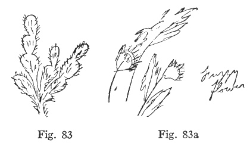

Nor was she afraid to repeat herself when she came to another "fuzzy
flower" in this series ([figs. 84, 84a](#img_fig084)):

 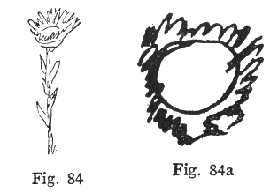

p. 138

Frequently she will make a good drawing of an object, but name it badly.
In that same series twelve I drew a hoe, and she got the shape of it,
but wrote: "May be scissors, may be spectacles with long stem ears"
([figs. 85, 85a](#img_fig085)):

 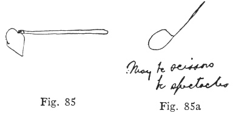

Also in the same series these reindeer horns, which she calls "holly
leaves." It is psychologically interesting to note that reindeer and
holly trees were both associated with Christmas in Craig's childhood
([figs. 86, 86a](#img_fig086)):

 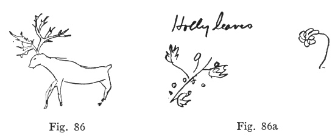

And in series eighteen, this fat baby bird of mine is hardly
recognizable when called "flounder" ([figs. 87, 87a](#img_fig087)):

p. 139

 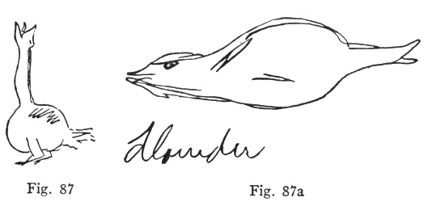

This very dim stalk of celery, drawn by me, I must admit looks more like
a fish-fork ([figs. 88, 88a](#img_fig088)):

 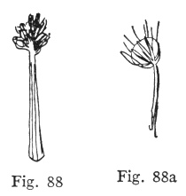

Craig's verbal description of the above reads: "Stone set in platinum;
may be diamond, as points seem to be white light—at least it shines, not
red shine of fire but white shine." How does a stalk of celery, which
looks like a fish-fork, come to have a diamond set in it? You may
understand the reason when you hear that three drawings later in the
same series is a diamond

p. 140

set in a stick. Just why it occurred to me to set a diamond thus I
cannot now recall, but the drawing is plain, and it led to a bit of fun.
I had been to lunch with Charlie Chaplin that day, and had come home and
told my wife about it; so here my sparkling diamond undergoes a
transfiguration! "Chaplin," writes my wife, and adds: "I don't see why
he has on a halo" ([figs. 89, 89](#img_fig089)):

 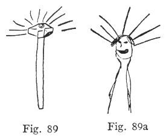

From the point of view of bad guessing, the most conspicuous series is
number twenty. In this I have recorded four successes, seven partial,
and one failure; yet there is hardly an object that is correctly named.
Here are the three which I call successes; there may be dispute about
any one of them, but it seems to me the essential elements have been
got. You may be surprised at a necktie which "began to smoke" —but not
when you see that the next drawing is

p. 141

a burning match! ([Figs. 90, 90a](#img_fig090); [91, 91a](#img_fig091);
[92, 92a](#img_fig092)):

 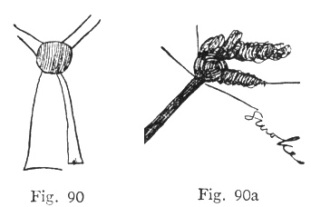

 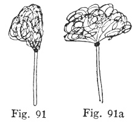

 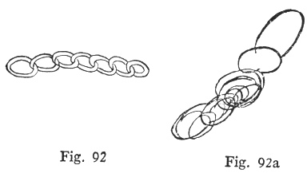

As for the partial successes, I give six of them by way of samples. For
the first, Craig's comment was: "The body is vague, but see there is

p. 142

a body." You will agree that my mountain landscape looks oddly like a
body ([figs. 93, 93a](#img_fig093)):

 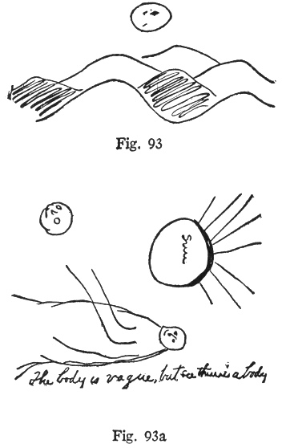

And the pedals of this harp make a charming pair of lady's feet ([figs,
94, 94a](#img_fig094)):

 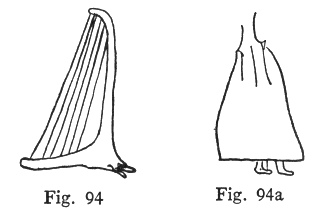

p. 143

[This balloon](#img_fig095) is described in my wife's comment as:
"Shines in sunlight, must be metal, a scythe hanging among vines or
strings."

 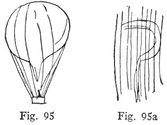

This, which is called "front foot and leg of dog, though I don't see the
dog," is really drawn more like the spigot of my drawing ([figs. 96,
96a](#img_fig096)):

 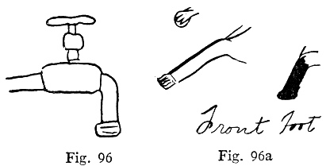

A butterfly's wings are "got" remarkably well ([figs. 97,
97a](#img_fig097)). And the trade-marks on my little box are called
"tiny stars. or sparks" ([figs. 98, 98a](#img_fig098)):

p. 144

 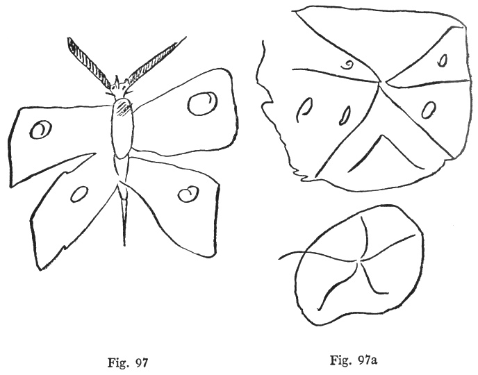

 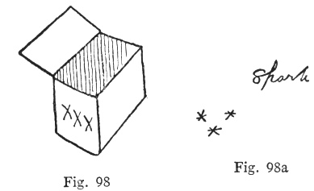

------------------------------------------------------------------------

[Next: Chapter XVII](mrad18)
