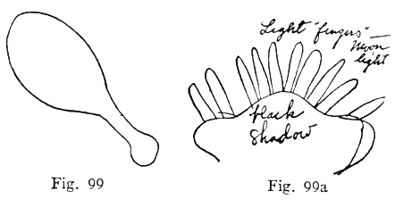

  
[Intangible Textual Heritage](../../index)  [Parapsychology](../index) 
[Index](index)  [Previous](mrad17)  [Next](mrad19) 

------------------------------------------------------------------------

[Buy this Book at
Amazon.com](https://www.amazon.com/exec/obidos/ASIN/B002FGTN5A/internetsacredte)

------------------------------------------------------------------------

  
*Mental Radio*, by Upton Sinclair, \[1930\], at Intangible Textual
Heritage

------------------------------------------------------------------------

p. 145

### XVII

I have referred to the fact that my
wife's drawings sometimes contain things which are not in mine, but
which were in my mind while I was making them, or while she was
"concentrating." One of the most curious of such cases came in series
twenty-eight, which was after we had given up, as too great a nuisance,
all precautions in the way of sealing the drawings in envelopes. I made
eight drawings, and laid them face down on my wife's table, and then
went out and took a walk while she did them. So, of course, it was easy
for her to do what she pleased—and maybe she "peeked," the skeptic will
say. But as it happens, she didn't get a single one right! Instead of
reproducing my drawings, what she did was to reproduce my thoughts while
I was walking up and down on the ocean front. It seems to me that in so
doing, she provided a perfect answer to those who may attribute these
results to any form of deception, whether conscious or unconscious.

There was a moon behind a bank of dark

p. 146

clouds, and it produced an unusual effect—a well-defined white cross in
the sky. I watched it for nearly half an hour, and my continued thought
was: "If this were an age of superstition, that would be a portent, and
we should hear about it in history." It was so strange that I finally
went home and called my wife out onto the street. I did not tell her
why. I wanted to see her surprise, so I purposely gave no hint. I said:
"Come out! Please come!" Finally she came, and her comment was: "I just
drew that!" We went back into the house, and she handed me a drawing. I
give it alongside my drawing of an Indian club, which Craig had held
while doing hers. You may see exactly how much of her impulse came from
that source ([figs. 99, 99a](#img_fig099)):

 

The "comment" reads: "Light 'fingers'—moonlight." Also: "black shadow."

Let me add also that in the eight drawings I handed to Craig there was
neither moon, cloud,

p. 147

cross, nor light. Two of these eight my wife failed to mark, and so I
cannot identify them as belonging to this series; but we examined all
eight at the time, and made sure of this point. Those which I now have
are a flag, a bearded man, a chiffonier, a cannon, a dirt-scraper, and
the Indian club, given above.

You will ask, perhaps, did Craig look out of the window. As it happened,
this sky effect was invisible from any window, and I have her word that
she had not moved from her couch. I should add that she is nervous, and
keeps the curtains tightly drawn at night, and never goes out at night
unless it is to be driven somewhere. It was early in March, with a cold
wind off the sea, and I had to labor to persuade her to put a wrap over
her dressing gown and step out into the middle of the street to look up
at the sky.

------------------------------------------------------------------------

[Next: Chapter XVIII](mrad19)
