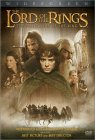

[Sacred-Texts](../index)   [Sources of Lord of the Rings](index)  [Sagas
and Legends](../neu/index)  
[Buy Sacred-Texts CD-ROM](../index)  [Buy Books: Tolkien](../books/ring)

------------------------------------------------------------------------

# Lord of the Rings Links

  
[  
Buy the Fellowship of the Ring on
DVD](https://www.amazon.com/exec/obidos/ASIN/B00003CWT6/internetsacredte)  
[Buy The Two Towers on
DVD](https://www.amazon.com/exec/obidos/ASIN/B00009TB5G/internetsacredte)

[The Official Lord of the Rings Movie
Site](https://www.lordoftherings.net/)

[Sources of the Lord of the Rings](index) Complete eBooks of the
Kalevala, Icelandic Sagas, Beowulf and many other sources of the Lord of
the Rings! from [ith.oarc.science](https://ith.oarc.science/index)

[Lord of the Rings Merchandise Shop](https://www.lordoftheringsshop.com)
All Lord of the Rings & Tolkien related products and merchandise: Books,
CDs, Movies, Posters, Toys, Figures, Statues, Standups, Swords, Knives,
Collectibles, Cards, Calendars and many more. Including Product Specials
and Reviews.

[Lord of the Rings Fanatics Plaza](https://www.lotrplaza.com) Tolkien
Forum & Fan Gatherings Description: Lord of the Rings Fanatics Plaza: a
Gathering Place for all Fans of The Lord of the Rings and Tolkien. Join
the Forums, enter the Halls of Knowledge, earn Fanatic Points and start
your Fanatic Career.
