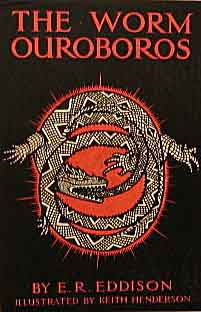

  
[Intangible Textual Heritage](../../index)  [Tolkien](../index.md) 

------------------------------------------------------------------------

[Buy this Book at
Amazon.com](https://www.amazon.com/exec/obidos/ASIN/B001VKXH3K/internetsacredte.md)

------------------------------------------------------------------------

<table width="75%">
<colgroup>
<col style="width: 50%" />
<col style="width: 50%" />
</colgroup>
<tbody>
<tr class="odd">
<td width="50%" data-valign="TOP"></td>
<td width="50%" data-valign="CENTER"><h1 id="the-worm-ouroboros" data-align="CENTER">THE WORM OUROBOROS</h1>
<h2 id="by-e.-r.-eddison" data-align="CENTER">by E. R. Eddison</h2>
<h4 id="section" data-align="CENTER">[1922]</h4></td>
</tr>
</tbody>
</table>

------------------------------------------------------------------------

[Contents](#contents)    [Start Reading](two00.md)    [Page
Index](pageidx)    [Text \[Zipped\]](two.txt.gz.md)

------------------------------------------------------------------------

|                                                                                                                           |
|---------------------------------------------------------------------------------------------------------------------------|
|  |

*The Worm Ourorobos* is second only to the *Lord of the Rings* in the
pantheon of 20th century English fantasy. E.R. Eddison, who moved in the
same literary circles as Tolkien, was praised by Tolkien as "The
greatest and most convincing writer of 'invented worlds' that I have
read".[\*](#fn1.md)

*The Worm Ourorbos* was originally published in a very limited and now
very rare edition in 1922 (a used first edition recently listed for
$3,750). Eddison wrote three sequels set in roughly the same universe,
but none of them have the sustained pacing and invention of *Ouroboros*.

Before diving in, there are a few things to be aware of. The rich
language Eddison uses is based on Tudor and Jacobean English, with some
modern anachronisms; it may take some getting used to, and occasionally
a trip to the unabridged *Oxford English Dictionary*. The narrator, one
Lessingham, who appears in a very brief framing sequence, disappears a
few dozen pages in. The book is set on Mercury; however, keep in mind
this is not science fiction, so this is not *literally* the planet
Mercury. Eddison on several occasions in the body of the book calls the
world 'Middle Earth', and the setting is recognizably the *Midgard* of
the Norse myths and sagas, although for some unexplained reason the
denizens worship the Greek pantheon. The cast of characters, like
Tolkien, are principally masculine, albeit with a couple of standout
female leads. And lastly the various nationalities (Demons, Witches,
Pixies, Imps, etc.) are not really separate species as in Tolkien; they
are all essentially humans.

Once you get past these details, *The Worm Ouroboros* is a thoroughly
enjoyable book which will satisfy anyone who has finished the Lord of
the Rings and wants a new immersive universe. The only thing one could
wish for would be some [maps](maps.md). . . .

--J. Lelievre

[\*](#fr1.md) *Letters of Tokien, p. 258*. To be
accurate, Tolkien also pointed out that his work was not derivative from
Eddison, had some pointed criticism of the ad-hoc nature of the the
languages and geography of the *Worm Ouroboros*, and disliked most of
the characters except for Lord Gro.

------------------------------------------------------------------------

 [Title Page](two00.md)  
[Dedication](two01.md)  
[Thomas the Rhymer](two02.md)  
[Contents](two03.md)  
[Illustrations](two04.md)  
[Introduction](two05.md)  
[The Induction](two06.md)  
[I. The Castle of Lord Juss](two07.md)  
[II. The Wrastling for Demonland](two08.md)  
[III. The Red Foliot](two09.md)  
[IV. Conjuring in the Iron Tower](two10.md)  
[V. King Gorice's Sending](two11.md)  
[VI. The Claws of Witchland](two12.md)  
[VII. Guests of the King in Carcë](two13.md)  
[VIII. The First Expedition to Impland](two14.md)  
[IX. Salapanta Hills](two15.md)  
[X. The Marchlands of the Moruna](two16.md)  
[XI. The Burg of Eshgrar Ogo](two17.md)  
[XII. Koshtra Pivrarcha](two18.md)  
[XIII. Koshtra Belorn](two19.md)  
[XIV. The Lake of Ravary](two20.md)  
[XV. Queen Prezmyra](two21.md)  
[XVI. The Lady Sriva's Embassage](two22.md)  
[XVII. The King Flies His Haggard](two23.md)  
[XVIII. The Murther of Gallandus by Corsus](two24.md)  
[XIX. Thremnir's Heugh](two25.md)  
[XX. King Corinius](two26.md)  
[XXI. The Parley Before Krothering](two27.md)  
[XXII. Aurwath and the Switchwater](two28.md)  
[XXIII. The Weird Begun of Ishnain Nemartra](two29.md)  
[XXIV. A King in Krothering](two30.md)  
[XXV. Lord Gro and the Lady Mevrian](two31.md)  
[XXVI. The Battle of Krothering Side](two32.md)  
[XXVII. The Second Expedition to Impland](two33.md)  
[XXVIII. Zora Rach Nam Psarrion](two34.md)  
[XXIX. The Fleet at Muelva](two35.md)  
[XXX. Tidings of Melikaphkhaz](two36.md)  
[XXXI. The Demons Before Carcë](two37.md)  
[XXXII. The Latter End of All the Lords of Witchland](two38.md)  
[XXXIII. Queen Sophonisba in Galing](two39.md)  
[Argument: with Dates](two40.md)  
[Bibliographical Note on the Verses](two41.md)  
