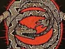
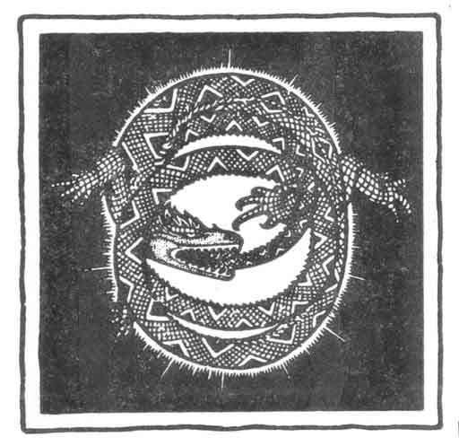

  
[Intangible Textual Heritage](../../index)  [Tolkien](../index.md) 
[Index](index)  [Next](two01.md) 

------------------------------------------------------------------------

[Buy this Book at
Amazon.com](https://www.amazon.com/exec/obidos/ASIN/B001VKXH3K/internetsacredte.md)

------------------------------------------------------------------------

  
*The Worm Ouroboros*, by E. R. Eddison, \[1922\], at Intangible Textual
Heritage

------------------------------------------------------------------------

# THE WORM OUROBOROS

 

## by E. R. Eddison

#### Illustrations by Keith Henderson

#### London; Jonathan Cope

#### \[1922\]

###### Scanned at Intangible Textual Heritage, November 2003. J. Lelievre, redactor. The text is in the public domain in the United States because it was first published prior to 1923. These files may be used for any non-commercial purpose, provided this notice of attribution is left intact.

------------------------------------------------------------------------

[Next: Dedication](two01.md)
