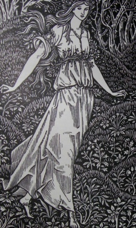

  
[Intangible Textual Heritage](../../index)  [Tolkien](../index) 
[Morris](../../neu/morris/index) 

------------------------------------------------------------------------

<table width="75%">
<colgroup>
<col style="width: 50%" />
<col style="width: 50%" />
</colgroup>
<tbody>
<tr class="odd">
<td width="50%" data-valign="TOP"></td>
<td width="50%" data-valign="CENTER"><h1 id="the-wood-beyond-the-world" data-align="CENTER">The Wood Beyond the World</h1>
<h2 id="by-william-morris" data-align="CENTER">by William Morris</h2>
<h4 id="hammersmith-kelmscott-press" data-align="CENTER">Hammersmith, Kelmscott Press</h4>
<h4 id="section" data-align="CENTER">[1894]</h4></td>
</tr>
</tbody>
</table>

------------------------------------------------------------------------

[Contents](#contents)    [Start Reading](wbw00)    [Text
\[Zipped\]](wbw.txt.gz)

------------------------------------------------------------------------

 [Title Page](wbw00)  
[Chapter I: Of Golden Walter And His Father](wbw01)  
[Chapter II: Golden Walter Takes Ship To Sail The Seas](wbw02)  
[Chapter III: Walter Heareth Tidings Of The Death Of His
Father](wbw03)  
[Chapter IV: Storm Befalls The Bartholomew, And She Is Driven Off Her
Course](wbw04)  
[Chapter V: Now They Come To A New Land](wbw05)  
[Chapter VI: The Old Man Tells Walter Of Himself. Walter Sees A Shard In
The Cliff-wall](wbw06)  
[Chapter VII: Walter Comes To The Shard In The Rock-wall](wbw07)  
[Chapter VIII: Walter Wends The Waste](wbw08)  
[Chapter IX: Walter Happeneth On The First Of Those Three
Creatures](wbw09)  
[Chapter X: Walter Happeneth On Another Creature In The Strange
Land](wbw10)  
[Chapter XI: Walter Happeneth On The Mistress](wbw11)  
[Chapter XII: The Wearing Of Four Days In The Wood Beyond The
World](wbw12)  
[Chapter XIII: Now Is The Hunt Up](wbw13)  
[Chapter XIV: The Hunting Of The Hart](wbw14)  
[Chapter XV: The Slaying Of The Quarry](wbw15)  
[Chapter XVI: Of The King's Son And The Maid](wbw16)  
[Chapter XVII: Of The House And The Pleasance In The Wood](wbw17)  
[Chapter XVIII: The Maid Gives Walter Tryst](wbw18)  
[Chapter XIX: Walter Goes To Fetch Home The Lion's Hide](wbw19)  
[Chapter XX: Walter Is Bidden To Another Tryst](wbw20)  
[Chapter XXI: Walter And The Maid Flee From The Golden House](wbw21)  
[Chapter XXII: Of The Dwarf And The Pardon](wbw22)  
[Chapter XXIII: Of The Peaceful Ending Of That Wild Day](wbw23)  
[Chapter XXIV: The Maid Tells Of What Had Befallen Her](wbw24)  
[Chapter XXV: Of The Triumphant Summer Array Of The Maid](wbw25)  
[Chapter XXVI: They Come To The Folk Of The Bears](wbw26)  
[Chapter XXVII: Morning Amongst The Bears](wbw27)  
[Chapter XXVIII: Of The New God Of The Bears](wbw28)  
[Chapter XXIX: Walter Strays In The Pass And Is Sundered From The
Maid](wbw29)  
[Chapter XXX: Now They Meet Again](wbw30)  
[Chapter XXXI: They Come Upon New Folk](wbw31)  
[Chapter XXXII: Of The New King Of The City And Land Of
Stark-wall](wbw32)  
[Chapter XXXIII: Concerning The Fashion Of King-making In
Stark-wall](wbw33)  
[Chapter XXXIV: Now Cometh The Maid To The King](wbw34)  
[Chapter XXXV: Of The King Of Stark-wall And His Queen](wbw35)  
[Chapter XXXVI: Of Walter And The Maid In The Days Of The
Kingship](wbw36)  
