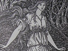

  
[Intangible Textual Heritage](../../index)  [Tolkien](../index) 
[Morris](../../neu/morris/index)  [Index](index)  [Previous](wbw20) 
[Next](wbw22) 

------------------------------------------------------------------------

  
*The Wood Beyond the World*, by William Morris, \[1894\], at Intangible
Textual Heritage

------------------------------------------------------------------------

# CHAPTER XXI: WALTER AND THE MAID FLEE FROM THE GOLDEN HOUSE

There he abode amidst the hazels, hearkening every littlest sound; and
the sounds were nought but the night voices of the wood, till suddenly
there burst forth from the house a great wailing cry. Walter's heart
came up into his mouth, but he had no time to do aught, for following
hard on the cry came the sound of light feet close to him, the boughs
were thrust aside, and there was come the Maid, and she but in her white
coat, and barefoot. And then first he felt the sweetness of her flesh on
his, for she caught him by the hand and said breathlessly: "Now, now!
there may yet be time, or even too much, it may be. For the saving of
breath ask me no questions, but come!"

He dallied not, but went as she led, and they were lightfoot, both of
them.

They went the same way, due south to wit, whereby he had gone a- hunting
with the Lady; and whiles they ran and whiles they walked; but so fast
they went, that by grey of the dawn they were come as far as that
coppice or thicket of the Lion; and still they hastened onward, and but
little had the Maid spoken, save here and there a word to hearten up
Walter, and here and there a shy word of endearment. At last the dawn
grew into early day, and as they came over the brow of a bent, they
looked down over a plain land whereas the trees grew scatter-meal, and
beyond the plain rose up the land into long green hills, and over those
again were blue mountains great and far away.

Then spake the Maid: "Over yonder lie the outlying mountains of the
Bears, and through them we needs must pass, to our great peril. Nay,
friend," she said, as he handled his sword-hilt, "it must be patience
and wisdom to bring us through, and not the fallow blade of one man,
though he be a good one. But look! below there runs a stream through the
first of the plain, and I see nought for it but we must now rest our
bodies. Moreover I have a tale to tell thee which is burning my heart;
for maybe there will be a pardon to ask of thee moreover; wherefore I
fear thee."

Quoth Walter: "How may that be?"

She answered him not, but took his hand and led him down the bent. But
he said: "Thou sayest, rest; but are we now out of all peril of the
chase?"

She said: "I cannot tell till I know what hath befallen her. If she be
not to hand to set on her trackers, they will scarce happen on us now;
if it be not for that one."

And she shuddered, and he felt her hand change as he held it.

Then she said: "But peril or no peril, needs must we rest; for I tell
thee again, what I have to say to thee burneth my bosom for fear of
thee, so that I can go no further until I have told thee."

Then he said: "I wot not of this Queen and her mightiness and her
servants. I will ask thereof later. But besides the others, is there not
the King's Son, he who loves thee so unworthily?"

She paled somewhat, and said: "As for him, there had been nought for
thee to fear in him, save his treason: but now shall he neither love nor
hate any more; he died last midnight."

"Yea, and how?" said Walter.

"Nay," she said, "let me tell my tale all together once for all, lest
thou blame me overmuch. But first we will wash us and comfort us as best
we may, and then amidst our resting shall the word be said."

By then were they come down to the stream-side, which ran fair in pools
and stickles amidst rocks and sandy banks. She said: "There behind the
great grey rock is my bath, friend; and here is thine; and lo! the
uprising of the sun!"

So she went her ways to the said rock, and he bathed him, and washed the
night off him, and by then he was clad again she came back fresh and
sweet from the water, and with her lap full of cherries from a wilding
which overhung her bath. So they sat down together on the green grass
above the sand, and ate the breakfast of the wilderness: and Walter was
full of content as he watched her, and beheld her sweetness and her
loveliness; yet were they, either of them, somewhat shy and shamefaced
each with the other; so that he did but kiss her hands once and again,
and though she shrank not from him, yet had she no boldness to cast
herself into his arms.

------------------------------------------------------------------------

[Next: Chapter XXII: Of The Dwarf And The Pardon](wbw22)

