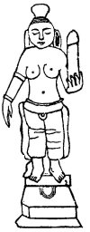
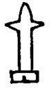

  
[Intangible Textual Heritage](../../index.md)  [Sacred
Sexuality](../index)  [Index](index)  [Previous](asw00)  [Next](asw02.md) 

------------------------------------------------------------------------

p. 5

# I.

### ORIGIN OF THE CROSS.

FAR back in the twilight of the pictured history of the past, the cross
is found on the borders of the river Nile. A horizontal piece of wood
fastened to an upright beam indicated the hight of the water in flood.
This formed a cross, the Nileometer. If the stream failed to rise a
certain hight in its proper season, no crops and no bread was the
result. From famine on the one hand to plenty on the other, the cross
came to be worshiped as a symbol of life and regeneration, or feared. as
an image. of decay and death. This is one, so called, origin of the
Cross.

The cross was a symbol of life and regeneration in India long before
this usage on the Nile, and for another reason. The most learned
antiquarians agree in holding it unquestionable that Egypt was colonized
from India, and crosses migrated with the inhabitants. "Proofs in
adequate confirmation of this point

p. 6

are found," says the learned Dr. G. L. Ditson, "in waifs brought to
light in ancient lore. Waif originally signified goods a thief, when
pursued, threw away to avoid detection. Many of the facts to be brought
forth in our inquiry were doubtless intentionally scattered and put out
of sight to prevent apprehension of the proper subject to which they
belong."

The cross bespeaks evolution in religion. It is the product of time, and
the relic of the revered past. It begins with one thing and ends with
another.

In seeking for the origin of the cross it becomes necessary to direct
attention in some degree to the forms of faith among mankind with whom
the cross is found. Retrogressive inquiry enables the
religio-philosophical student to follow the subject back, if not to its
source, to the proximate neighborhood of its source. Like every item of
ecclesiastical ornament, and every badge of devotion, the cross is the
embodiment of a symbol. That symbol represents a fact, or facts, of both
structure and office. The facts were *generation* and *regeneration*.
Long before the mind matures the generative structure matures. The
*cerebellum* attains its natural size at three years of age, the
*cerebrum* at seven years, if we accept the measurements as announced by
Sir William Hamilton. Throughout the realm of animal life there is no
physical impulse so overbearing as the generative, unless we except that
for food. Food gives satisfaction. Rest to tired nature gives pleasure.
To the power of reproduction is appended the acme of physical bliss. How
natural, then, that this last-named impulse should, early in human
development, take the lead, give direction and consequence to religious
fancies, and lead its votaries captive to a willing bondage,--as it did
in India, Egypt, among the

p. 7

\[paragraph continues\] Buddhists, Babylonians, Phœnicians, Assyrians,
and ancient Hebrews.

The ancients personified the elements, air, water, fire, the earth, the
sea, the celestial orbs; in imagination gave superintending Deities to
some and deified others. The Sexual ability of man and Nature was also
personified, and likewise supplied with a governing Deity, which was
elevated to the niche of the Supreme. Once enthroned as the ruling God
over all, dissent therefrom was impious. A king might be obeyed, but God
must be worshiped. A monarch could compel obedience to the state, but
the ministers of God lured the devotee to the shrines of Isis and Venus
on the one hand, and to Bacchus and Priapus or Baal-Peor on the other,
by appealing to the most animating and sensuous force of our physical
nature. The name of this God bore different appellatives in different
languages, among which we find Al, El, Il, Ilos, On, Bel, Jao, Jah, Jak,
Josh, Brahma, Eloihim, Jupiter, and Jehovah. Being God of the genital
power, he became the reputed sire of numerous children, and numberless
children were born under his auspicious rule. The names of his dutiful
descendants were composite in signification, and in many, ways
characterized the honored Deity. Hence, derived therefrom, we meet with
the El God in Micha*el*, Ragu*el*, Rapha*el*, Gabra*el*, Jo*el*,
Phani*el*, Uri*el*, Saraki*el*, Beth*el*, Chap*el*, *El*i, *El*ijah.

Al, El, Il, are used interchangeably, one for the other; likewise Jah,
Ju, Jao, Yho, Iah, Iao, Iu. On expresses the idea of the male Creator.
Am, Om, Um, or Umma, represent the female Deity. From Am we have Amelia
and Emma. On is an integrant of many names, as Abd*on*, *On*an,
Aijal*on*, Ashcal*on*, Ezb*on*. From Ra, Re, or Ri, arise *Re*bekah,
*Re*gem, *Re*hoboam, and *Re*ba,

p. 8

which signifies "sexual congress." The cognomens in which Jah enters are
almost unlimited, as in Isa*iah*, Hezek*iah*, Zedek*iah*, Pad*iah*,
Man*iah*, *Je*hu.

The attributes of this presiding Deity were characteristic of his
office. Her was strong, powerful, erect, high, firm, bright, upright,
happy, large, splendid, noble, mighty, hard, able. Corresponding to the
same idea, he was often, indeed nearly always, associated in pictured
relics with animals which denoted the above qualities. These were the
bull, elephant, ass, goat, ram, and lion, which were typical of strength
and salacious vigor. When a large and strong man appeared, he at once
resembled the prevalent idea of God, and was most naturally called the
man of God, or the God-man; also large, strong animals were noted as the
bulls of God, the rams of God.

The meaning of a large number of Bible names verifies this view. From
Dr. Inman's Vocabulary of Bible Names I set out to copy those the
signification of which related to "divine," sexual, generative, or
creative power; such as Alah, "the strong one"; Ariel, "the strong Jah
is El"; Amasai, "Jah is firm"; Asher "the male" or "the upright organ";
Elijah, "El is Jah"; Eliab, "the strong father"; Elisha, "El is
upright"; Ara, "the strong one," "the hero"; Aram, "high," or, "to be
uncovered"; Baalshalisha, "my Lord the trinity," or, "my God is three";
Ben-zohett, "son of firmness"; Camon, "the erect On"; Cainan, "he stands
upright"; but after copying over one hundred names with their
meaning--some of which related to feminine qualities--I found I had
advanced only to the letter E of the alphabet, and gave up the
undertaking for these limited pages.

We must look at this curious subject as we find it. Quaint though most
of it is, we hope to treat it with all

p. 9

the decorum of philosophic inquiry, and in the chaste language of
scientific precision.

That the cross, or crucifix, has a sexual origin we determine by a
similar rule of research as that by which comparative anatomists
determine the place and habits of an animal by a single tooth. The cross
is a metaphoric tooth which belongs to an antique religious body
physical, and that essentially human. A study of some of the earliest
forms of faith will lift the vail and explain the mystery.

India, China, and Egypt have furnished the world with a *genus* of
religion. Time and culture have divided and modified it into many
species and countless varieties. However much the imagination was
allowed to play upon it, the animus of that religion was
sexuality--worship of the generative principle of man and nature, male
and female. The cross became the emblem of the male feature, under the
term of the *triad*--three in one. The female was the unit; and, joined
to the male triad, constituted a sacred four. Rites and adoration were
sometimes paid to the male, sometimes to the female, or to the two in
one.

From motives of improved modesty, or the less commendatory motive to
gain prestige through the power of superstition, much truth bearing
directly upon our subject has been suppressed by an interested
hierarchy. Stripped of euphemisms, we find "the Chaldees believed in a
Celestial Virgin, who had purity of body, loveliness of form, and
tenderness of person; and to whom the erring sinner could appeal with
more chance of success than to a stern father. She was portrayed with a
child in her arms. Her full womb was thought to be teeming with
blessings,

p. 10

and everything which could remind a votary of a lovely woman was adopted
into her worship."

The worship of the woman by man naturally led to developments which our
comparatively sensitive natures shun, as being opposed to all religious
feeling. But among a people whose language was without the gloss of
modern politeness, whose priests both spoke and wrote without the least
disguise, and whose God, through his prophets and lawgivers, promised
abundance of offspring and an increase in flocks and herds, as one of
the greatest blessings he had to bestow, we can readily believe that
what we call "obscenities" might be regarded as sacred homage or divine
emblems. What were these emblems? When plainness of speech is restored
to its original office, and the meaning of words is defined or traced to
their primitives, names of natural objects give us this wonderful
answer, and tell us the homely story of these emblems.

### EMBLEMS.

THE Phallus and Linga, or Lingham, Stood for the image of the *male
organ*; and the Yoni, or Unit, for the *female organ*.

#### PHALLUS.

PRIVY member (membrum virile) signifies, "he breaks through, or passes
into." This word survives in German *pfahl*, and *pole* in English.
Phallus is supposed to be of Phœnician origin, the Greek word *pallo*,
or *phallo*, "to brandish preparatory to throwing a missile," is so near
in assonance and meaning to phallus that one is quite likely to be
parent of the other. In Sanskrit it can be traced to *phal*, "to burst,"
"to produce,"

p. 11

\[paragraph continues\] "to be fruitful;" then, again, phal is "a
plowshare," and is also the name of Siva and Mahadeva, who are Hindu
Deities. Phallus, then, was the ancient emblem of creation: a Divinity
who was companion to Bacchus. [Figure 1](#img_fig01.md) is a copy of a
statuette of this Hindu Devi. The figure holds a phallus, or lingham, in
the left hand, formed after an imaginary lotus bud. The coarsely carved
unit of the feminine figure completes ale dogma of masculine and
feminine powers combined in one. The son of Reuben, Phallu (Gen. xlvi,
9), signifies "a distinguished one," "he splits, divides," "he is round
and plump," all of which point to a religion of sensual love.

Phallic emblems abounded at Heliopolis in Syria, and many other places,

<table data-align="RIGHT">
<colgroup>
<col style="width: 100%" />
</colgroup>
<tbody>
<tr class="odd">
<td data-valign="CENTER"> 
Fig. 1.</td>
</tr>
</tbody>
</table>

even into modern times. The following unfolds marvelous proof to our
point. A brother physician, writing to Dr. Inman, says: "I was in Egypt
last winter (1865-66), and there certainly are numerous figures of Gods
and kings, on the walls of the temple at Thebes, depicted with the male
genital erect. The great temple at Karnak is, in particular, full of
such figures, and the temple of Danclesa likewise, though that is of
much later date, and built merely in imitation of old Egyptian art. The
same inspiring *bass-reliefs* are pointed out by Ezek. xxiii, 14. I
remember one scene of a king (Rameses II.) returning in triumph with
captives, many of whom are undergoing the operation of castration, and
in the corner of the picture are numerous heaps of the

p. 12

complete genitals which have been cut off--many hundreds in all, I
should think." This shows, first, how largely virility was interwoven
with religion; second, how completely English Egyptologists have
suppressed a portion of the facts in the histories which they have given
to the world; third, it tells us of the antiquity of the practice, which
still obtains among the negroes of North Africa, of mutilating entirely
every male captive and slain enemy. See 2 Kings xx, 18; Isa. xxxix, 7.
This vindictive usage was practiced by Saul and David, as may be seen in
1 Sam. xviii, 25, 27, when the king demands a hundred foreskins.

David, more heartless than Saul, doubled the quantity and brought two
hundred of the vulgar trophies. Also Isaiah (xxxix, 7) intimidates the
people, and says, "Thy sons that shall issue from the . . . shall be
eunuchs in the palace of the king of Babylon." The Apache Indians of
California and Arizona delight in perpetrating the same barbarous
mutilations upon captives and the slain.

Dr. Ginsingburg, in "Kitto's Cyclopædia," says: "Another primitive
custom which obtained in the patriarchal age was, that the one who took
the oath put his hand under the thigh of the adjurer (Gen. xxiv, 2, and
xlvii, 29). This practice evidently arose from the fact that the genital
member, which is meant by the euphemic expression, thigh, was regarded
as the most sacred part of the body, being the symbol of union in the
tenderest relation of matrimonial life, and the seat whence all issue
proceeds, and the perpetuity so much coveted by the ancients. Compare
Gen. xlvi, 26; Exod, i, 5; Judg. viii, 30. Hence the creative organ
became the symbol of the Creator and the object of worship among all
nations of antiquity. It is for this reason that God claimed it as a
sign of the

p. 18

covenant between himself and his chosen people in the rite of
circumcision. Nothing therefore could render the oath more solemn in
those days than touching the symbol of creation, the sign of the
covenant, and the source of that issue who may at any future period
avenge the breaking a compact made with their progenitor." From this we
learn that Abraham, himself a Chaldee, had reverence for the phallus as
an emblem of the Creator. We also learn the rite of circumcision touches
phallic or lingasic worship. From Herodotus we are informed the Syrians
learned circumcision from the Egyptians, as did the Hebrews. Says Dr.
Inman: "I do not know any thing which illustrates the difference between
ancient and modern times more than the frequency with which circumcision
is spoken of in the sacred books, and the carefulness with which the
subject is avoided now. To speak of any man as being worthy or
contemptible, as men and women did among the Jews, according to the
condition of an organ never named, and very rarely alluded to, in a
mixed company of males and females among ourselves, shows us that
persons holding such ideas must have thought far more of these matters,
and spoken of them more freely, than we have been taught to do.
Abundance of offspring is the absorbing promise to the faithful; a
promise liable to fail except the parts destined to that purpose were in
an appropriate condition."

We can compass some idea of the esteem in which people in former times
cherished the male or phallic emblems of creative power when we note the
sway that power exercised over them. If these organs were lost or
disabled, the unfortunate one was unfitted to meet in the congregation
of the Lord, and disqualified to minister in

p. 14

the holy temples. Excessive was the punishment inflicted upon the person
who should have the temerity to injure the sacred structure. If a woman
were guilty of inflicting such injury, her hand should be cut off
without pity (Deut. xxv, 12). It was an unpardonable offense, a sin not
to be forgiven, for it was a calamity that bumbled their God and made
him of no esteem. When his ability failed, respect for him failed. Such
a man was "an abomination."

With a people enslaved to such groveling tenets, it was an easy and
natural step from the actual to the symbolical; from the crude, and,
perhaps, to some, offensive, to the improved, the pictured, the adorned,
the less offensive; from the plain and self-evident, to the mixed,
disguised and mystified; from the unclothed privy member to the letter
**T**, or the cross; for these became the phallic analogues. The linga
is the symbol of the male organ and Creator in Hindostan. It is always
represented standing in the yoni, as in Figs. [4](asw02.htm#img_fig04.md)
and [23](asw03.htm#img_fig23.md). Obelisks, pillars of any shape, stumps,
trees denuded of boughs, upright stones, are some of the means by which
the male element was symbolized. Siva is represented as a stone standing
alone.

### TRIAD.

To know exactly who is who, and what is what, it will be necessary to
explain the Triad, or Trinity, its origin and its changes or
metamorphoses: then the *tria juncta in uno*--the three in one--can be
recognized in the cross more readily than most people see the "three
persons in one God." The triad generally belongs to the male, although
the female Divinities were sometimes of triple constitution. If we turn
to the analysis of the subject according to Rawason, we find that the
first and

p. 15

most sacred trinity--three persons and one God---consisted of Asshur, or
Asher, or Ashur, whose several names were *Il*, *Ilos*, and *Ra*; *Anu*
and *Hed*, or *Hoa*. Beltis was the Goddess associated with him. These
four, that is, Asher, Anu, Hea, and Beltis, made up *Arba*, or Arba-il,
the four great Gods, the quadrilateral, the perfect Creator. Asher was
the phallus, or the linga, the *membrum virile*--the privy member; the
cognomen *Anu* was given to the right testis, while that of *Hea*
designated the left testis. When Asher was canonized a Deity, it was but
right and natural his ever-attendent appendages should be deified with
him. The idea thus broached receives confirmation when we examine the
opinions which obtained in ancient times respecting the power of the
right side of the body compared with the titles given to Ann. It was
believed that the right testicle produced masculine seed, and that when
males were begotten they were developed in the right side of the womb.
Benjamin signifies "son of my right side;" thus the name of a member of
a family attests the reigning notion. The name Benoni, given to the same
individual by his mother, may mean, literally, either "son of Anu," or
"son of my On." The male, or active, principle was typified by the idea
of "solidity," and "firmness"; and the female, or passive, principle by
"water," "fluidity," or "softness." It is then, *a priori*, probable
that Anu was the name of the testis on the right side. To inspect the
perfect man, or a correctly designed statue of Apollo Belvidere, will
detect the fact that the right "egg" hangs on a higher level than the
left, for which there is an anatomical reason. The metaphors we
sometimes hear, such as "king of the lower world," "the original chief,"
"father of the Gods," "the old Anu," relate to these parts, and are

p. 16

of phallic import. "King of the lower world" cannot refer to the
"infernal regions" of modern orthodoxy, since that mythical Hades had
not then come into existence,

How about the gland on the left side, the third divinity of the triad?
Rawlinson states, as best he could determine, this was named Hea or Hoa,
and he considers this Deity corresponds to Neptune. Neptune was the
presiding Deity of the great deep, "Ruler of the Abyss," and "King of
Rivers." He also regulates aqueducts, and waters generally. There is a
correspondence between this Deity and Bacchus.

As Darwin and his coadjutors teach, mankind, in common with all animal
life, originally sprung from the sea, so physiology teaches that each
individual bas origin in a pond of water. The fruit of man is both solid
and fluid. It was natural to imagine that the two male appendages had a
distinct duty: that one formed the infant, the other the water in which
it lived; that one generated the male and the other the female
offspring; [1](#fn_0.md) and the inference was then
drawn that water must be feminine, the emblem of the passive powers of
creation. The use of water would then become the emblem of it new
birth--"born of water;" and it would represent the phenomenon which
occurs when the being first emerges into day. The night, which favors
connubial intercourse, and the dark interior of the womb, in which for
many months, the new creature is gradually formed, are represented by
the "darkness brooding." It was night when the world was formed out of
chaos; likewise it was thought

p. 17

to be obscure when the mingling of the male and female fluids started a
new being into existence. Favoring food fed the tiny speck for months,
and its emerging as male or female into the world of men was the
prototype of the emergence of animal life from the bosom of earth, or
the womb of time, into actual existence.

Having dwelt on stem and branches of the god Asher, it is proper to give
his definition as a personality and function; in other words, as a God.
Asher (Gen. xxx, 13), "to be straight," "upright," "fortunate," "happy,"
"happiness," i. e., *unus cui membrum erectum est vel fascinum
ipsum*--the erect virile member charmed with the act of its proper
function. Says Dr, Inman: "While attending hospital practice in London,
I heard a poor Irishman apostrophize his diseased organ as 'You father
of thousands'; and in the same sense Asher is the father of the Gods. I
find that a corresponding part of the female (*pudenda*) is currently
called "the mother of all saints." Asher was the supreme God of the
Assyrians, the Vedic God Mahadeva, the emblem of the human male
structure and creative energy. This idea of the Creator is still to be
seen in India, Egypt, Judea, the East, Phœnicia, the Mediterranean,
Europe, Denmark, depicted on stone relics.

This much for Asher seemed necessary to explain the origin of the
Trinity. So we find *the male privy member and the adjacent twin testes
made the Triad*, and constructed into the pictured formula thus:

 

A  
S  
H  
E  
R  
ANU    HEA

 

p. 18

With this glossary we can now understand the hidden meaning of Psa.
cxxvii, 3, "Children are an heritage of the Lord, and the fruit of the
womb is his reward." Exactly! Anu is Assyrian. There is a God in Babylon
by the name of Anu. Asher is only another name for Al, On, Ra, Il, El,
Hos, Helos, Bel, Baal, Allah, Elohim. These are also sometimes given to
the run as the representative of the Creator and the phallic emblem.
Asher, Anu, and Hea, three persons and one God, or, as modern
theologians have been led to speak of the Trinity, "the more three
because one, and the more one because three." One, by himself, is of no
value, but "*all* work together for good."

### VOCABULARY.

IN all ages and all localities of the world, people conferred names
which imply some one or more characteristics of person, feature, faith,
place, or event. Among defectively educated people, and those of rough
manners, we find "Long John," "Broad Bottom," "Squinting Dick"; and
names for helpless children, "Makepeace," "Faithful," "Freelove" and
"Praise God Barebones." In this matter the people of antiquity appear to
have set the example. The Greeks had "Theodore," "the gift of God";
"Theophilus," "the friend of God." The analysis of the following
vocabulary of Bible names throws a flood of light on the subject in
hand. It unvails an interesting question, the nudity of which, for the
most part, has been clothed with the vesture of words.

Ahumai (I Chron. iv, 2), "ach is mi," or "semen"; Baal-Shalisha (2 Kings
iv, 42), "my Lord the trinity," "my Lord is three," "the triple male
genitals."

p. 19

Amorite, "speaking, flowing"; "erecting, or swelling up."

Ankura, "a sprout, or intumescence," "an erection."

Aram, "high," "to swell up," "to be uncovered or naked."

Aras, "to erect," "to build," "a nuptial bed."

Asahel, "to create," "to beget," "El-created."

Baal-Peor (Num. xxv, 3), "the maiden's hymen opener," "my Lord the
opener."

Baal-Perazim, "Baal of the fissure."

Baal-Tamar, "Baal the palm tree," "my Lord who is or causes to be
erect."

Benoni, "son of Anu," or "son of my On," "son of my God."

Ben-zoheth, "son of firmness," "to set up," "an erection," "a cippus."

Beren, "the womb," "the round belly," "the female organs."

Boladan, "my Lord of pleasure and delight."

Buli, "the vulva," "the belly,"

Cainan, "he stands upright," "Hermes."

Camon, "the erect On."

Chesil, "the loins or flanks." Loins is an euphemism for the male
genitals.

Cyrus, "the bended bow," "the abdomen of a pregnant woman."

Dimon, "river, place"; "the semen, or viscous discharge of On."

Dodai, "loving, amatory."

p. 20

Ehud, "conjugation, union"; "strong," "powerful," "the one."

Eliasaph, "El the fascinator."

Elisha, "El is," "the erect El."

Elkana, "El the erect One," "the tall reed," "El burning with desire."

Elkoshi, "El the hard One."

En-am, "the eye or fountain of the mother."

En-an, "the eye of On, or Anu."

Epaphroditus, "Love was my parent," "given by Venus."

Epher, "a calf," "a faun," "to join," "be strong."

Esau, "to make, to press, to dig, to build up, to squeeze immodestly,"
"the hairy El."

Eshek (1 Chron. viii, 39), "he presses, squeezes, penetrates into."

Eshton, "the power of woman."

Ether, "fullness," a God in the second Assyrian triad, his colleagues
being the Sun and Moon. His name may be read as *Eva*, *Iva*, Air, Aer,
Aur, Er, Ar, also Vul.

Ethnan, "a harlot's fee," "begotton by harlotry."

Eve, *Chavah*, *havah*, or *hauah*, "to breathe," "to blow,"
"eagerness," "lust"; "a cleft, fissure, or gap really, a fissure."
(Concha).

Evi, "desire."

Ezem, "to fit firmly to one another," "hard."

Gaal, "the proud or erect Al."

Galah, "To be," or "to be naked," as in gala days.

Gath, "A wine press," also "a slit, pit, hole, well," or the euphemism
for the vulva.

p. 21

Gaza, "strong," "the trunk of a tree," "a phallic emblem."

Gilboa, "the sun is Baal."

Gilgal, "a wheel," a "circle, "the sun's heap of stones," "a phallus";
see [Fig. 2](#img_fig02.md).

<table data-align="RIGHT">
<colgroup>
<col style="width: 100%" />
</colgroup>
<tbody>
<tr class="odd">
<td data-valign="CENTER"> 
Fig. 2.</td>
</tr>
</tbody>
</table>

Giloh, "the revealer," "to be or make naked," "to uncover," "to
disclose."

Ginath, "the virgins," "the goddesses."

Ginnethon, "the power of the virgins."

Gomorrah, "a fissure, a cleft."

Habakkuk, "embrace of love."

Hai, Assyrian *ai*, "female power of the Sun."

Hamor, "the swelling up one," or "the red one," to be dark red," "sudden
in rising," also "an ass"--which is notorious for salacity. "My beloved
is white and ruddy" (Sol. Songs, v, 10).

Hashupa, "uncovering," "nakedness."

Hephzibah, "pure delight," "my delight in her."

Jaaz, "he is hard, firm, stiff," "he rules," "decides."

Jabal, "he rejoices," "he flows out," "he is strong."

Jabok, "running, or flowing forth."

Jabash, "a stout, fat one."

Jachin, "he strengthens," "to be hot with desire," "to have
intercourse." Boaz has the same phallic meaning.

Jahdo, "he unites."

Jahaz, "Jah shines," "to be fair," "to be proud," "he is firm."

Jahdial, "El makes glad."

p. 22

Jair, "enlightens," "shines," "blooms," "flows." Jair is united with
Eros (erotic desire).

Jakim, "he set up," "standing erect," "raising seed to."

Japho, "beauty," "widely extending," "seduce," persuade."

Jehoaddan, "Jah is lovely," "Yeho is the provider of sexual pleasure."

Jepthel-el, "El is a begetter."

Jeroham, "a beloved or favored One."

Jesher, "he is upright."

Jesimel, "El creates."

Jeziah, "He is son of Jah."

Jonathan, "the gift of Jao" (a God).

Jhoharaph, "Jah is juicy, vigorous, strong or proud."

Joshar, "he is straight," "upright."

Jurah, "he boils up," "to glow, to burn," "to pour out largely."

Kishon, "the firm or hard On."

Maon ,"pudenda of On."

Tamar, the palm, an euphemism for the male organ.

It "ill be observed, a few of the above name,; refer to the Sun Deity,
and solar worship. In some, the solar and phallic tenets are combined in
the same, name, and depicted in the same figure. Such an illustration
will be found in Webster's Unabridged Dictionary, under the name *Agnus
Dei*. The figure--lamb, rain, or goat--is in the impossible attitude of
holding a cross with the foot--sometimes a crosier, or shepherd's crook,
either of which

p. 23

are phallic emblems. The head of the animal is surrounded by a circle,
or with rays, which are always typical of the Sun God. For the Hebrew
text of the above names the reader is referred to "Inman's Ancient
Faiths."

### MARKS AND SIGNS OF THE TRIAD.

THE triad is parent to the idea of Trinity. It is met with in the most
distant countries, and is traced to Phoenicia, Egypt, on the west, and
Japan on the east, of our hemisphere, and to India. Constituting, as the
triad and yoni did, the ever-dominant thought, and actuated by the
narrow realm of an absorbing self-personality, they formed the basis and
spirit of religious observance. They were referred to openly and
broadly, or more generally and in later times by a mark, a metaphor, a
motion, or a sign. For this sign the letter **T** became typical, and
still later the figure of the cross became that sign. "It is most
remarkable," says Payne Knight, that "the letter **T** and the cross,
symbols of symbols, are made to represent the male procreative powers,
which are emblems of generation and regeneration."

Reverse the position of the triple deities Asher, Anu, Hea and we have
the figure of the, ancient "tau" ✝ Of the Christians, Greeks, and
ancient, Hebrews--not of the modern Hebrews. It is one of the oldest
conventional forms of the cross. It is also met with in Gallic, Oscan,
Arcadian, Etruscan, original Egyptian, Phœnician, Ethiopic and
Pelasgian. The Ethiopic form of the "tau" is this ✝ the exact prototype
and image of the cross; or, rather, to state the fact in order of merit
and position in time, the cross is *made in the exact image of the
Ethopic "tau."* The fig-leaf, having three lobes to it, became a symbol
of the triad. As the male genital organs were

p. 24

held in early times to exemplify the actual male creative power, various
natural objects were seized upon to express the theistic idea, and at
the same time point to those parts of the human form. Hence, a
similitude was recognized in a pillar, a heap of stones, a tree between
two rocks, a club between two pine cones, a trident, a thyrsus tied
round with two ribbons With the two ends pendant, a thumb and two
fingers, the caduceus. Again, the conspicuous part of the sacred triad
Asher is symbolized by a single stone placed upright--as in Gilgal in
"Vocabulary," [Fig. 2](#img_fig02.md)--the stump of a tree, a block, a
tower, spire, minaret, pole, pine, poplar, or palm tree. While eggs,
apples, or citrons, plums, grapes, and the like, represented the
remaining two portions; altogether called phallic emblems. [Fig.
3](#img_fig03.md) 

<table data-align="LEFT">
<colgroup>
<col style="width: 100%" />
</colgroup>
<tbody>
<tr class="odd">
<td data-valign="CENTER"> 
Fig. 3.</td>
</tr>
</tbody>
</table>

portrays a triad found on a medal of Apollo. The triple points at the
summit are in multiple of the Trinity, as they but repeat the same idea
the structure would express without them. Baal-Shalisha is a name which
seems designed to perpetuate the triad, since it signifies "my Lord the
Trinity," or "my God is three."

We must not omit to mention other phallic emblems, such as the bull, the
ram, the goat, the serpent, the torch, fire, a knobbed stick, the
crozier: and still further personified, as Bacchus, Priapus, Dionysius,
Hercules, Hermes, Mahadeva, Siva, Osiris, Jupiter, Molech, Baal, Asher,
and others.

If Ezekiel is to be credited, the triad **T**, as Asher, Anu, and Hea,
was made of gold and silver, and was in his day not symbolically used,
but actually employed; for he bluntly says "whoredom was committed with
the images of men," or, as the marginal note has it, images of "a male"
(Ezek. xvi, 17). It was with this god-mark--a cross

p. 25

in the form of the letter **T**--that Ezekiel was directed to stamp the
foreheads of the men of Judea who feared the Lord (Ezek. ix, 4). In
China, *Tau* is Nature's absolute unity.

Thus we find the cross is the Ethiopic and ancient Hebrew "tau" ✝. The
**T** is the triad, the triad is Asher, Ann, and Hea--the male genitals
deified--the genitals are pudenda, pudenda means shame or immodest, and
so we arrive at the unavoidable conclusion that the cross is of sexual
origin and purely masculine. It is the sign of a man-God.

This is not all of the cross. In ancient days it had a natural
counterpart little suspected by moderns. This essential opposite was
denominated the Yoni.

------------------------------------------------------------------------

### Footnotes

[16:1](asw01.htm#fr_0.md) Somewhat recent
information on this point teaches that sex is governed by the health and
maturity of the ovum. Female offspring will follow when conception
occurs at the earliest period of the maturing ovum, and mile offspring
at the concluding period of heat.

------------------------------------------------------------------------

[Next: II. Yoni](asw02.md)
