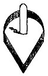
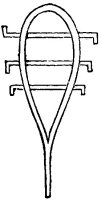
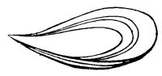
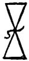
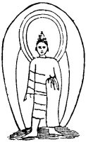
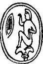
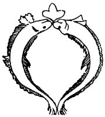
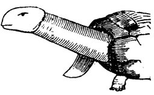

  
[Intangible Textual Heritage](../../index.md)  [Sacred
Sexuality](../index)  [Index](index)  [Previous](asw01)  [Next](asw03.md) 

------------------------------------------------------------------------

# II.

### YONI.

THERE: is in Hindostan an emblem of great sanctity, which is known as
the Linga-Yoni. It consists of a simple pillar in the center of a figure
resembling the outline of a conical ear-ring, or an old-fashioned wooden
battledore. Dr. Inman says: 

<table data-align="RIGHT">
<colgroup>
<col style="width: 100%" />
</colgroup>
<tbody>
<tr class="odd">
<td data-valign="CENTER"> 
Fig. 4.</td>
</tr>
</tbody>
</table>

"As a Scholar, I had heard that the Greek letter, Delta, △, is
expressive of the female genital organ both in shape and idea. The
selection of name and symbol was judicious, for the words Daleth
(Hebrew) and Delta (Greek) signify the door of a house, and the outlet
of a river, while the figure reversed, with the heavy side above, ▽
modestly represents the fringe with which the human delta is
overshadowed."

p. 26

Yoni is of Sanskrit origin. Yauna, or Yoni, means (1) the vulva, (2) the
womb, (3) the place of birth, (4) origin, (5) water, (6) a mine, a hole,
or pit. As Asher and Jupiter were the representatives of the male
potency, so Juno and Venus were representatives of the female attribute.
Moore, in his "Oriental Fragments,", says: "Oriental writers have
generally spelled the word, 'Yoni,' which I prefer to write 'IOni.' As
Lingham was the vocalized cognomen of the male organ, or Deity, so IOni
was that of hers." Says R.P. Knight: "The female organs of generation
were revered as symbols of the generative powers of Nature or of matter,
as those of the male were of the generative powers of God. They are
usually represented emblematically by the shell *Concha Veneris*, which
was therefore worn by devout persons of antiquity, as it still continues
to be by the pilgrims of many of the common people of Italy" ("On the
worship of Priapus," p. 28). If Asher, the conspicuous feature of the
male Creator, is supplied with types and representative figures of him
self, so the female feature is furnished with substitutes and typical
imagery of herself.

<table data-align="LEFT">
<colgroup>
<col style="width: 100%" />
</colgroup>
<tbody>
<tr class="odd">
<td data-valign="CENTER"> 
Fig. 5.</td>
</tr>
</tbody>
</table>

Fig. 5 is one of these, and is technically known as the *sistrum* of
Isis. It is the virgin's symbol. The bars across the *fenestrum*, or
opening, are bent so they cannot be taken out, and indicate that the
door is closed. It signifies that the mother is still *virgo intacta*--a
truly immaculate female--if the truth can be strained to so denominate a
*mother*. The pure virginity of the Celestial Mother was a tenet of
faith for 2,000 years before the accepted Virgin Mary now adored was
born. We

p. 27

might infer that Solomon was acquainted with the figure of the
*sistrum*, when he said, "A garden inclosed is my spouse, a spring shut
up, a *fountain sealed*" (Song of Sol. iv, 12). The *sistrum*, we are
told, was only used in the worship of Isis, to drive away Typhon (evil).

<table data-align="RIGHT">
<colgroup>
<col style="width: 100%" />
</colgroup>
<tbody>
<tr class="odd">
<td data-valign="CENTER"> 
Fig. 6.</td>
</tr>
</tbody>
</table>

The Argha, [Fig. 6](#img_fig06.md), is a contrite form, or boat-shaped dish
or plate used as a sacrificial cup in the worship of Astarte, Isis, and
Venus. Its shape portrays its own significance. The Argha and *crux
ansata* were often seen on Egyptian monuments, and yet more frequently
on bass-reliefs. 

<table data-align="LEFT">
<colgroup>
<col style="width: 100%" />
</colgroup>
<tbody>
<tr class="odd">
<td data-valign="CENTER"> 
Fig. 7.</td>
</tr>
</tbody>
</table>

[Fig. 7](#img_fig07.md) is a Buddhist emblem in which the two triangles
typifying the male and female principles are united by a serpent, the
emblem of desire. It also typifies wisdom.

Equivalent to Iao, or the Lingham, we find Ab, the Father, the Trinity,
Asher, Anu, Hea, Abraham, Adam, Esau, Edom, Ach, Sol, Helios (Greek for
Sun), Dionysius, Bacchus, Apollo, Hercules, Brahma, Vishnu, Siva,
Jupiter, Zeus, Aides, Adonis, Baal, Osiris, Thor, Oden, the cross,
tower, spire, pillar, minaret, tolmen, and a host of others; while the
Yoni was represented by Io, Isis, Astarte, Juno, Venus, Diana, Artemis,
Aphrodite, Hera, Rhea, Cybele, Ceres, Eve, Frea, Frigga, the queen of
heaven, the oval, the trough, the delta, the door, the ark, the ship,
the chasm, a ring, a lozenge, cave, hole, pit, Celestial Virgin, and a
number of other names. Lucian, who was an Assyrian, and visited the
temple of Dea Syria, near the Euphrates, says there are two phalli
standing in the porch with this inscription on them, "Those phalli I,
Bacchus, dedicate to my step-mother Juno."

p. 28

<table data-align="LEFT">
<colgroup>
<col style="width: 100%" />
</colgroup>
<tbody>
<tr class="odd">
<td data-valign="CENTER"> 
Fig. 8.</td>
</tr>
</tbody>
</table>

[Fig. 8](#img_fig08.md) is a fearless emblem of the maternal door. Jesus is
reported to have said, "I am the door," and some one in a sacred book
said, "My beloved put in his hand by the hole of the door" (Sol. Song v,
4). But this picture is a Buddhist theological badge, showing the God
Siva standing in the ambient yoni, or door; the date of which was long
before the birth of Jesus. It is one of the antecedents of the Virgin
Mary. Mary is a compound word, as many of the deities are compound
deities, composed of male and female principles and pattern. Mare, or
Mar, in the Chaldee, signifies "Lord," the lord or master, and *ri*
signifies "the Celestial Mother." *Ri* was the name of an Assyrian
Goddess. When these two words are united in one they form mar-ri, or
Mary, a union of father and mother elements and parts, as portrayed in
the above crude figure of antiquity. Molly is the name of a married,
woman, or of a woman with children. The above diagram comprehends the
phallus and unit, under the designation of Linga-Yoni, the mystical
four. The aureole about the head of the figure is a solar tenet.

From time immemorial to our day, it is, to be noticed the man is put
first and foremost, the woman next. He is three; she is one. Christians
have perpetuated the triune male God as Abba, father, but left out the
mother altogether, except among the Catholics. The sacred four
"dignitaries"--of which Rev. Cotton Mather said "the Devil is one"--are
only made up by adding Satan, the Typhon or Dagon of antiquity.

Our singular [Fig. 8](#img_fig08.md) has, in some measure, descended

p. 29

to comparatively modern times. In Ireland, up to almost the last
century, there were three Christian churches over whose doors might be
seen the coarsely sculptured figure of a nude woman exposing the *maar*
(pudenda) in the most shameless manner, the idea being that the sight
thereof brought good luck. The horse shoe is the modern representative
of the organ in question, and is often fastened over the main entrance
door by the superstitious for the same object.

The Papal religion is essentially feminine, and built on the ancient
Chaldean basis. It clings to the female element in the person of the
Virgin Mary. Naphtali (Gen. xxx, 8) was a descendant of such worshipers,
if there be any meaning in a concrete name. Bear in mind, names and
pictures perpetuate the faith of many peoples. Neptoah is Hebrew for
"the vulva," and, Al or El being God, one of the unavoidable renderings
of Naphtali is "the Yoni is my God," or "I worship the Celestial
Virgin." The Philistine towns generally had names strongly connected
with sexual ideas. Ashdod, *aish* or *esh*, means "fire, heat," and
*dod* means "love, to love," "boil up," be agitated," the whole
signifying "the heat of love," or "the fire which impels to union."
Could not those people exclaim, Our "God is love?" (I. John iv, 8). The
amatory drift of Solomon's Song is undisguised, though the language is
dressed in the habiliments of seeming decency. The burden of thought of
most of it bears direct reference to the Linga-Yoni. He makes a woman
say, "He shall lie all night betwixt my breasts" (S. of S. i, 13).
Again, of the phallus, or linga, she says, "I will go up to the
palm-tree, I will take hold of the boughs thereof" (vii, 8). Palm-tree
and boughs are euphemisms of the male genitals. Solomon, like the
ancients before him, worshiped at the high sanctuary of sex.

p. 30

### COLOR OF GODS.

ONE would naturally suppose the color of a Deity would be the same as
the complexion which belonged to the worshipers of it. Black Gods and
Goddesses were met with among the Egyptians, Hindus, Greeks and
Romans--yes, in Europe.) In explanation of these facts, Dr. Inman
remarks that "the female generative structure in some countries is of a
dark or black color; that Buddha and Brahma were as often painted black
as white." There was a black Venus at Corinth. Osiris, Isis and her
child Horus, were black. A black Virgin and black child are to be seen
at St. Stephens, in Genoa; at St. Francisco, in Pisa; at St. Theodore,
in Munich; and in other places. These Somber facts seem to explain a
passage in the Song of Solomon, where a woman is made to Say, "I am
*black*, but comely" (i, 5).

The reason for black Deities assigned above is less satisfactory than
attends the author's explanations generally; for the same reason may
apply among the same people to their male Gods, which are perhaps more
often painted white or red, and for the same local reason. Mahadeva in
India was often painted red. Some ancient figures of Bacchus, the Greek
personification of Mahadeva, have been found painted red. In the Townley
Collection a bisexual figure of Bacchus was, like his analogue, Priapus,
painted red. Ezekiel says (xxiii, 14), "the images of Chaldean men
portrayed upon the wall were with vermilion."

The experience of those concerned in opening Etruscan tombs shows that
whenever the phallus is found therein it is painted red. Adam means red
or ruddy.

"My beloved \[he\] is white and ruddy (Sol. Song V, 10).

p. 31

\[paragraph continues\] 

<table data-align="LEFT">
<colgroup>
<col style="width: 100%" />
</colgroup>
<tbody>
<tr class="odd">
<td data-valign="CENTER"> 
Fig. 9.</td>
</tr>
</tbody>
</table>

Further generous light is thrown upon the subject of male sanctities and
female worship by a religio-historic gem unearthed at Nineveh. [Fig.
9](#img_fig09.md) is a copy of that keepsake. It is an Egyptian seal,
copied from Layard ("Nineveh and Babylon," p.156). On it is engraved the
Egyptian God Harpocrates seated on the mystic lotus in profound
adoration of the Yoni, or *havah*, the "Divine Mother of all," which is
set in the field before him.

"Set me as a seal upon thine heart, as a seal upon thine arm, for love
is strong as death" (Sol. Song viii, 6). Solomon's *seal* was in outline
the shape of the unit in the field of [Fig. 9](#img_fig09.md). The same
lozenge-shaped figure was the symbol of Astarte, the Celestial Virgin,
wherefrom Solomon may have obtained it. Layard and others state that
such homage as is here depicted in the above seal is actually paid, in
some parts of Palestine and India, to the living symbol, the worshiper,
on bended knees, offering to it bread before he eats it, with or without
silent prayer. A corresponding homage is paid by female devotees to the
masculine emblem of the Sheik, or Patriarch, which is devoutly kissed by
all the women of the tribe on one solemn occasion during the year, when
the old ruler sits in state to receive the homage. The emblem is, for
many, of greater sanctity than the crucifix. Such homage is depicted in
Picart's "Religious Ceremonies of all the People of the World," plate
71.

It may easily be understood that few people would be so gross as to use
in religious worship true similitudes of these parts, which their owners
think it shame to speak of, and a punishment or reproach publicly to
show. As there is circumlocution in language, so there is symbolism in
sculpture. Words and figures are adopted which are ingeniously vailed so
as not to be understood by the

p. 32

multitude, yet significant enough to the initiated. The palm-tree, the
wine-press, the pomegranate, the tower, steeple, hand gestures, are
quite innocent in common conversation, while in mythoses they have a
hidden meaning. The scholar is aware there are occasions on which no
such reticence was used, but where an excessive shamelessness prevailed.
Of their nature it is unnecessary to speak further than to say that the
exposures were made with the impulse of a religious idea, such as that
which might have actuated David when he leaped and danced naked before
the ark, and in sight of the women of his household (II. Sam. vi,
14-20). Moderns who have not been initiated in the ancient mysteries,
and only know the emblems considered sacred, have need of anatomical
knowledge and physiological lore ere they can see the meaning of many a
sign. Note the Greek Delta inverted ▽, the door of life; likewise the
*concha shell*, which was held to typify the same feminine organ.

### FISH AND GOOD FRIDAY.

THE Fish was a sacred being. Fish are found among the venerated pictures
and sculptured works of the Buddhists, Egyptians, Babylonians,
Assyrians, Phœnicians. 

<table data-align="LEFT">
<colgroup>
<col style="width: 100%" />
</colgroup>
<tbody>
<tr class="odd">
<td data-valign="CENTER"> 
Fig. 10.</td>
</tr>
</tbody>
</table>

[Figure 10](#img_fig10.md) is a Buddhist emblem of the quadruple deity. The
rudimentary fig-leaf at the summit is the triad or male feature. The
fish yield in a fanning bias for the yoni and female person. Imagine an
Oriental priest expounding the mystery of the Godhead and unfolding, the
holy Trinity. While

p. 33

pointing to the above figure as the visible expression thereof, he might
say--leaving out one person, as many Christians do--"There are three
that bear witness in earth--the spirit, the water, and the blood--and
these three agree in one" (I. John v, 8). That *one* may be the yoni,
though it be not named, neither would he name the fig-leaf triad, or
fish, but all would understand that figurative language Bays one thing
and means two of more.

Tell me, is it religion  
   To say, The Gods are three?  
To attain to God, within you  
   Your search for him must be.  
                  *Caldwell's Indian Folk Lore*.

The statue of Isis with her child Horus has a fish on her head; likewise
in [Fig. 12](asw03.htm#img_fig12.md) Ardanari stands with an intrepid
dolphin on his or her head--for one head seems to answer for the two
persons.

The modern idea in regard to the physical influence of fish as an
article of diet is, that it is specially adapted to repair waste brain
tissue, on account of the phosphatic elements it contains. Phosphates
are larger constituents of brain than of other portions of the body. But
the ancients took to fish repasts wholly for another end, and for the
support of a full vein of divine ardor. They believed it benefited the
virile powers. Says Dr. Inman: "I have ascertained that eating fish for
supper on Friday night is a Jewish custom. It is well known that
fecundity among that people is a blessing specially promised by the
Omnipotent. So it is thought proper to use human means for securing the
desired end on the day set apart to the Almighty"--Almighty Asher of
old. "The Hebrew Sabbath begins at sunset on Friday. Three meals are to
be taken during the day, which are

p. 34

supposed to have a powerful aphrodisiac operation. The ingredients in
their dishes are meat and fish, garlic and pepper. The particular fish
selected, as near as I can determine, is the skate that which in the
Isle of Man is still supposed to be a powerful satyron?"

Layard remarks: "In our days, indeed, the Druses of Lebanon, in their
secret vespers, offer a true worship to the sexual parts of the female,
and pay their devotions every *Friday night*--that is to say, the day
which was consecrated to Venus, likewise the day in which, on his side,
the Mussulman finds in the code of Mahomet the double obligation to go
to the mosque and to perform the conjugal duty."

Mythology informs us that the body of Osiris, when killed by Typhon, was
carried in a chest to Byblos, there found by Isis and brought back to
Egypt; but the malignant demon cut up the body, and threw the places
away. All were recovered but the pudenda, which were replaced by a model
thereof, and this image, enshrined in an ark, became one of the symbols
of the God. The missing parts are said to have been eaten by a fish.
Thus we see "the Ark," "the Fish," and "Good Friday," brought into
parallelism. We are also told that the holy chest (ark) of Isis was
carried once in a year, in November, to the seaside; the priests, during
the passage, pouring drink-offerings of water upon it from the river.
The signification of this lavement must at once be apparent to those who
know that the Hebrew mi in the text signifies not only "water," but
"semen virile."

In the foregoing we have seen how the eroto-religious feeling of
antiquity deified the male members of the body under Asher, Ann, and
Hea. We here perceive the same genius has divinized the female
structure. With a fish

p. 35

diet, the male God was believed to be *omnipotent* and all-powerful.
Joshua was the son of Nun. Nun in Hebrew is the name for fish; it also
signifies a woman, or, rather, the sexual part of a woman.

### TORTOISE.

THE Tortoise, like the elephant, ox, ram, goat, ass, serpent, fish, was
an object of pious veneration. In the Hindu mythos, the tortoise was the
form taken by Vishnu in his second Avatar-Incarnation. The statue of the
celestial Venus stands with one foot on the tortoise. Resemblances in
form, similitudes in type, constituting as they did in the Hindu mind
the highest power of expression, logic was found in comparisons. A
glance at 

<table data-align="RIGHT">
<colgroup>
<col style="width: 100%" />
</colgroup>
<tbody>
<tr class="odd">
<td data-valign="CENTER"> 
Fig. 11.</td>
</tr>
</tbody>
</table>

[Fig. 11](#img_fig11.md) enables us to understand how the tortoise came to
be regarded as sacred to Venus. It represents, by the extended head and
neck, the acting linga--virile member, a sustainer of creation, a symbol
of regeneration, a renewer of life, a supporter of the world, a type of
omnipotence, and pointing to immortal felicity.

### EARTH MOTHER.

"MOTHER Earth" is a legitimate expression, only of the most general
type. Religious genius gave the female quality to earth with a special
meaning. When once the idea obtained that our world was *feminine*, it
was easy to induce the faithful to believe that natural chasms were
typical of that part which characterizes woman. As at birth the new
being emerges

p. 36

from the mother, so it was supposed that emergence from a terrestrial
cleft was equivalent to a new birth. In direct proportion to the
resemblance between the sign and the thing signified was the sacredness
of the chink, and the amount of virtue which was imparted by passing
through it. From natural chasms being considered holy, the veneration
for apertures in stones, as being equally symbolical, was a natural
transition. Holes, such as we refer to, are still to be seen in those
structures which are called Druidical, both in the British Islands and
in India. It is impossible to say when these first arose; it is certain
that they survive in India to this day. We recognize the existence of
the emblem among the Jews in Isaiah li, 1, in the charge to look "to the
hole of the pit whence ye are digged." We have also an indication that
chasms were symbolical among the same people in Isaiah lvii, 5, where
the wicked among the Jews were described as "inflaming themselves with
idols under every green tree, and slaying the children in the valleys
under the clefts of the rocks." It is possible that the "hole in the
wall" (Ezek. viii, 7) had a similar signification. In modern Rome, in
the vestibule of the church close to the Temple of Vesta, I have seen a
large *perforated stone*, in the hole of which the ancient Romans are
said to have placed their hands when they swore a solemn oath, in
imitation, or, rather, a counterpart, of Abraham swearing his servant
upon his thigh--that is, the male organ. Higgins dwells upon these holes
and says: "These stones are so placed as to have a hole under them,
through which devotees passed for religious purposes. There is one of
the same kind in Ireland, called St. Declau's stone. In the mass of rock
at Bramham Crags there is a place made for

p. 37

the devotees to pass through. We read in the accounts of Hindostan that
there is a very celebrated place in Upper India, to which immense
numbers of pilgrims go, to pass through a place in the mountains called
the Cow's Belly." In the Island of Bombay, at Malabar Hill, there is a
rock upon the surface of which there is a natural crevice which
communicates with a cavity opening below. This place is used by, the
Gentoos as a purification of their sins, which they say is effected by
their going in at the opening below and emerging at the cavity
above--"born again." The ceremony is in such high repute in the
neighboring countries that the famous Conajee Angria ventured by
stealth, one night, upon the Island, on purpose to perform the ceremony,
and got off undiscovered. The early Christians gave them a bad name, as
if from envy: they called these holes "Cunni Diaboli" ("Anacalypsis," p.
346).

------------------------------------------------------------------------

[Next: III. Unity](asw03.md)
