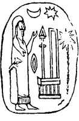

  
[Intangible Textual Heritage](../../index.md)  [Sacred
Sexuality](../index)  [Index](index)  [Previous](asw03)  [Next](asw05.md) 

------------------------------------------------------------------------

p. 58

# IV.

### PHALLIC AND SUN WORSHIP.

THE Sun was a majestic Deity, revered among many peoples. Volumes would
be required to give the history of the Sun God and his worshipers. We
here advert to him and speak of a act or two in order to show he has not
been neglected, also to indicate his good standing among the other Gods
in general, as well as among inhabitants of earth.

It is a moot-point whether the worship of sexual appointments as
Sovereign Creator and the foundation of the great thought of creation
had priority, or whether solar worship had precedence. Looking at the
fact that physical development moves in a free advance of the rational
and philosophical, that impulse outstrips inquiring thoughtfulness, that
phallic religion is purely one of feeling and passion, while solar faith
involves more of the mental structure--a slower and later outgrowth of
man--would, in the nature of things indicate sex worship to be long
anterior to that of the sun. The one is practical and matter-of-fact.
The other is inferential and imaginary. Youth would swell the eager
votaries in one; maturity and age would cultivate the other: for there
are infancy, youth, and maturity, in nations, and society, as well at;
in individuals.

Without deciding which may be the older, we find them mixed. The phallic
or linga-yoni worship and that of the sun were not merely cotemporaneous
with each other: they were tenets which mingled together under

p. 59

the same faith. All had the same or similar significance; both embody
sex divinity. The sun was male and the moon and earth were females; the
moon, an attendant emblem of the feminine Deities, and the earth, with
the aid of concurring deities, gave birth to man. [Fig. 24](#img_fig24.md)
represents certain articles of

<table data-align="RIGHT">
<colgroup>
<col style="width: 100%" />
</colgroup>
<tbody>
<tr class="odd">
<td data-valign="CENTER"> 
Fig. 24.</td>
</tr>
</tbody>
</table>

this complex faith, sculptured on agate, which is copied by Lajara from
the original. in Calvert's Museum at Avignon. It proves the existence of
solar and phallic worship at an early period of the world. It is worthy
of study. We see the sun and moon in proximity, and the priest in female
habiliments--like those of the Catholic and Episcopalian priests of
to-day--adoring the male trinity in the form of the triangle near the
hand of the hierarch; while on the right side of the sacred chair, or
"throne," is the mystic palm-tree of male significance, and on the left
and front of the devotee is the never-to-be-forgotten lozenge, unit, or
yoni. Altogether they form the great four, the male and female Creators,
Preservers, and Regenerators of the world. This is really one of the
most comprehensive revelations of ancient faiths, in a small compass,
yet brought to light. It deserves more than a passing notice. The male
and female counterparts of the human form are viewed as palpable
Creators and Regenerators in the most immediate as well as the most
continuous sense. The idea that the imperial Sun is the only other
all-powerful, omnipresent Creator known to man agrees with modern
science. The scientific high priests of to-day, like Mayers and Tyndall,
inform us that all

p. 60

forces manifest to man on this planet, except those of earthquakes,
tides and gravitation, proceed from the sun. Every plant and every
animal is each a product of the sun. Every steam engine moves by means
of force derived from the sun: force shot in beams of heat and light
from his beneficent breast millions of years ago; here condensed in
teeming vegetation, and re-condensed in silent, sleeping beds of coal in
the womb of mother earth. The shrill whistle of every steam engine in
the startled air may be interpreted as an appropriate pean sounded in
honor of the everlasting God Sol. Though he has reared a majestic living
world like ours, and maintains the continuity of life upon it from year
to year, and from age to age, yet only a small portion of his rays are
spent upon the theater of our grand old globe. Grand to us, but a speck
in the universe of worlds.

As we quoted Bible names in proof of the faith of the ancient fathers
who gave to their children certain good names of phallic import, so we
refer to a few in illustration of the faith in the sun men cherished,
the proud ruler of, earth and heaven. In the Vedas, the sacred books of
the Hindus, the sun has twenty different names, not pure equivalents,
but appelatives descriptive of it, such as Brilliant, Beneficent,
Beautiful, Creator, Master, Preserver. The Sanskrit Deva, "Splendor," is
one of them.

Aaron, "the Heavenly On," "the God of Air."

Abigal, "the Father of the Circle," i. e., "the Sun."

Abram, "the Father is high."

Ahasbai, "Jah is shining," "God is blooming."

Ammiel, "the Maternal Sun."

Amalek, "Mother King," or "Mother Sun."

p. 61

Elijah. This innocent is weighted with the names of two Gods at once,
the El of the Chaldees, and Jah of the Hebrews, which signifies "El is
Jah."

El and Ilos were Babylonian names of the "Sun God."

Esthon, "the Uxorious On."

Ether, "fullness," A God in the Assyrian triad, his colleagues being the
Sun and Moon. His name may be read Eva, Iva, Air, Aer, Aur, Er, Ar, also
Vul.

Hai, "female power of the Sun."

Helon, "God Sun," "El is On."

Jahmai, "Jah is hot."

Malcham, "the Queen of Heaven," wife of Asher.

Mishael, "El is firmness," or, "El is powerful," or, "El is Mish," the
Sun.

Naashon, "Shining On."

Potiphar (Coptic), "belonging to the Sun."

Punon, "the Setting On."

Samson or Shimshon, "Shemesh is On," or "On is the Sun."

Like many others, the Sun was it crucified God. "It is certainly proved
as completely as it is possible in the nature of things for a fact of
this kind to be proved that the Romans had a crucified object of
adoration of the God Sol (Sun)--represented in some way to have been
crucified. The cross was ail emblem of the sun, though rarely. met with
in Assyrian and Babylonian sculptures. Besides the *crux ansata*, the
most remarkable which I have heard of is a votive offering found near
Numidia in 1833, on which was a man surrounded with a wreath of *beams*,
with both arms stretched out and holding a branch in each

p. 62

hand, thus representing a perfect cross. Below him was this surprising
inscription, which reads as translated by Gesenius, '*To the Lord Baal*,
the Solar King eternal, who has heard prayers.' Kindred to this it must
be noticed that, in many ancient pictures of our Saviour in Italy, the
words *Deo Soli* are inscribed, which signify, alike, 'to the only God,'
and 'to the God Sol.' Solomon built temples to the Sun God Chemosh (II.
Kings xxiii, 13)," ("Inman's Ancient Faiths").

------------------------------------------------------------------------

[Next: V. The Phallus in California](asw05.md)
