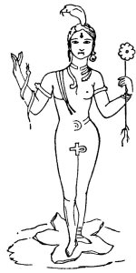

  
[Intangible Textual Heritage](../../index.md)  [Sacred
Sexuality](../index.md) 

------------------------------------------------------------------------

<table width="75%" data-align="CENTER">
<colgroup>
<col style="width: 33%" />
<col style="width: 33%" />
<col style="width: 33%" />
</colgroup>
<tbody>
<tr class="odd">
<td width="50%" data-valign="CENTER"></td>
<td></td>
<td width="50%" data-valign="CENTER"><h3 id="the-masculine-cross-and-ancient-sex-worship" data-align="CENTER">The Masculine Cross and Ancient Sex Worship</h3>
<h4 id="by-sha-rocco" data-align="CENTER">by Sha Rocco</h4>
<h4 id="pseudonym-of-hargrave-jennings" data-align="CENTER">(pseudonym of Hargrave Jennings)</h4>
<h6 id="section" data-align="CENTER">[1874]</h6></td>
</tr>
</tbody>
</table>

------------------------------------------------------------------------

[Contents](#contents)    [Start Reading](asw00.md)

------------------------------------------------------------------------

This short book on ancient 'Phallic worship', as the Victorians called
it, contains much which is covered in the other entries in this
literature. Jennings has a compelling thesis about the role of sexuality
in ancient religions and their modern successors which bears careful
examination. There is also a lot of speculation, incorrect information,
conclusion-leaping and questionable etymology.

Jennings places an inordinate amount of signficance on anything that is
vaguely phallic looking or resembles a vagina. This includes pawn shop
signage, tortise heads, arched doors, lozange-shaped design elements,
and so on. While some of this is revealing and possibly valid, he
finishes off by pegging a fairly standard native Californian mortar and
pestle as a set of ritual phallic symbols. There are examples *ad
nauseum* of these items in the anthropologicial and archeological
literature of California, and none of them have ever been associated
with sex-worship to my knowledge. Sometimes a pestle is just a
pestle....

Hargrave Jennings also wrote [The Rosicrucians, their Rites and
Mysteries](../../sro/rrm/index.md), also available online at Intangible
Textual Heritage, where he goes into much more detail on the subject of
phallic worship.

*Introduction © 2003 J. Lelievre*

------------------------------------------------------------------------

[Title Page](asw00.md)  
[I. Origin of the Cross](asw01.md)  
[II. Yoni](asw02.md)  
[III. Unity](asw03.md)  
[IV. Phallic and Sun Worship](asw04.md)  
[V. The Phallus in California](asw05.md)  
[Author's Afterword](asw06.md)  
