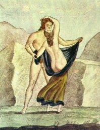

  
[Intangible Textual Heritage](../../index)  [Sacred
Sexuality](../index)  [Classics](../../cla/index) 

------------------------------------------------------------------------

<table width="75%">
<colgroup>
<col style="width: 50%" />
<col style="width: 50%" />
</colgroup>
<tbody>
<tr class="odd">
<td width="50%" data-valign="CENTER"></td>
<td width="50%" data-valign="CENTER"><h1 id="the-royal-museum-at-naples" data-align="CENTER">The Royal Museum at Naples,</h1>
<h6 id="being-some-account-of-the-erotic-paintings-bronzes-and-statues-contained-in-that-famous-cabinet-secret" data-align="CENTER">BEING SOME ACCOUNT OF THE EROTIC PAINTINGS, BRONZES, AND STATUES CONTAINED IN THAT FAMOUS "CABINET SECRET"</h6>
<h3 id="by-colonel-fanin." data-align="CENTER">BY COLONEL FANIN.</h3>
<h3 id="stanislas-marie-césar-famin-b.-1799-d.-1853" data-align="CENTER">(Stanislas Marie César Famin, b. 1799 d. 1853)</h3>
<h4 id="section" data-align="CENTER">[1871]</h4></td>
</tr>
</tbody>
</table>

------------------------------------------------------------------------

[Contents](#contents)    [Start Reading](rmn00)

------------------------------------------------------------------------

The ancient Roman and Greek cultures had a very different attitude about
sexuality than successive European cultures, more akin to that of the
[Kama Sutra](../kama/index). This, of course, was unimaginable to latter
day Europeans, who rigidly compartmentalized body, mind and spirit, and
to whom any sexuality was sinful and morbid.

Some of the best artistic expressions of this can be found in the
recovered city of Pompeii. Pompeii was frozen in time by the volcanic
eruption of Vesuvius in 79 A.D., and not unearthed until 1748. Pompeii
was a seaside resort, devoted to the arts, relaxation, and the pursuit
of pleasure. The excavators were horrified to discover erotic frescos,
mosaics, statuary and phallic votive objects. The moveable erotic
artifacts were taken to Naples and kept in seclusion in the Royal
Museum. The erotic wall and floor art had lockable metal boxes
constructed over them and were displayed to tourists for an extra fee
(women and children excluded). When I visited Pompeii in the late 1960s,
this peepshow was still in operation.

This work is a translation of a book by a 19th Century French
antiquarian César Famin. In 1816 (according to a citation in the Library
of Congress catalog) he published (under the initials M. C. F.) Musée
royal de Naples; peintures, bronzes et statues érotiques du cabinet
secret, avec leur explication containing sixty lithographs of the best
erotic artifacts in the Naples collection. The name of the artist is
unknown. The volume was published with the cooperation of the Naples
museum in a very limited edition. The French authorities confiscated and
destroyed most known copies of the original book. One ended up in the
'Private Case' of the British Museum. There is also a copy in the
Special Collections of the Library of Congress.

In 1871, an English translation of Famin's work was published in England
under the byline of 'Colonel Fanin'. Privately printed in a limited
edition, this translation became one of the rarest erotic books. A
photographic reprint of this was published in 1969 in paperback by
'Collectors Publications' (City of Industry, CA), under the title The
Secret Erotic Paintings. Collectors Publications was a fly-by-night pulp
publisher whose line consisted mostly of stroke books, 'marriage'
manuals, pirate editions of Grove Press books, and a few reprints of
rare erotic books. The 1969 paperback edition, with atrocious color
separations, was the source of this etext and the accompanying images.
Originally priced at $15 (an astronomical price for a poorly printed 150
page paperback at the time--a more typical price was 50 cents), used
copies of this run up to $50 on the Internet.

Famin's text to accompany the images is deeply conflicted. He is
obviously drawn to the subject matter and has a deep understanding of
the significance of the artifacts. He also takes every opportunity to
condemn Classical sexual practices and cultural values. Whether this is
a figleaf or a sincere reaction is impossible to determine. However, in
spite of the 'shocked, shocked' attitude in Famin's text, it contains
quite a bit of valid and well-researched information, including quotes
from classical authors and details of mythology, artistic methods,
spiritual practices, architecture, and literature.

These pictures are fairly explicit and aren't for everyone. Few of the
items on display here are excessively purient by contemporary standards.
These are historical cultural artifacts, not pornography. Nonetheless,
consider yourself warned.

*Introduction © 2003 J. B. Hare*

------------------------------------------------------------------------

 [Title Page](rmn00)  
[Introduction](rmn01)  
[Plate I: The Satyr and the Goat](rmn02)  
[Plate II: Marsyas and Olympus](rmn03)  
[Plate III: Venus Callipyge](rmn04)  
[Plate IV: Sarcophagus](rmn05)  
[Plate V: The God Pan on a Mule](rmn06)  
[Plate VI: Invocation to Priapus](rmn07)  
[Plate VII: Bacchanalia](rmn08)  
[Plate VIII: Sacrifice to Priapus](rmn09)  
[Plate IX: The Phalluses in Stone](rmn10)  
[Plate: X: Two Little Votive Columns](rmn11)  
[Plate: XI: Drillopota](rmn12)  
[Plate XII: Drillopota](rmn13)  
[Plate XIII: Drillopota](rmn14)  
[Plate XIV: Dancer to the Crotalum](rmn15)  
[Plate XV: A Priapus-Hermes](rmn16)  
[Plate XVI: Votive Figure](rmn17)  
[Plate XVII: The Hermes in Bronze](rmn18)  
[Plate XVIII: The Tripod](rmn19)  
[Plate XIX: Two Mimic Buffoons](rmn20)  
[Plate XX: Two Idols](rmn21)  
[Plate XXI: Three Bronze Figures](rmn22)  
[Plate XXII: A Votive Phallus](rmn23)  
[Plate XXIII: Phallus-Hermes](rmn24)  
[Plate XXIV: Votive Phallus](rmn25)  
[Plate XXV: Phallic Lamps](rmn26)  
[Plate XXVI: Votive Phalli](rmn27)  
[Plate XXVII: Votive Phallus](rmn28)  
[Plate XXVIII: Votive Phalli](rmn29)  
[Plate XXIX: Bronze Amulets](rmn30)  
[Plate XXX: The Surprised Nymph](rmn31)  
[Plate XXXI: The Flight of Aeneas](rmn32)  
[Plate XXXII: The Faun's Kiss](rmn33)  
[Plate XXXIII: A Satyr and a Bacchante](rmn34)  
[Plate XXXIV: Venus on her Shell Conch](rmn35)  
[Plate XXXV: Spinthria](rmn36)  
[Plate XXXVI: Mercury and Yphtima](rmn37)  
[Plate XXXVII: An Erotic Scene](rmn38)  
[Plate XXXVIII: Spinthria](rmn39)  
[Plate XXXIX: Spinthria](rmn40)  
[Plate XL: An Hermaphrodite](rmn41)  
[Plate XLI: An Hermaphrodite and Faun](rmn42)  
[Plate XLII: A Satyr and Hermaphrodite](rmn43)  
[Plate XLIII: A Faun and Bacchante](rmn44)  
[Plate XLIV: Spinthria](rmn45)  
[Plate XLV: Spinthria](rmn46)  
[Plate XLVI: Spinthria](rmn47)  
[Plate XLVII: Spinthria](rmn48)  
[Plate XLVIII: Spinthria](rmn49)  
[Plate XLIX: Apollo and a Nymph](rmn50)  
[Plate L: Aeneas and Dido](rmn51)  
[Plate LI: Spinthria](rmn52)  
[Plate LII: Spinthria](rmn53)  
[Plate LIII: Spinthria](rmn54)  
[Plate LIV: Group of Animals](rmn55)  
[Plate LV: Pan and Syrinx](rmn56)  
[Plate LVI: Etruscan Vase](rmn57)  
[Plate LVII: Hercules and the Stymphalic Birds](rmn58)  
[Plate LVIII: Bell-shaped Vase](rmn59)  
[Plate LIX: Bell-shaped Vase](rmn60)  
[Plate LX: Langelle Vase](rmn61)  
