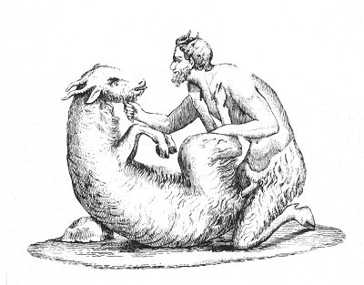

  
[Intangible Textual Heritage](../../index)  [Sacred
Sexuality](../index)  [Classics](../../cla/index)  [Index](index) 
[Previous](rmn01)  [Next](rmn03) 

------------------------------------------------------------------------

 

   
Plate I.

 

p. 1

# The Satyr and the Goat

PARIAN MARBLE. *Height about 2 feet*.

PLATE I.

THIS group, found among the excavations at Herculaneum, is more
remarkable for the expression which gives life to the marble than for
the purity of the execution. It might especially be wished that the goat
were more correctly drawn; but it is impossible not to admire the
expression of sensuous passion and intense enjoyment depicted on the
Satyr's features, and even on the countenance of the strange object of
his passion.

The crime of bestiality was not rare among the ancients, and it was not
confined to the intercourse of men with female animals; it extended also
to that of women with males. Herodotus (Book 2, § 46) informs us that in
his time a surprising thing happened in Egypt, in the Mendesian nome, a
he-goat had intercourse publicly with a woman, and the fact was widely
and generally known. But it is true the Egyptians might be inclined to
excuse this crime, being, as they were, under the conviction that the
god Pan frequently metamorphosed himself into a he-goat. In their
language the god and the animal were both alike named Mendes.

p. 2

In our own days there still exist, in Sicily and Calabria, half-savage
herdsmen who pass whole days in profound solitude, and come for a few
moments only every evening into the villages, where bread and oil are
distributed among them. These men, whose sole task is to watch over the
preservation of flocks, often conceive an insensate passion for the
animals confided to their care. The same thing also happened to the
shepherds of Virgil's time:--

"We know that towards thee in the obscure nook  
The jealous he-goats cast an angry look,  
While in the shade the nymphs with laughter shook;"

Virg. Eglog. III.

Plutarch says:--

"When Nature, supported though she be by law, cannot contain your
intemperance within the bounds of reason, as if it were a torrent
carrying it away perforce, she often and in many places commits great
outrages, disorders, and scandals against nature in the matter of the
pleasure of love; for there have been men who have conceived a passion
for goats, sows, mares, &c." [1](#fn_6)

------------------------------------------------------------------------

### Footnotes

[2:1](rmn02.htm#fr_6) PLUTARCH. *Discourse on the
Reason of Beasts*, xvii.

------------------------------------------------------------------------

[Next: Plate II: Marsyas and Olympus](rmn03)
