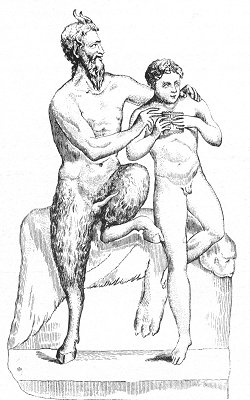

  
[Intangible Textual Heritage](../../index.md)  [Sacred
Sexuality](../index)  [Classics](../../cla/index)  [Index](index.md) 
[Previous](rmn02)  [Next](rmn04.md) 

------------------------------------------------------------------------

 

   
Plate II.

 

p. 3

# Marsyas and Olympus

Life-size.

PLATE II.

MARSYAS, the Satyr, the inventor, according to several mythologists, of
the pastoral flute, is represented in this group, one of the
masterpieces of antiquity, at the instant when, while giving lessons on
that instrument to young Olympus, he is preparing to attack the chastity
of his pupil. His features, on which a god-like majesty is impressed,
betray the transports of his passion, to which he appears to wish to
abandon himself: his mouth and nostrils open to fan the fire of
concupiscence which devours his breast. His left hand rests on the
youth's shoulder, as if to draw him towards him, and one of his legs,
which he lifts up in order the better to secure him, leaves no doubt as
to the object of his desires. The youth, meanwhile, looks down, confused
and abashed; he seems to break off his music; and we fancy we see him
tremble in every limb.

A rock, on which a lion's skin is spread, serves as a seat for the
Satyr.

Olympus, a son of Meon, a native of Mysia, lived before the Siege of
Troy. Plutarch attributes to him the composition of several hymns in
honour of the gods. Ancient authors agree in representing him as a pupil

p. 4

of Marsyas, whom Pliny has confounded with Pan. Suidas speaks as follows

"Olympus (a son of Meon, a Mysian), a flute-player and poet, a disciple
and favourite of Marsyas. He lived before the Trojan war, and gave his
name to Mount Olympus in Mysia."

This subject has been several times treated by the artists of antiquity.
Among others a painting was found at Herculaneum which has none of the
obscenity of the group here described: Marsyas is there represented with
the features of a Faun and the legs of a man. [1](#fn_7.md)

According to Pliny, the invention of the pastoral flute, composed of
several reeds bound together, and called *fistula* or *syrinx*, is due
to Pan. [2](#fn_8.md)

The above group is taken from the Farnese Museum.

------------------------------------------------------------------------

### Footnotes

[4:1](rmn03.htm#fr_7.md) Pausanias, x. 30.

[4:2](rmn03.htm#fr_8.md) Pliny, vii. 56.

------------------------------------------------------------------------

[Next: Plate III: Venus Callipyge](rmn04.md)
