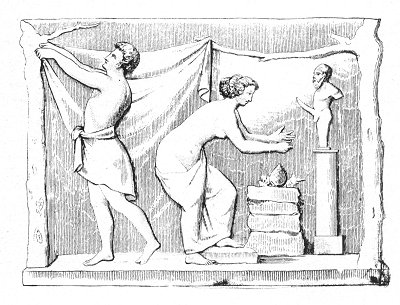

  
[Intangible Textual Heritage](../../index)  [Sacred
Sexuality](../index)  [Classics](../../cla/index)  [Index](index) 
[Previous](rmn06)  [Next](rmn08) 

------------------------------------------------------------------------

 

   
Plate VI.

 

p. 14

# Invocation to Priapus

BAS-RELIEF IN MARBLE.

PLATE VI.

EVERYTHING in this bas-relief indicates an interior scene, an act of
candour and piety, and not a disgusting orgy. The a married pair, clad
as decently as the nature of the sacrifice to which they are about to
proceed will allow, seem to be asking the god who presides over
generation to put an end to a grievous sterility; the expressive
gestures of the woman, especially, bear out this explanation. The
husband is occupied in stretching out a curtain which is to veil from
profane eyes the mysteries of the sacrifice.

Procul esto, profane!

The god, represented with the figure of a bald-headed and bearded old
man, reposes on a little column, before which we observe a kind of altar
erected in haste by the married pair, on which they have placed some
oak-leaves and the pine-apple which surmounted the thyrsus of the
priestesses of Bacchus.

The execution of this piece is not without some merit. The figures in it
are expressive and harmoniously grouped; but the defects are
sufficiently obvious to enable us to dispense with enumerating them all.
It will easily be perceived, for instance, that the man's back shows too
much convexity; that his legs are too short and his arms too powerful.
Doubtless nature is often thus made, but not that which artists use as a
model.

------------------------------------------------------------------------

[Next: Plate VII: Bacchanalia](rmn08)
