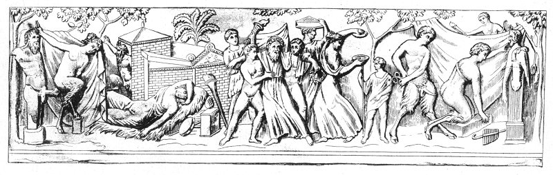

  
[Intangible Textual Heritage](../../index)  [Sacred
Sexuality](../index)  [Classics](../../cla/index)  [Index](index) 
[Previous](rmn07)  [Next](rmn09) 

------------------------------------------------------------------------

 

   
Plate VII.

 

p. 15

# Bacchanalia

BAS-RELIEF IN MARBLE,

PLATE VII.

ONE of the most celebrated pagan festivals, known by the name of
Bacchanalia--and sometimes disguised with slight modifications, under
the appellations of Eleusinia, Dionysia, Lampteria mysteries of Isis, of
the Cabeiri, of Mithra, Adonis, the Bona Dea, &c.--is represented in
this curious bas-relief. All these mysteries, and the greater part of
those which we have omitted, had also their dogmatic, liturgic, and
moral side; they differed not so much in doctrine and moral tendency as
in origin and rites. The generating power symbolised, a victim
sacrificed and purifications of the faithful,--these pervade all.

The Cabeiri, gods deriving their name from the Arabic word *Cabir*
(power), were four in number--Ceres, Persephone, Pluto, and Mercury.
With the initiated Ceres was called Oxieres; Persephone, Axiokersa;
Pluto, Axiokersos; and Mercury, Casmilus. Many of the celebrated men of
antiquity, such as Moses, Orpheus, Musæus, Homer, Archimedes, Dædalus,
Thales, Plato, Lycurgus, Solon, Pythagoras, &c., had themselves
initiated in these mysteries, which differed little in their liturgy,
and not at all in their moral tendency, from the Dionysia.

Bacchus was surnamed Dionysus, derived from Διος (the genitive of Ζευς,
Jupiter) and from *Nysa*, a town in which he is supposed to have been

p. 16

brought up. Several writers of antiquity have maintained that this god,
undoubtedly the Theban one, was the same as Osiris, whilst Ceres, in
whose honour the Eleusinian feasts were celebrated at Eleusis, was no
other that the Egyptian Isis. However this may be (and mythology is
often here at variance), it appears certain that the custom of the
Dionysiac festivals, of Bacchanalia, was introduced from Egypt into
Greece by a certain Melampus, the son of Amiathon. [1](#fn_10) He, according to Herodotus, introduced the
worship of Bacchus and of the phallus into Greece.

The Athenians celebrated the festivals of Bacchus with the greatest
splendour; and the Romans very soon introduced the Bacchanalia into the
whole of Italy. Originally no men were admitted, and consequently the
scandal was not very great; but afterwards, when men were introduced,
these festivals degenerated into such atrocious orgies that the Senate
thought it right to interfere. In the year of Rome 568 a decree was
issued for the suppression of these scandals throughout Italy. [2](#fn_11)

The places where the Dionysia were by preference held were isolated
spots; not only because the effrontery of the Bacchantes found
encouragement in solitude, but also because they were more adapted to
the echoing of the voice. "Evohe, evohe!" shouted Jupiter when
encouraging his, son Bacchus to overcome the obstacles which the jealous
Juno threw in his way, "Evohe, evohe!" repeated the eager actors in the
scene. Hence the word Bacchanal is used to designate a great uproar or
loud clamour.

The priestesses of Bacchus were fourteen in number; they were called
*Gerarai*, from *Gerasko* (*to grew old*), because they were chosen when

p. 17

advanced in years. They had fourteen altars, and presided at the
offering of fourteen sacrifices; they were the real Bacchantes, but
[subsequently](errata.htm#1) the name was extended to all the females
that took part in these outrageous scenes. Some authors have maintained
that the Bacchantes were virgins, and continued to be so, defending
themselves against all attacks amidst the most extravagant sensualities
and Bacchantic libations.

The statue of the god was generally painted over with cinnibar, besides
which it was clad in the skin of a stag, a panther, a leopard, or some
other animal. The hierophant, or priest, upon whom devolved the duty of
revealing sacred things, represented the Demiurgus, the Creator. The
torch-bearers went by the name of Lampadophores; their chief personified
the sun; the acolyte symbolised the moon, and the sacred herald
Mercury. [1](#fn_12)

Processions, in which vessels filled with wine and covered with
vine-branches were carried about, constituted the principal ceremonies.
Then came the *canephores*, young women carrying baskets of flowers and
fruit and after them the *Lampadophores*. These were followed by flute
and cymbal players; after whom a multitude of men and women dressed up
as satyrs, pans, fauns, sileni, nymphs, and bacchantes; crowned with
violets and ivy-leaves, with dishevelled hair, flushed with the fumes of
wine, their garments arranged with immodest art, so as to disclose to
the eye what the eye should not have seen, they marched onward, singing
the *phallica*, obscene songs in honour of Bacchus.

In the rear of this motley crowd came the Phallophores and Hyphalli, the
former exhibiting shamelessly to the spectators images of the *lingam*,
which by means of straps, were tied to the hip, and the latter carrying
the same objects, but of more gigantic dimensions, at the end of a long
pole.

p. 18

\[paragraph continues\] The whole procession was closed by the fourteen
priestesses, whom the archon, or high priest, had entrusted with the
preparatory arrangements.

In Egypt, the ceremony was very much the same, except that the Egyptians
had invented, instead of a phallus, figures about two feet high, which
they set in motion by a spring. These figures, of which the virile
attribute was almost as large as the rest of the body, were moved up and
clown with a string by the women, who carried them through the towns and
villages. When the crowd had reached its destination, which was either
the middle of a lonely forest or the enclosure of a deep valley
surrounded by rocks, these debauched fanatics drew the image of Bacchus
from a box which the Latins called the *arca ineffabilis*. It was then
placed on a Hermes, and a swine was offered to the god as a holocaust,
after which the wine and the fruit were liberally distributed among the
crowd. In a very short time the plentiful libations, the continuous
clamour, the immoderate hilarity, and the mingling of the sexes,
produced a general excitement, and drove the priests of the infamous
divinity to the highest pitch of frenzy. Every one behaved in the
presence of all as if he were isolated from the whole world, and several
hundreds of spectators witnessed the most disgraceful scenes of
debauchery. The naked women ran about exciting and inviting the men by
obscene words and gestures, and the latter never thought of what had
become in that crowd of their wives, their sisters, or their daughters.
They little heeded the shame, which was reciprocal. In a word, there was
no kind of licentiousness which was not improved upon on this occasion.

At last the night that had spread its veil over this scene of
abomination fled before the car of Phœbus and the god was restored to
the *arca ineffabilis*. The men staggering, filled with wine, and
enervated by their lusts, returned to their deserted homes, where they
were gradually joined by their wives and children, dishonoured and
defiled.

p. 19

The government of a civilized nation could not tolerate all this
scandal. We have already seen that the Bacchanalia were prohibited by
the Roman Senate.

The bas-relief which has furnished the subject of the above explanation
is a good representation of a Dionysiac or Bacchanal. In the centre is
the old Silenus, crowned with ivy, carrying a cup in one hand, and in
the other a crown, the emblem of his Victory over the drinkers. He
staggers. and would certainly fall to the ground but for two young fauns
who support him. A Lampadophor and a Canephor are behind him. To his
left may be perceived, in order of succession, a Bacchante, a female
cymbal-player, a young boy carrying some of the instruments of
initiation, an immodest *phallophore* fixing his strap, a female Satyr
placing the *pedum* and the *syrnix* at the feet of Bacchus-Hermes, who
may be recognised by his horns and by the stag's skin which envelopes
his chest. In the corner appears the god Cupid, who seems to have come
to take part in the festival. To the left of Silenus is a small altar,
and on it a pine-apple, and a lighted torch has been prepared for the
Sacrifice. A Bacchante, lying on a bear-skin, reclines voluptuously in
an attitude which leaves but little doubt as to the cause of her
exhaustion. In the background appears a Satyr, who, attracted by the
noise, leaves his dwelling in order to share in the orgie. Finally, at
the extremity of the bas- relief, a woman in the disguise of a Satyr
places herself on the attribute of a Priapus-Hermes. The scene takes
place in a forest, where may be seen several oaks and a palm-tree.

------------------------------------------------------------------------

### Footnotes

[16:1](rmn08.htm#fr_10) Herodotus II., § 49.

[16:2](rmn08.htm#fr_11) Herodotus, *ubi supra*.
Diodorus Siculus. Athenæus. *Memoires do l'Academie des Inscriptions*.

[17:1](rmn08.htm#fr_12) EUSEBIUS, *Catena
Patrum*, lib. III.

------------------------------------------------------------------------

[Next: Plate VIII: Sacrifice to Priapus](rmn09)
