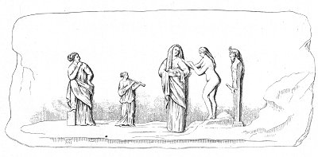

  
[Intangible Textual Heritage](../../index)  [Sacred
Sexuality](../index)  [Classics](../../cla/index)  [Index](index) 
[Previous](rmn08)  [Next](rmn10) 

------------------------------------------------------------------------

 

   
Plate VIII.

 

p. 20

# Sacrifice to Priapus

Height, 12 5/25 inches; length, 27 20/25 inches.

PLATE VIII.

IN this bas-relief is represented one of the most disgraceful ceremonies
of Paganism. Several women are conducting a young girl, whom we may
suppose to be newly married, to a Statue of Priapus, and the unfortunate
creature is already on the point of making to the marble figure the
painful sacrifice of her virginity. She alone, of all the troop, is
entirely naked; she bends her head with a confused and sad air, and
leans on the shoulder of an aged woman, possibly her mother. Not far off
a little girl plays on the double flute to stifle the cries of pain
extorted from the victim; farther off an old woman, resting on one knee,
looks upon the scene, and appears to grow impatient at the hesitation
manifested by the young wife.

We have spoken in our introduction of these abominable sacrifices
prevalent in ancient times. We do not consider them less revolting than
those which stained with blood the dark thickets in which the Druids
celebrated their mysteries. The latter coldly slaughtered men whom
society had already doomed to death, extracting absurd presages from the
groaning of their entrails and the palpitations of their tortured limbs.
The former caused the purest blood of innocent virgins to flow on an
obscene marble;

p. 21

without pity for the cries and torments of the youthful victims, they
pitilessly destroyed that magic talisman which makes the married pair
who have mingled together their first sentiments of desire, of shame,
and of pleasure, so dear to each other.

It may nevertheless be presumed that this impure rite did not long
subsist; but we may reasonably suppose that the priests of the false
divinities then turned the public credulity to their own advantage, and
themselves supplied the place of insensible idols.

In the temple of Isis at Pompeii, on an altar upon which the statue of
the goddess was placed, may be seen a hollow pedestal, into which access
was had by a concealed staircase, which terminated in the interior
dwelling of the priests. It was by this passage that the impostor passed
who was entrusted with the task of making the statues speak . . . . . .
*ab uno disce omnes*. [1](#fn_13)

------------------------------------------------------------------------

### Footnotes

[21:1](rmn09.htm#fr_13) The bas-relief here
spoken of is in terra-cotta. It belongs to the cabinet of M. de S. C.,
who has been obliging enough to communicate it to us. The subject which
it represents is repeated in one of the pieces belonging to the
collection of the secret cabinet of the Royal Museum of Naples; but the
limits within which we have been obliged to confine this work not having
allowed us to give both, we have chosen this one as the more complete
and ingenious of the two.

------------------------------------------------------------------------

[Next: Plate IX: The Phalluses in Stone](rmn10)
