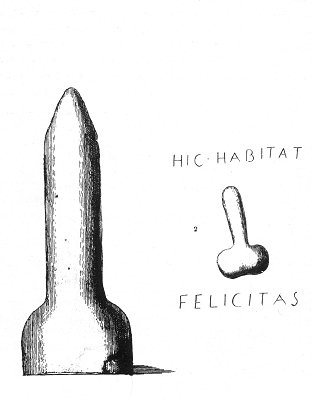

  
[Intangible Textual Heritage](../../index)  [Sacred
Sexuality](../index)  [Classics](../../cla/index)  [Index](index) 
[Previous](rmn09)  [Next](rmn11) 

------------------------------------------------------------------------

 

   
Plate IX.

 

p. 22

# The Phalluses in Stone

No. 1.--FIRST PHALLUS. *Height 17 5/25 inches*.

PLATE IX

IN certain towns, the corners of streets and the railings of public
fountains may still be seen embellished with posts the form of which
scarcely differs, except in the base, from the one here given. The habit
of seeing them every day is alone the cause of their not being remarked;
however, in those newly constructed, especially in the fine parts of
Paris, a form has been adopted at once simpler and less indecorous.

Priapus was the protector of gardens; it was he who kept off the thieves
from them. Devout persons thought it sufficient for that purpose to
place his statue and attributes on the limits of their property; but a

certain area of land could not have been protected equally on all sides
by it small number of these statues, and the multiplication of them
would have

rendered the precaution too costly; their place was supplied by coarse
images of the nature of that which is represented here.

NO. 2.--SCULPTURE. *Height, 16 10/25 inches; width, 10 20/25 inches*.

As we have already said, the attributes of the garden god were accounted
sure preservatives against the influence of evil-disposed persons, of
magicians, and sorcerers; and this belief is still prevalent in the
East, in

p. 23

\[paragraph continues\] Italy, and in Spain. It must not, then, be
wondered at that at a period when this worship was freely admitted into
the palaces of the great and rich, there should be found a humble
artisan who had the notion of placing on his stall the protecting image
of this singular god. *Hic habitat felicitas*, here happiness dwells; it
is in the shelter of this revered image that we live exempt from trouble
and care.

This stone was found at Pompeii, on the door of a baker's shop.

------------------------------------------------------------------------

[Next: Plate: X: Two Little Votive Columns](rmn11)
