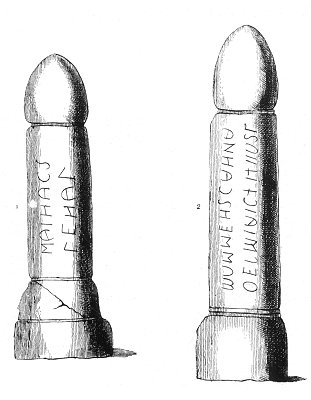

  
[Intangible Textual Heritage](../../index.md)  [Sacred
Sexuality](../index)  [Classics](../../cla/index)  [Index](index.md) 
[Previous](rmn10)  [Next](rmn12.md) 

------------------------------------------------------------------------

 

   
Plate 10.

 

p. 24

# Two Little Votive Columns

No. 1.--*Height, 22 5/25 inches*. NO. 2.--Height, 26 15/25 inches.

PLATE X.

THESE votive columns, in the form of a phallus--strange monuments of a
shameful worship--each bear an inscription in the Uscan language and
character.

The Uscans were a people of Campania, between Capua and Naples they were
so much given to sensual pleasures that their corruption became
proverbial throughout Italy. This people instituted highly indecent
games, and represented in Atella, one of their towns, certain plays, in
which the recklessness of debauchery reached its culminating point; but
the Romans, already very depraved themselves, gradually adopted these
licentious performances, and called them from the name of the town,
*Atellania*. The degradation of Uscan morals was not without its
influence on the Greek language, which formed the basis of the
vernacular of Campania: thus the Latins used *Osce loqui* to express
both licentious language and obsolete phraseology. From the Latin
*Osoi*, or *Opsi*, *Obsci*, is derived the word OBSCENE.

According to Silius Italicus, the country of the Uscans comprehended all
the towns along the coast, between Terracina and Cumæ. The principal

p. 25

town was Capua, afterwards so famous for its pleasures, or rather
debaucheries. This nation was destroyed, and the remnants of it became
amalgamated with the neighbouring peoples; but for a long time the Uscan
language was used in Rome for the obscene plays. All knowledge of this
language has now entirely disappeared from the memory of man, and
therefore the Uscan as well as the Etruscan inscriptions are for the
most part indecipherable. Several antiquarians, among them the learned
Montfaucon, have given their attention to the various transformations of
the Greek characters from their Phœnician origin to their entire
annihilation among the peoples of Italy. This, however, they could not
do with the language. It would be in vain to find anything like pure
characters in the Etruscan or Uscan inscriptions through the aid of
Greek palæography, because the interpretation of the words would not the
less, in most cases, be impossible.

Figure 1. represents merely two words; having regard to a certain
resemblance of characters, we might perhaps there recognize the
inscription To the *Son of Maia*. This is therefore most likely a votive
monument to Mercury, but we do not desire to overrate the weight of this
hypothesis. It appears, however, that the second word begins with ΓΕΗ,
derived from γῆ, earth, root of generation; to engender, to produce,
γείνομαι.

------------------------------------------------------------------------

[Next: Plate: XI: Drillopota](rmn12.md)
