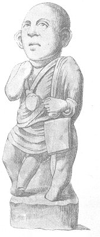

  
[Intangible Textual Heritage](../../index)  [Sacred
Sexuality](../index)  [Classics](../../cla/index)  [Index](index) 
[Previous](rmn11)  [Next](rmn13) 

------------------------------------------------------------------------

 

   
PLATE XI

 

p. 26

# Drillopota.

TERRA COTTA. *Height 11 5/25 inches*.

PLATE XI.

THIS grotesque little figure was found at Civita. [1](#fn_14) It represents one of those unfortunate
beings whose only purpose in life seems to be as a kind of plaything to
their fellow-creatures. What have they done to deserve the worst share
in the distribution of the common heritage, those sad abortions of a
capricious mother? Unfathomable Providence! here too, undoubtedly, we
should have cause to wonder at Thy will, if Thy motive were known; but
it is not given to man to read Thy sacred pages; he knows that the truth
exists, he feels it, but he knows it not.

As it was the custom only a short time ago in several courts of Europe,
so in antiquity the wealthy had certain dwarfs in their service, whose
business it was to amuse the company when dull. They had to dance on the
table, and were shut up in gigantic pasties. They poured out wine for
their masters, and followed them when they went out. They were called
*moriones*, from μωρὸς, a fool, and *morus*, a word used by Plautus; or
*fatui*, whence our word *fatuous* comes; and sometimes *insani*,
nugatores, &c.

p. 27

These buffoons were in the habit of shaving their heads to make
themselves appear still more ridiculous. The present figure is entirely
bald: near his left arm are the *tavolæ pugillares*, tablets which the
children used at school. He wears round his neck the golden ball
(*bulla*), which distinguished the sons of the nobles and senators. The
origin of this distinction dates from Tarquin the Elder, who awarded
this mark of honour to his son for having conquered his opponent in
single combat. [1](#fn_15) The *bulla* could be
opened at pleasure, and was used to keep talismans in.

The tunic of this singular personage is raised, and reveals a phallus of
enormous proportions. This agrees with the assertion of Theophrastus,
that the *membrum* of dwarfs was out of all proportion with their body;
that is to say, that the former was just as large as the latter was
diminutive. [2](#fn_16)

Καὶ Θεόφραστος ὡς νάννον αἰδοῖον ἔχοντα  
μεγα, οἱ γὰρ νάννοι μέγα αἰδοῖον ἔχουσι· [3](#fn_17)

 

------------------------------------------------------------------------

### Footnotes

[26:1](rmn12.htm#fr_14) A town of Naples, near
Cassano, in the northern part of Calabria.

[27:1](rmn12.htm#fr_15) Pliny, xxiii. 1.

[27:2](rmn12.htm#fr_16) The drilled vessel
behind this figure represents one of those drinking-cups called
*drillopota*, of which we shall speak when explaining another plate.

[27:3](rmn12.htm#fr_17) SUIDAS.--HESYCHIUS.

------------------------------------------------------------------------

[Next: Plate XII: Drillopota](rmn13)
