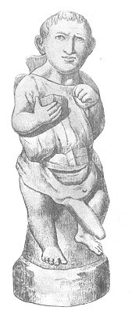

  
[Intangible Textual Heritage](../../index.md)  [Sacred
Sexuality](../index)  [Classics](../../cla/index)  [Index](index.md) 
[Previous](rmn12)  [Next](rmn14.md) 

------------------------------------------------------------------------

 

   
PLATE XII

 

p. 28

# Drillopota.

TERRA COTTA. *Height, 16 5/25 inches*.

PLATE XII.

BEHIND this figure is seen a vessel, which represents one of those
obscene vases called *Drillopotæ*, [1](#fn_18.md)
out of which the ancients were wont to drink on certain occasions,
undoubtedly in honour of Venus, or perhaps of Bacchus; for, assuredly it
would be difficult to suppose anything like dignity or seriousness in
such ceremonies. For a long time the corruption of the antique nations
led them to feign a disgraceful attachment for the immodest ceremonies
to which they were no longer able to yield a sincere worship.

This dwarf holds two objects in his hand which it would be difficult to
qualify--two lumps of bread, perhaps. He carries in his belt a sort of
casket, which may be the *crepundia*, a small box or purse for children
to keep their toys in.

This *Drillopota* comes from Civita.

------------------------------------------------------------------------

### Footnotes

[28:1](rmn13.htm#fr_18.md) From δρῖλος, the virile
member, and ποτὴρ, a drinking-cup.

------------------------------------------------------------------------

[Next: Plate XIII: Drillopota](rmn14.md)
