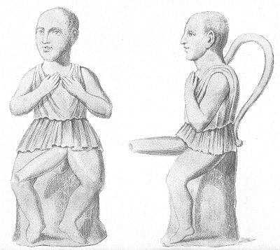

  
[Intangible Textual Heritage](../../index)  [Sacred
Sexuality](../index)  [Classics](../../cla/index)  [Index](index) 
[Previous](rmn13)  [Next](rmn15) 

------------------------------------------------------------------------

 

   
PLATE XIII

 

p. 29

# Drillopota.

TERRA COTTA. *Height, 16 16/25 inches*.

PLATE XIII.

LIKE the former, this is another specimen of the *drillopotæ*,
representing a dwarf, a child's body with the head of an old man. Its
figure is as much out of proportion as its attitude is obscene and yet
its gestures seem too indicate modesty.

Sometimes the ancients made use of certain *drillopotæ*, made of glass
these were called *phallovitroboli*, or *phalloveretroboli*,
drinking-glasses in the form of phalluses. [1](#fn_19) Juvenal says: "He drinks from a Priapeian
glass;" [2](#fn_20) and the commentator adds:
"Glass [phalluses](errata.htm#2) called *drillopotæ*."

The present vase is seen full and side-face; it will be remarked that
the upper part has no opening, whence it appears that the vessel was
turned upside down and filled at the bottom; it is probable that they
drank from he projecting part as from a spout. *O tempora*!!

Many other *drillopotæ* have been found at Civita, Herculaneum, and
several parts of Magna Grecia; but as they are not in any way different
from those we have described, we have deemed it useless to repeat a
description of them.

------------------------------------------------------------------------

### Footnotes

[29:1](rmn14.htm#fr_19) PLINY, xxxiii. 1.

[29:2](rmn14.htm#fr_20) JUVENAL, *Sat*. ii. 95.

------------------------------------------------------------------------

[Next: Plate XIV: Dancer to the Crotalum](rmn15)
