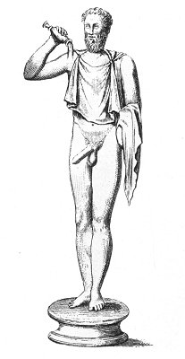

  
[Intangible Textual Heritage](../../index)  [Sacred
Sexuality](../index)  [Classics](../../cla/index)  [Index](index) 
[Previous](rmn16)  [Next](rmn18) 

------------------------------------------------------------------------

 

   
Plate XVI.

 

p. 35

# Votive Figure

BRONZE. *Of the size of the original*.

PLATE XVI.

AN old man, whose left hand is enveloped in the chlamys, after the
manner of athletes, pours on his phallus the liquor contained in a vase
of elegant form.

Here, as perhaps in the preceding plate, the allegorical meaning
constitutes one of the most important degrees of initiation into the
mysteries of Isis and Osiris, of Bacchus or of the Sun. Ablution was a
symbol dear to the ancients; it indicated at one and the same time the
union of water and fire, at the period when baths are necessary to
temper the ardour of the latter. Thence, as we have already said, is
derived the origin of the

p. 36

fires of the festival of St John, and of the sprinklings of cold water
still in use at that period of the year in some parts of France.

In the application, the positive meaning is, we think, the
representation of a custom very common among the Romans. [1](#fn_24) The vase which the old man holds in his
right hand is supposed to contain an aphrodisiac essence: and indeed it
may be remarked that figures of this kind all represent old men, the
young not needing to have recourse to these irritant preparations in
order to prepare themselves for the act of coition.

To the details we have given on this subject in the preceding article,
we may add the following:

Antony, having become desperately enamoured of Cleopatra, fell for some
time into a strange dilemma. The excesses in which he had at first
indulged in the arms of his royal mistress had weakened him to such a
degree as to disable him for a long time from satisfying her
ever-impetuous and ever-increasing desires. And assuredly Cleopatra was,
both by temperament and habit, the least likely woman in the World to
content herself with a meagre ration. History has preserved the
remembrance of the truly prodigious prowess of this celebrated woman:
"In one night, having assumed a veil, she lay with a hundred and six men
in a public brothel."

Antony, on hearing of the numerous infidelities of his mistress, became
greatly enraged, and even threatened to destroy her if she did not alter
her behaviour. Cleopatra, terrified, resigned herself to abstinence, but
at the expense of her health. She fell so dangerously ill that Antony,
in despair, thought it his duty to apply forthwith to Quintus Soranus, a
learned doctor and grave philosopher. He laid before him, with great
frankness, the causes

p. 37

of the malady which was ravaging the beautiful Cleopatra, importunately
entreating him to point out both the means of tempering the ardour which
internally devoured the passionate Queen, and those of reviving in
himself desire and vigour. Quintus Soranus justified the confidence
reposed in him by the Consul, and wrote him a letter on the subject,
which Latin antiquity has preserved for us, and which contains the
following passages:--

"Touched with your troubles, as a devoted friend should be, I have long
sought by what means I could alleviate, or even entirely destroy, the
anxiety you have confessed to me. I have consulted several books, and
interrogated the secrets of nature, both in the class of animals, in
that of stones, of trees, and of herbs; and although I found many
remedies to cool the ardours of lust, I did not, however, discover the
means of extinguishing the fire of libertinism, until at last, in
following out my researches to the temple of Venus in the island of
Scio, I found there a book which contained the veritable recipe, and the
virtue of this ointment I now send you, as also some other preparations
preserved for the use of women; you will be able to judge of its
efficacy both by what I tell you and by your own experience. The virtue
of this ointment is such that any woman feels herself so absorbed in the
love of the man who makes use of it, in holding intercourse with her,
that the memory of every other passion immediately vanishes. This is the
way in which you must at first proceed: Abstain during nine days from
all venereal labour, so as to lose none of your strength. Make use of
warm aliments, as also of cheese, eggs, strong wine, and spices. If you
were old, or your temperament naturally cold, I might point out to you
the stimulants used in medicine; but as you have no need of them, you
can make use of ordinary meat. What you must especially attend to, in
the next place, is that, after the ninth day, when you prepare yourself
for the amorous combat, your instrument shall not be less than ten
inches long. If you cannot obtain this naturally, you must do it by
means of art."

------------------------------------------------------------------------

### Footnotes

[36:1](rmn17.htm#fr_24) See the explanation of
Plate XV.

------------------------------------------------------------------------

[Next: Plate XVII: The Hermes in Bronze](rmn18)
