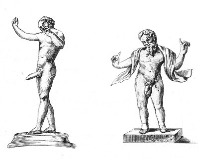

  
[Intangible Textual Heritage](../../index.md)  [Sacred
Sexuality](../index)  [Classics](../../cla/index)  [Index](index.md) 
[Previous](rmn19)  [Next](rmn21.md) 

------------------------------------------------------------------------

 

   
Plate XIX.

 

p. 42

# Two Mimic Buffoons.

BRONZE. Height about 2 6/25 inches.

PLATE XIX.--No. 1.

GOOD in execution, this little bronze represents one of those buffoons
whom the Latins called *sanniones*. Their occupation was to create
laughter with the aid of pantomime. The present one is entirely nude,
and displays a phallus of gigantic proportions. His bald and bearded
head inclines above his right shoulder. He is making an expressive
grimace, and carrying the fore finger of his left hand to his mouth. His
other hand is closed, with the exception of the thumb, which is passed
between the fore and middle finger. This indecent gesture is still in
our own day called "making the fig." The expression is common in early
every country of Europe. In England the phrase "don't care a fig" is
well known, and Shakespeare speaks of the "*Italian Ficco*" more than
once. Nurses now-a-days may often be seen threatening children with the
sign, little thinking of the origin and true meaning of the symbol.

To Mercury was consecrated the first fig--and to Priapus the virginity
of a young girl. Is this analogy the origin of the denomination given to
this immodest gesture?

The ancient Southern peoples, and especially the Greeks, held pantomime
in high esteem. The art was transmitted to the Romans, and perpetuated

p. 43

through all the south of Europe; it is especially carried to a great
point of perfection in Sicily and Naples. At Naples, the stage
understands how to turn to profit the theory of the art of pantomime.
The Neapolitan punchinello is entrusted with the principal part. This
character, of which the type is the "laughing, censorship of manners,"
is of the greatest antiquity, and the little figure we are explaining
may be considered as a veritable punchinello; for irk all times, and
among all nations, persons have been found who, under the mask of
buffoonery, have arrogated to themselves the right of saying anything
and everything.

As for the particular and local character of the Neapolitan punchinello,
his origin may be said to date from the middle ages. At the time when
the House of Anjou occupied the throne, there was a French governor at
Naples, of sombre and atrabilious mood. He had in his service a domestic
born at Acerra, a little town situated on the western side of Mount
Vesuvius, whose inhabitants still dress like the punchinello, that is to
say, wearing a Calabrian hat of the shape of a sugar-loaf and without
any brim, their only clothing being drawers of commodious width and a
shirt above, bound round the loins in the form of a blouse.

This servant was called *Paolo Ciniello*. He was a buffoon, witty,
gluttonous, and cowardly. His master was very fond of his repartees,
which were full of naïveté, wit, and good sense. In moments of
ill-humour he was in the habit of calling for him, and not being able to
repeat his name except with great difficulty, he called him
*Poulchinelle*, of which the Italians made *Pulcinella*.

No. 2, a little figure in bronze, found at Pompeii, is another
mimic-buffoon who is balancing his head and arms with great nonchalance,
after this manner of the Chinese pagods. His two forefingers are
stretched out, and seem to form a pair of horns.

------------------------------------------------------------------------

[Next: Plate XX: Two Idols](rmn21.md)
