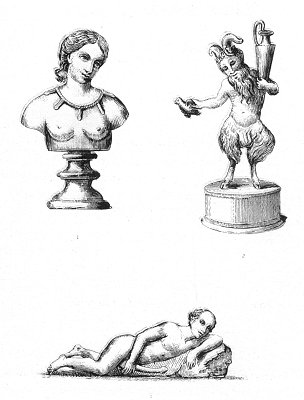

  
[Intangible Textual Heritage](../../index)  [Sacred
Sexuality](../index)  [Classics](../../cla/index)  [Index](index) 
[Previous](rmn21)  [Next](rmn23) 

------------------------------------------------------------------------

 

   
Plate XXI.

 

p. 45

# Three Bronze Figures.

Of the original size.

PLATE XXI.

SEVERAL phalluses are suspended to a necklace round the neck of the
first figure--a charming little bust of a woman. We have already said
that among the Egyptians, and in Greece and Italy, the gravest matrons
did not blush to wear these amulets in public. It was especially for
barren women, and for those who generally brought forth children with
difficulty and miscarriage, that these charms were reserved; but some
only saw in these trinkets a kind of votive offering displaying the
image of Priapus as many times as the god had satisfied their desires.
"The unwearied Messalina lay with many men in one night. From none did
she require any reward that he did not bring of his own free will. When
day returned, the conqueress dedicated four-and-twenty wreaths of rose
and myrtle to Priapus, Marsyas, and other mirthful deities: each being a
thank-offering for a victory." [1](#fn_27)

Were it not for the undeniable monuments that antiquity has bequeathed
to us, we should be led to believe that civilized nations have at all
times had the same ideas as ourselves about decency, so natural does it
appear not to

p. 46

separate mystery from the pleasures of the senses--unless we would
become like the beasts! It was not so, however; and the countries that
gave birth to Socrates, Plato, Lycurgus, Cicero, and Antoninus were
sullied by the most dissolute manners and the most disgusting orgies.
Some centuries have elapsed since a religion of purity and chastity
struck its powerful roots into the soil of old Europe, and yet some
traces are still to be found there of the infamous worship of the god
Phallus. Even in France, a country which for a long time past has
marched in the van of civilization, later centuries have witnessed
public processions in which, out of devotion, men who called themselves
flagellants appeared entirely naked!

No. 2 represents a satyr, perhaps the god Pan, whose head is surmounted
by an enormous pair of horns. A long beard flows over his chest. In one
hand he holds an amphora, full, doubtless, of wine:

"For Venus would freeze if unaided by Bacchus and Ceres."

With the other he holds by its wings a bird, which Sylvain Maréchal, and
the academicians of Naples before him, have declared to be a cock, but
which nowise resembles that animal. Its size would lead us to take it
for a pigeon or a turtle, and its shape for a sparrow. All these birds,
whose loves are renewed several times in the year, are very lascivious:
they were therefore consecrated to Venus.

It is to be presumed that this little figure was one of the household
gods of a Roman dwelling: his large horns and immoderate phallus served
to keep off sorceries. Let us remark in passing that, whatever may have
been said on the subject, the custom of insulting husbands deceived by
their wives by imagining them to have horns is merely derived from that
very ancient, but yet very false opinion, that of the two men he is the
happier whose wife is unfaithful; for the need she experiences, at every
moment of the day, to lull to sleep the suspicions of him whom she is
outraging, induces her incessantly to feign sweetness, resignation-all
the virtues, in short, which she

p. 47

no longer possesses; besides that, her libertinism is sometimes only the
result of ambition, and thus procures in the family an case and
affluence which, without her, it would never know. Whilst the husband
whose wife is virtuous must, they say, pay with usury for the sacrifices
his companion imposes on herself through love of honesty. He is indeed
to be pitied, whilst the former is as happy as if he wore horns; for
horns, like phalluses, have the property of keeping off witchcraft and
incantations, and incessantly bringing down joy, riches, and
tranquillity. We have said, in the introduction to this work, that the
superstition relative to horns still exists in all its vigour in the
south of Italy, in Spain, and in the Levant.

It forms no part of our plan to demonstrate how absurd and immoral is
the opinion which makes a deceived husband a happy man, and a respected
husband an unfortunate being. Greatly to be pitied are those whose own
hearts will not suggest to them all that we omit here! Truly those are
to be pitied who cannot appreciate all the respect and consolation that
there is in the pride of a woman who has nothing to reproach herself
with, who can carry her head high everywhere; who, in fine, is not
afraid, when necessary, to interpose between a guilty son and an angry
husband, because she knows that son is no stranger in the family, and
that he has a right to the paternal condescension!

The *third* figure is that of a bald old man lying on the ground. He is
entirely naked, his right hand rests on a large erect phallus, and his
left arm is passed under his head. As there existed in Kircher's museum
a statue of the Indian Buddha, very nearly similar to this figure, with
the Latin inscription, "DIVO MERCURIO" (to the god Mercury), certain
Neapolitan antiquaries have believed that this also was the Indian
Buddha, the ninth incarnation of Vishnu, the Greek Mercury, the *Thoth*
of the Egyptians, &c., and what gives some weight to this opinion is
that this piece comes from Egypt.

------------------------------------------------------------------------

### Footnotes

[45:1](rmn22.htm#fr_27) *Joannes Meursius*.

------------------------------------------------------------------------

[Next: Plate XXII: A Votive Phallus](rmn23)
