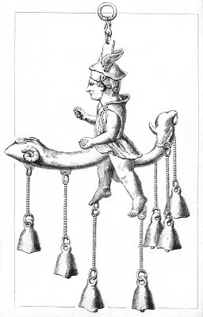

  
[Intangible Textual Heritage](../../index.md)  [Sacred
Sexuality](../index)  [Classics](../../cla/index)  [Index](index.md) 
[Previous](rmn23)  [Next](rmn25.md) 

------------------------------------------------------------------------

 

   
Plate XXIII.

 

p. 49

# Phallus-Hermes.

Height, 5 inches.

PLATE XXIII.

THIS bronze seems to have been used as a lamp. A Hermes, with the
petasus on his head, in a threatening attitude and with clenched fists,
seems animated by a violent passion of anger or concupiscence. His tunic
is raised by a phallus of gigantic proportions, terminating in the head
of a he-goat.

The he-goat, of which the ancients had remarked the lasciviousness, was
consecrated to Priapus.

This lamp is especially remarkable for a triple phallus attached to the
posterior part of our Hermes.

Mercury (or Hermes) was one of the most immodest of the pagan gods. It
was to him that Jupiter entrusted his amorous messages. He was in
general the procurer of the gallant inhabitants of Olympus.

He had many temples, and his statue was rarely clad with any more
decency than that of Priapus himself.

------------------------------------------------------------------------

[Next: Plate XXIV: Votive Phallus](rmn25.md)
