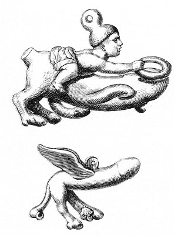

  
[Intangible Textual Heritage](../../index.md)  [Sacred
Sexuality](../index)  [Classics](../../cla/index)  [Index](index.md) 
[Previous](rmn25)  [Next](rmn27.md) 

------------------------------------------------------------------------

 

   
Plate XXV.

p. 53

# Votive Phalli.

PLATE XXV.

No. 1.

A TWO-FOOTED phallus, having itself a second phallus and two wings, or
fins, is represented by this lamp. A little child, wearing a kind of
Phrygian cap, which served to suspend the lamp, is seated astride on
this singular Priapus, and leans to place a crown upon its head. Some
antiquaries have considered this crown to be intended as a sort of check
which the young rider was desirous to put on his steed; but the opinion
does not appear to us tenable. The ancients used bits for their horses
which in no wise resembled the object we have here.

This little child astride on a phallus recals the obscene idea which in
all times and among all peoples has attached itself to the word *ride*;
in Latin, *equitare*; in Italian, *cavalcare*.

The two feet of the animal, which form the body of the lamp, terminate
in two heads of phalluses.

From what we have previously said, every reader may explain to himself
the meaning of this bronze, for the crown, the feet, the wings, or fins,
indicate clearly enough the power of the generative principle innate
with all animals living on land, in air, or in water.

No. 2. BRONZE.

Another votive phallus, with wings and the feet of a quadruped.

------------------------------------------------------------------------

[Next: Plate XXVI: Votive Phalli](rmn27.md)
