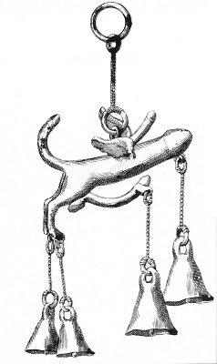

  
[Intangible Textual Heritage](../../index.md)  [Sacred
Sexuality](../index)  [Classics](../../cla/index)  [Index](index.md) 
[Previous](rmn27)  [Next](rmn29.md) 

------------------------------------------------------------------------

 

   
Plate XXVII.

 

p. 55

# Votive Phallus.

BRONZE FROM HERCULANEUM. Length, 3 9/25 inches.

PLATE XXVII.

HE hinder part of this bronze is somewhat like a horse. The wings are
typical of the rapidity of fecundation. This novel Pegasus has three
phalluses, one of which occupies the ordinary place assigned to it by
nature among the mammalia. The second is raised like a tail, and the
third rises from between the wings, in the place which would be occupied
by a rider. It is evident that, from whatever side the maleficent spirit
might present itself, it found a talisman ready to repulse it: much in
the same way that, in our own day, a public building is surrounded with
lightning conductors.

------------------------------------------------------------------------

[Next: Plate XXVIII: Votive Phalli](rmn29.md)
