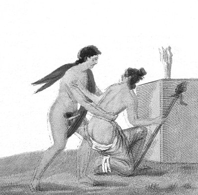

  
[Intangible Textual Heritage](../../index)  [Sacred
Sexuality](../index)  [Classics](../../cla/index)  [Index](index) 
[Previous](rmn30)  [Next](rmn32) 

------------------------------------------------------------------------

 

   
Plate XXX

 

p. 60

# The Surprised Nymph.

FRESCO FROM POMPEII.

PLATE XXX

A YOUNG girl, bearing a thyrsus, or rather a kind of crook, which would
seem to indicate a shepherdess, is sheltering herself at the foot of the
statue of Minerva in order to escape from the pursuit of her lover: a
symbol of the combats waged by love against wisdom. Her precaution is
useless, for the young man, the shape of whose cars would lead us to
take him for a faun, tears her away from this last shelter; his ardour,
and the weakness with which the young girl repulses him, sufficiently
indicate the not far distant issue of the combat.

Some persons have thought that this fresco may represent the rape of
Cassandra, committed by Ajax, the son of Oileus, in the temple of
Minerva:

"Behold the royal prophetess, the fair  
Cassandra, dragg'd by her dishevell'd hair;  
Whom not Minerva's shrine, nor sacred bands,  
In safety could protect from sacrilegious hands." [1](#fn_34)

This supposition does not seem probable; for the rape of the priestess,
the daughter of Priam, often exercised the talent of the artists of
antiquity, but never under the form of an allegory. And, indeed, what is
the use of allegory in a subject where the painter works with all the
licence of art?

p. 61

The fresco would rather recall an anecdote cited by Apuleius:

"The beautiful Chromis, daughter of the shepherd Chrasias, on going to
pray for wisdom in a wood consecrated to Minerva on the eve of her
marriage with the young Alcimedes, was surprised by Myrtillus, whose
prayers she had disdained, and was sacrificed without pity at the feet
of the statue of the goddess. The sacrilegious rival had taken the
disguise of a faun. This insult did not go unpunished. Myrtillus never
left the sacred wood, and Minerva restored to the young girl her
virginity."

However, in. this kind of subjects, it often happens that commentators
exhaust themselves in conjectures to discover a hidden meaning which did
not exist in the mind of the ancients; more especially in the libertine
fancies of Greek or Roman artists, it is often useless to look for an
allegorical, historical, or imitative idea. Those who painted the
frescoes and arabesques in the triclinia and boudoirs of Baïa, Pompeii,
and Herculaneum gave themselves up entirely to the folly of their
caprice and to the shamelessness common to artists of their time. They
only cared to satisfy the passions of the employer, without troubling
themselves about the morality of art. It has often happened that an
allegory has been understood in a sense opposite to the idea that guided
the pencil; thus, in the *Nymph Surprised*, might we not discover an
epigrammatic idea? May it not be a satire against Wisdom, a goddess
powerless to save innocence even when it shelters itself at the foot of
her altar?

Commentators sometimes injure the interests of art when they give forced
explanations, and seem to delight in contradictions. It is best to leave
a subject of antiquity in that mysterious vagueness which possesses far
more charm for the lover of art than that conflict of erudition and
science which is neither error nor truth.

------------------------------------------------------------------------

### Footnotes

[60:1](rmn31.htm#fr_34) VIRG., Æn. II.

------------------------------------------------------------------------

[Next: Plate XXXI: The Flight of Aeneas](rmn32)
