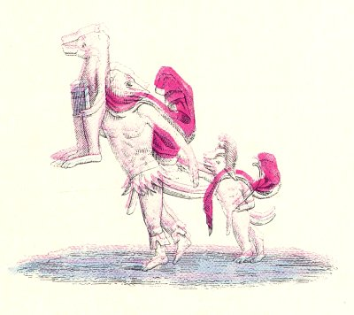

  
[Intangible Textual Heritage](../../index.md)  [Sacred
Sexuality](../index)  [Classics](../../cla/index)  [Index](index.md) 
[Previous](rmn31)  [Next](rmn33.md) 

------------------------------------------------------------------------

 

   
Plate XXXI.

 

p. 62

# The Flight of Aeneas.

Height, 10 inches; breadth, 12 inches.

PLATE XXXI.

THIS fresco was discovered at Gragnano in 1760, and represents in
caricature the flight of Æneas. The ancients were fond of such grotesque
representations, which they called *cercopitheci* (long-tailed monkeys),
or *cynocephali* (dog-headed monkeys). [1](#fn_35.md)

The Trojan hero wears round his neck that kind of garment which was
called a chlamys. It is of dark red, as is also that of young Ascanius.
The latter, who wears the Phrygian cap, of the same colour, gives his
left hand to his father, and carries in the other a kind of reed or
little stick he has picked up while playing on the road; for childhood,
happy and heedless, knows no danger; the features of Anchises, on the
other hand, bear the impress of a melancholy gravity. The unfortunate
old man has survived the fall of those sacred walls which Hector was
unable to protect; but in his flight he has not forgotten his household
gods; they are safe in the casket which he holds in his hands. At the
same time Æneas, the valiant protector of the family. looks behind, no
doubt for his faithful spouse, of whom he is doomed to see nothing more
but the plaintive shade. It may

p. 63

easily be seen that the safety of the family had necessarily to depend
on him, for he seems to be of a higher organization of life than his
companions: he has at least the legs of a man, whereas his father and
his son have rather those of a quadruped.

In spite of their dog's heads, these three figures bear the distinctive
character of the personages whom they represent. Nor should it be
overlooked how carefully the painter has followed the indications of
Virgil as they occur in that justly-celebrated second book of the Æneid.
The young Ascanius grasps his father's right hand, according to the
poet's description

     --Dextræ se parvus Iulus  
Implicuit. [1](#fn_36.md)

Too young and feeble to keep up with him, he follows with lagging
steps:--

Sequiturque patrem non passibus æquis. [2](#fn_37.md)

Indeed, in looking at the present fresco, the lines of the poet
naturally recur to our memory.

The casket in the hands of Anchises undoubtedly contains the household
gods of the family; for the pious Æneas had asked his sire to take care
of them, since he was not allowed to touch them, stained as he was with
the blood of the battle-field, until he had washed himself in the pure
water of a running stream.

"Our country-gods, the relics, and the bands,  
Hold you, my father, in your guiltless hands:  
In me 'tis impious holy things to bear,  
Red as I am with slaughter, new from war:  
Till in some living stream I cleanse the guilt  
Of dire debate, and blood in battle spilt."

Finally, the artist has with reason depicted restlessness and even
terror

p. 64

in the features of the Trojan hero; for this brave warrior, who did not
fear the redoubtable Grecian phalanx, who did not dread their pointed
arrows, now takes fright at the least breath of air; the slightest noise
makes him tremble, such was his anxiety for the father he carried and
the son he led.

"I who so bold and dauntless just before  
The Grecian darts and shock of lances bore,  
Now take alarm while horrors reign around  
At every breeze, and start at every sound."

The reader will see that it would be impossible to carry exactness any
farther.

The caricatures of the artists of antiquity were by no means always of
so harmless a nature. At Rome it was not unusual for impudent actors to
appear on the stage with certain masks bearing the features of the most
distinguished citizens of the empire. Such scandals called forth the
laughter of the vulgar and the indignation of the well-bred.

Caricature did not therefore originate with modern art. This must be
said with pride, because of the great abuse which we have made of this
playful weapon, kindly even in its origin, and sometimes grave in its
most burlesque features. *Castigat ridendo mores*.

Perhaps lovers of poetry will not be sorry to see some more of those
beautiful lines which follow immediately upon the selection already
quoted.

Creusa has lost her way: the pious Æneas, whose heart is sore with the
bitterest grief, does not hesitate to retrace his steps in order to seek
his faithful companion; he sees once more the palace of Priam and the
citadel and temple of Juno

Then with ungoverned madness I proclaim  
Through all the silent streets Creusa's name.  
Creusa still I call: at length she hears,  
And, sudden, thro' the shades of night appears. p.
65  
Appears no more Creusa, nor my wife,  
But a pale spectre, larger than the life.  
Aghast, astonish'd, and struck dumb with fear,  
I stood; like bristles rose my stiffen'd hair,  
Then thus the ghost began to soothe my grief:  
'Nor tears, nor cries, can give the dead relief;  
Desist, my much-loved lord, to indulge your pain  
You bear no more than what the gods ordain.  
My fates permit me not from hence to fly;  
Nor he, the great comptroller of the sky.  
Long wandering ways for you the powers decree  
On land hard labours and a length of sea.  
Then, after many painful years are past,  
On Latium's happy shore you shall be cast  
Where gentle Tiber from his bed beholds  
The flowery meadows and the feeding folds.  
There end your toils; and there your fates provide  
A quiet kingdom, and a royal bride:  
There fortune shall the Trojan line restore  
And you for lost Creusa weep no more.  
Fear not that I shall watch with servile shame  
The imperious looks of some proud Grecian dame:  
Or, stooping to the victor's lust, disgrace  
My goddess-mother, or my royal race.  
And now farewell: the parent of the gods  
Restrains my fleeting soul in her abodes:  
I trust our common issue to your care,'  
She said; and, gliding, pass'd unseen in air.  
I strove to speak, but horror tied my tongue,  
And thrice about her neck my arms I flung:  
And, thrice deceived, on vain embraces hung.  
Light as an empty dream at break of day,  
Or as a blast of wind, she rush'd away." [1](#fn_38.md)

 

------------------------------------------------------------------------

### Footnotes

[62:1](rmn32.htm#fr_35.md) MARTIAL; PLINY;
PAUSANIAS.

[63:1](rmn32.htm#fr_36.md) Æn. II.

[63:2](rmn32.htm#fr_37.md) *Ib*. II.

[65:1](rmn32.htm#fr_38.md) ÆN. II., Dryden's
translation.

------------------------------------------------------------------------

[Next: Plate XXXII: The Faun's Kiss](rmn33.md)
