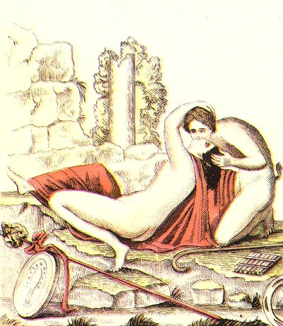

  
[Intangible Textual Heritage](../../index.md)  [Sacred
Sexuality](../index)  [Classics](../../cla/index)  [Index](index.md) 
[Previous](rmn32)  [Next](rmn34.md) 

------------------------------------------------------------------------

 

   
Plate XXXII.

 

p. 66

# The Faun's Kiss.

FRESCO FROM HERCULANEUM.

Height, 18 2/25 inches; breadth, 21 10/25 inches.

PLATE XXXII.

THE objects of art discovered in the excavations of Herculaneum are, as
a rule, far superior in execution to those found at Pompeii. The
delightful painting, reproduced faithfully in our plate, has already
been given, but very imperfectly, by the academicians of Naples, by
David, in the work of Sylvan Maréchal, and by Piroli.

What a mingled expression of daring and desire is there in the Faun, who
has rushed unawares upon a Bacchant imprudently traversing a solitary
and secret place. He has flung her down; his mouth has met that of the
nymph, and his hand is stealing over her voluptuous bosom. The beautiful
Bacchant, however, far from showing anger at this excess of boldness,
displays in every movement of her body a burning intoxication, an
impatient lust which chides his delay, and summons him to proceed to
closer endearments.

At the feet of the two lovers we may see the pastoral crook (*pedum*),
the seven-reeded flute [1](#fn_39) (*syrinx*.md),
the rattle-drum (*tympanum*) on which is Painted a cistrum, the thyrsus,
and a cercle sans fond.

p. 67

The colouring of this fresco is as brilliant as the design is graceful.
The flesh-tint of the two wrestlers differs in, tone just as they differ
in sex. Cinnabar has been lavished on the Bacchant's mantle and on the
riband of her thyrsus. We recognise in her a nymph of coquettish
manners; and the artist has taken care to omit no detail to make us envy
the young Faun's good fortune as we look upon her.

The celebrated Canova has imitated this very graceful group in one of
his charming compositions.

------------------------------------------------------------------------

### Footnotes

[66:1](rmn33.htm#fr_39.md) The present example has
eight; but this was probably an oversight of the painter, to whom we are
indebted for this delicious fresco.

------------------------------------------------------------------------

[Next: Plate XXXIII: A Satyr and a Bacchante](rmn34.md)
