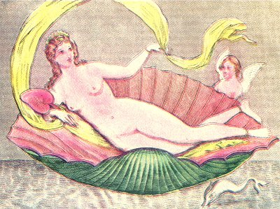

  
[Intangible Textual Heritage](../../index.md)  [Sacred
Sexuality](../index)  [Classics](../../cla/index)  [Index](index.md) 
[Previous](rmn34)  [Next](rmn36.md) 

------------------------------------------------------------------------

 

   
Plate XXXIV.

 

p. 69

# Venus on her Shell Conch

PLATE XXXIV.

THIS graceful painting would not have dishonoured the pencil of Titian.
The Queen of Love is reclining on a sea-shell; Cupid and a dolphin are
her attendants. A pure and limpid stream cradles her softly on its
surface, and her scarf, swollen by the breath of the zephyrs, serves as
a sail for the frail bark.

The form of the goddess is equally noble and voluptuous; her beautiful
hair, surmounted by an elegant diadem, falls in wavy curls over her
alabaster shoulders.

We feel that such beauty cannot be the portion of any mortal. She wears
bracelets on her arms and feet; in her right hand we observe a leaf of
lily. Roman ladies made use of the leaf of the lily (*nymphæ*) after the
manner of a fan.

The dolphin was consecrated to Venus. Several mythologists have
erroneously represented this as a fabulous fish. There is nothing
fabulous about it except the form that painters attribute to it. It has
been said that this fish was consecrated to Venus on account of her
penchant for young girls, and this ridiculous explanation has been
seriously reproduced by the academicians of Herculaneum and by Sylvain
Maréchal, following them. The dolphin generally swims on the surface of
the waters; we have ourselves

p. 70

seen numerous troops of them at the entrance of the gulf of Naples,
between the island of Capri and Cape Misena. Its movements resemble
those of a little boat, which rises and falls again with the wave that
carries it.

This charming fresco was found at Gragnano in 1762. It served as the
perspective to a small garden.

------------------------------------------------------------------------

[Next: Plate XXXV: Spinthria](rmn36.md)
