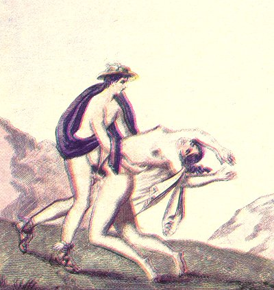

  
[Intangible Textual Heritage](../../index.md)  [Sacred
Sexuality](../index)  [Classics](../../cla/index)  [Index](index.md) 
[Previous](rmn36)  [Next](rmn38.md) 

------------------------------------------------------------------------

 

   
Plate XXXVI.

 

p. 74

# Mercury and Yphtima.

FRESCO FROM POMPEII.

PLATE XXXVI.

YPHTIMA, the nymph, had offended the gods; Mercury, being commissioned
to conduct her to Hades, led her to a solitary place and ravished her.
Such appears to be the subject of this painting. The drawing is
incorrect and in bad taste, while the exaggerated positions are quite
devoid of probability.

From this union of Mercury and Yphtima arose the satyrs.

At Cyllene, in Elidia, there was a temple where Mercury was worshipped.
The god was represented there in a most indecent posture, symbolical of
fecundity. Wit and eloquence were the attributes of Mercury, and it was
natural that the ancients should revere in him those powerful
auxiliaries of seduction and pleasure. [1](#fn_42.md)

------------------------------------------------------------------------

### Footnotes

[74:1](rmn37.htm#fr_42.md) PAUSANIAS.

------------------------------------------------------------------------

[Next: Plate XXXVII: An Erotic Scene](rmn38.md)
