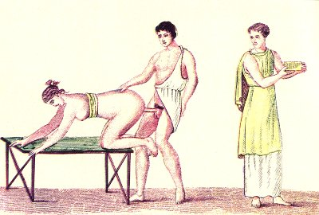

  
[Intangible Textual Heritage](../../index)  [Sacred
Sexuality](../index)  [Classics](../../cla/index)  [Index](index) 
[Previous](rmn39)  [Next](rmn41) 

------------------------------------------------------------------------

 

   
Plate XXXIX.

 

p. 80

# Spinthria

FRESCO FROM POMPEII.

PLATE XXXIX.

THIS erotic painting undoubtedly represents a bridal night. The young
bride still wears her virgin's zone, and, according to the custom of the
period, the husband will have to remove it after the consummation of the
first sacrifice. The cubicular slave, who may be perceived in the,
distance, carries a casket of essences and perfumes. The two young
people have chosen the attitude they deemed most suitable to facilitate
the accomplishment of the act to which they are proceeding, *more
ferarum*. Finally, the words lente inpelle, which may be read at the
bottom of the picture, further demonstrate that the actress in this
scene is a young woman who has pardon for her inexperience. "Push
gently, spare me!" delightful words you will not long resound in the
ears of the conqueror! The proud rider will soon require the spur.

The position adopted by our two personages is often enough found graven
stones and Etruscan vases, which is not at all surprising, for it seems:

to us that Voltaire made a doubly bad joke when he put into the mouth of
Dorothea the singular reproach which she addresses to Joan of Arc

"But I avow I can't conceive  
How one goes through the preparation  
Needed in such a situation."

 

p. 81

This attitude seems dictated by nature itself, and it is certain that in
the beginning of societies men who desired to have intercourse with
their wives, not having the means of throwing them down on a bed of down
at the end of a mysterious alcove, would not have dreamt of stretching
them on stones. The attitude which the quadrupeds taught them must have
seemed the most commodious and natural.

Plutarch says: "It is thus known that the Delphians are not wanting in
what they call *Venus-Harma*, that is to say, the yoked chariot, nor
Homer, when he calls such a conjunction φιλὸτης, which is to say,
friendship," &c.

For the rest, the conformation and position of the organs of generation
in both sexes sufficiently point out that the work may be accomplished
in this way with the best advantage to the reproduction of the human
species. Let us hear what Lucretius says on this subject:--

"The sage who views minute  
Herds, and the savage tribes by nature led,  
Holds that the virtuous matron chief conceives,  
When, with subsiding chest and loins erect,  
Her dulcet charms she offers, fittest then  
The luscious tide to absorb; for nought avail  
Exerted motions, the perpetual heave  
Of frame high-strain'd and ever-labouring lungs.  
These, rather, urged beneath the tender fray,  
All fruit prohibit; since the genial share  
Oft turn they from the furrow as it holds  
Its course direct, and break the impinging shock.' [1](#fn_43)

This fresco has been recently discovered. The drawing is not very
correct: it may especially be remarked that the arms of the principal
actor are out of all proportion to the other parts of his body.

------------------------------------------------------------------------

### Footnotes

[81:1](rmn40.htm#fr_43) DE RERUM NATURA, iv.
*Dr. Mason Good's Translation*.

------------------------------------------------------------------------

[Next: Plate XL: An Hermaphrodite](rmn41)
