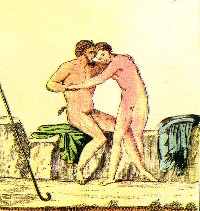

  
[Intangible Textual Heritage](../../index.md)  [Sacred
Sexuality](../index)  [Classics](../../cla/index)  [Index](index.md) 
[Previous](rmn41)  [Next](rmn43.md) 

------------------------------------------------------------------------

 

   
Plate XLI.

 

p. 83

# An Hermaphrodite and Faun.

PAINTING FOUND AT RESINA.

Height, 18 2/25 inches. Width, 12 22/25 inches.

PLATE XLI.

THIS charming fresco, excellent in colour and of very remarkable purity
of drawing, represents one of those bearded fauns called Sileni, who is
trying to do violence to a young hermaphrodite. The place is solitary
and rocky; near the Silenus we observe the bent crook, or *pedum*. The
two actors are entirely naked.

This painting is evidently allegorical. The old Silenus, seated on a
rock, and seeking to enjoy a being who unites in himself the two senses,
is the emblem of those old men, given up to debauchery, who endeavour to
reanimate their deadened passions by excess and variety of enjoyment.

The taste of some old men for both sexes is a consequence of the
impotency of their resources; they would fain rekindle, by the
refinement and monstrosity of their pleasures, a spark of the sacred
fire which animates Youth. Such, we think, was the idea which guided the
capricious pencil of the author of this fresco.

------------------------------------------------------------------------

[Next: Plate XLII: A Satyr and Hermaphrodite](rmn43.md)
