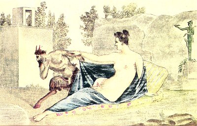

  
[Intangible Textual Heritage](../../index)  [Sacred
Sexuality](../index)  [Classics](../../cla/index)  [Index](index) 
[Previous](rmn42)  [Next](rmn44) 

------------------------------------------------------------------------

 

   
Plate XLII.

 

p. 84

# A Satyr and Hermaphrodite.

FRESCO FROM POMPEII.

PLATE XLII.

A SATYR has surprised a nymph asleep in a solitary place. He prepares to
violate her, and already having lifted up the veil that envelops her, he
casts a profane look on her most secret charms; but imagine his
confusion on perceiving that he has accosted a hermaphrodite! Full of
shame and vexation, he seeks to fly; but the hermaphrodite, whose sleep
was doubtless only a feint, tries to hold him, and seems himself to
promise him pleasures of which he had not dreamt.

In order that nothing may be wanting to complete the obscenity of this
painting, we observe in the background a Hermes, crowned with the
petasus, bearing in one hand the *pedum*, or pastoral crook, and in the
other the drinking-vessel, in the shape of a horn, called κρατὴρ.

As we have already remarked, these Hermes, with gigantic phalluses, were
placed at the entrance of gardens to keep away robbers and sorcerers.
They generally bore an inscription the idea of which was as pleasant as
the expression was unseemly. We will quote two, taken at random from the
collection entitled *Priapeia*:

Fœmina si furtum faciet mihi virque puerque,  
Hæc cunnum, caput hic, præbeat ille nates.

Pr. Carm., xxi.

p. 85

Quod sim ligneus, ut vides, Priapus,  
Et falx lignea, ligneusque penis:  
Prendam te tamen et tenebo prensam:  
Totamque hanc sine fraude, quantacumque est,  
Tormento, citharaque tensiorem,  
Ad costam tibi septimam recondam.

Pr. Carm., cv.

This fresco is not without merit, and the outlines are soft and well
drawn, the poses agreeable, and the figures rich in expression; but the
Satyr is evidently too short, and the painter has misunderstood the laws
of perspective. The contact of the two persons who form both foreground
and background makes this disparity still more noticeable.

The hermaphrodite is reclining on a leopard's skin; his mantle is of a
beautiful sky-blue colour, and behind him may be perceived an elegant
cushion. The colouring of this fresco is truly wonderful considering its
great age.

------------------------------------------------------------------------

[Next: Plate XLIII: A Faun and Bacchante](rmn44)
