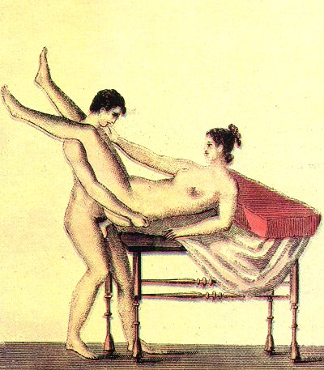

  
[Intangible Textual Heritage](../../index)  [Sacred
Sexuality](../index)  [Classics](../../cla/index)  [Index](index) 
[Previous](rmn45)  [Next](rmn47) 

------------------------------------------------------------------------

 

   
Plate XLV.

 

p. 88

# Spinthria.

FOUND AT POMPEII.

PLATE XLV.

HERE again we have an obscene painting, which recalls to mind a species
of libertinism much in vogue at Rome in the reigns of the Emperors. The
most undeniable antiquities, the authorities most worthy of belief, all
concur in demonstrating to us that unnatural enjoyment was tolerated at
this period by Roman manners, just as it had been before by Greek
manners. We have already said that Virgil, Martial, Persius, Juvenal,
Petronius, and other writers, who were read everywhere, and whose
productions were admired publicly, celebrated these extravagant unions.

However clumsy and inexpert we may suppose the painter to be to whom we
owe the fresco opposite, we cannot doubt that his intention was to
represent a lover obtaining from his mistress the favours to which Sodom
has attached an immortal name. To convince ourselves of this, it
suffices to examine how far the young athlete has lifted his obliging
companion on his shoulders. They are both naked, appear young and
beautiful, and are reclining on a bed of gilded bronze.

Although this shameful weakness arose in southern climates, where

p. 89

public manners still secretly tolerate it, unnatural enjoyment is
certainly far from being unknown in more northern latitudes, but there
it is the object of more direct punishment. In England, when the act has
been committed with a person of the male sex, it is punished with
death:--a barbarous law which is all the more to be deplored, because it
really tends to palliate the offender's guilt, bringing down on him as
it does the public commiseration by reason of the exaggerated
punishment. We must not allow the horror which a bad action inspires in
us to drive us to vengeance which inspires equal horror in others. In
the same country seduction and adultery art visited with a much lighter
punishment; and we conceive this to be a gross absurdity. For, in the
first case, that in which the pain of death is carried out, society
receives a far less injury, since it affects only the accomplices of it,
and cannot have results which fall to the public charge. Nor is it a
case for stretching to their extreme latitude the protection which the
law owes to the weak against the strong; as the force of resistance may
generally, both morally and physically, be adequately proportioned to
the force of attack.

Man is not born essentially perverse; he enters into society good by
nature; but bad laws create bad morals. Every time the weight of
punishment surpasses the enormity of the crime committed, the law falls
into disrespect, and consequently into desuetude; and thus people draw
the conclusion that the offence formerly condemned has become lawful. At
Rome, a law of the Twelve Tables authorized the husband to destroy his
wife when the latter was convicted of having drunk wine or committed
adultery. The very identity of punishment for two actions so widely
dissimilar and different in degrees of turpitude was itself a
monstrosity. The legislator, indeed, conceived that, as wine deprives
the person using it of the use of reason, it might lead to the most
guilty excesses; but, according to this principle, justice would have
required that the use of the

p. 90

beverage should be prohibited equally to both sexes. It is no argument
to say that men have stronger heads and more solid reason, for in the
very countries where wine is accessible to everybody, for one woman, ten
men may be seen in a state of drunkenness. The law we have alluded to
soon fell into desuetude, as might have been foreseen; husbands allowed
their wives the use of wine; and as for adultery, it acquired the
freedom of the city at Rome, in spite of the law; so that even the good
Cato thought it no dishonour and no extraordinary thing to lend his wife
to one of his friends. Ovid addressed a copy of verses to the husband of
one of his mistresses, begging him to be a little more jealous in
future, as his indifference on this matter deprived the poet of that
sense of fear and danger which add so much sweetness to love.

As we have already said, Roman manners authorized the kind of
libertinism which appears to be represented on our plate:

"What would you do?" said I, "do you forget that I am a young woman, and
not a boy?"

"You have the courage, then," he replied, "to refuse us the favour never
denied us yet by any of the women of Rome, most illustrious for their
wit and beauty, you who are not less beautiful and witty than the best!"

"But I have a horror of the action," I rejoined, "which I cannot get rid
of; you are going to engage in a warfare with me to which I am quite
unaccustomed."

"It will not be your death," he said, laughingly. "Much younger women
than you have made themselves famous among us by putting their body to a
similar use. The loss of your virginity formerly cost you very
dear." [1](#fn_44)

------------------------------------------------------------------------

### Footnotes

[90:1](rmn46.htm#fr_44) JOANNIS MEURSII.
*Elegantia Latini Sermonis*.

------------------------------------------------------------------------

[Next: Plate XLVI: Spinthria](rmn47)
