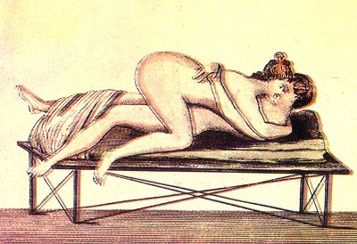

  
[Intangible Textual Heritage](../../index.md)  [Sacred
Sexuality](../index)  [Classics](../../cla/index)  [Index](index.md) 
[Previous](rmn46)  [Next](rmn48.md) 

------------------------------------------------------------------------

 

   
Plate XLVI.

 

p. 91

# Spinthria.

FRESCO FROM POMPEII.

PLATE XLVI.

IT must be admitted, this highly obscene painting would not be unworthy
of the infamous collections of Aretine. None of the supposed refinements
of pleasure were unknown to the ancients. Here, for instance, may be
seen two amorous athletes who have changed places in the combat of
Venus. Their youth seems emasculated, as it requires a new spur. The sex
whom nature has destined to make the attack, and for whom she reserves
the conqueror's crown, submits on this occasion to pass for vanquished.
The youth is reclining languidly on a heavy mattress, and submits to the
whole weight of a feeble woman, who is stript both of her vestments and
of the still less transparent veil of modesty.

Of all the extravagances to which the delirium of a lustful imagination
may lead, there could perhaps hardly be any less excusable in the two
accomplices. For the man misconceives the nobleness of his character and
the dignity of his nature, and the woman forgets that, of all her
attractions, there is none more seductive than that amiable weakness
which allows her to succumb while still resisting.

p. 92

This painting was discovered not very long ago, at Pompeii. The drawing,
as in most of the other *Spinthriæ*, is not very correct. The bed is
formed of a sort of table, the four legs of which seem to be fixed by
the help of cords crossing and recrossing each other.

------------------------------------------------------------------------

[Next: Plate XLVII: Spinthria](rmn48.md)
