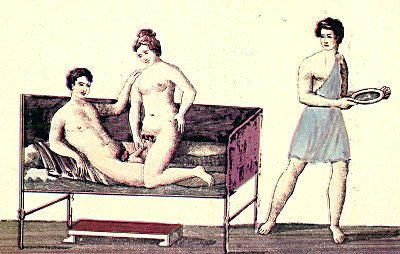

  
[Intangible Textual Heritage](../../index.md)  [Sacred
Sexuality](../index)  [Classics](../../cla/index)  [Index](index.md) 
[Previous](rmn47)  [Next](rmn49.md) 

------------------------------------------------------------------------

 

   
Plate XLVII.

 

p. 93

# Spinthria

FRESCO FROM POMPEII.

PLATE XLVII.

THIS painting is almost a repetition of the preceding one. A young girl,
seated astride over her lover, is again playing the chief part. The
cubicular slave, on the point of withdrawing from the mysterious
chamber, turns round and casts a lascivious look on the two lovers. He
bears a dish, upon which nothing is seen, and which probably contained
the aphrodisiac aliments of which the two actors have made use.

The bed, simple in form, appears to be of bronze. There are several
similar ones in the museum of Naples. They were found at Herculaneum and
Pompeii.

Under the bed may be observed a stool.

------------------------------------------------------------------------

[Next: Plate XLVIII: Spinthria](rmn49.md)
