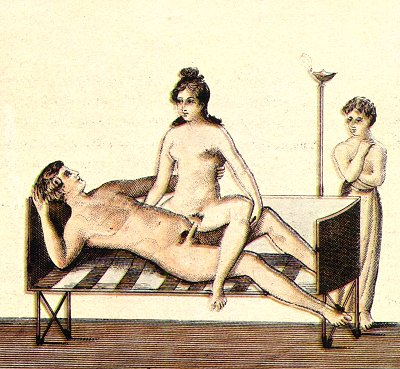

  
[Intangible Textual Heritage](../../index.md)  [Sacred
Sexuality](../index)  [Classics](../../cla/index)  [Index](index.md) 
[Previous](rmn48)  [Next](rmn50.md) 

------------------------------------------------------------------------

 

   
Plate XLVIII.

 

p. 94

# Spinthria.

FRESCO FROM POMPEII.

PLATE XLVIII.

A YOUNG and beautiful married couple are amorously toying on a small
bed. A lighted lamp shows that the scene takes place at night-time. As
in the previous picture, the young man is carelessly stretched on his
back, while his obliging companion, seated astraddle over him, is left
to perform the principal part. In the background may be seen the
cubicular slave, who is attentively watching the voluptuous pastime, and
seems to be even looking on it with a lustful eye--

Masturbabantur phrygii post ostia servi,  
Hectoreo quoties sederat uxor equo.

A circumstance which recalls the lines of Martial, already quoted.

This fresco is not without merit as regards its execution. The woman
appears strong and well-formed; her fair hair falls over her shoulders
in wavy curls. The man is beardless, but his stature is tall, and
everything about him denotes a youth full of vigour and fire.

The bed, a very inconvenient one for such sports, is formed of a
variegated cloth, of which the elasticity is not sufficiently seen. The
curved head-board would indicate rather a kind of canopy than a bed. The
whole

p. 95

is supported by four legs, too slender to resist long if they were not
made of iron, a custom which has been perpetuated down to our own day in
the south of Italy. It is, nevertheless, possible that this piece of
furniture, so simple in appearance, was composed of a substance more
precious than gold, for at the period of the decline, to which this
painting belongs, luxury was carried to such a degree among the Romans,
that it surpassed even the most marvellous stories of Eastern poets.

The Roman ladies attached great value to fair hair, though Nature had
given them such beautiful black hair. It was indeed their habitual
custom to have their heads shaved, and to cover them with light hair,
which the young girls of Germany or Gaul sold them at fabulously high
prices, Cosmetics of every kind were scattered over their toilet-tables;
and we learn that Poppea, the wife of Nero, invented a pomade which
received the name of *poppeanum*.

The same Poppea took baths of asses' milk to preserve her complexion;
and Pliny informs us that she had five hundred asses milked daily for
this purpose.

Every part of the known world at that time contributed to subserve the
reckless and mad luxury of the Romans. India sent them fine pearl
necklaces, valued at several millions of *sistertii*; [1](#fn_45.md) Arabia, her sweetest perfumes; Alexandria,
Tyre, and Asia Minor, precious stuffs worked with gold and silk; Sidon,
its metal or glass mirrors. Other countries sent to Rome purple, gold,
silver, bronze, all the productions both of art and nature, the choicest
wines, and the rarest animals. [2](#fn_46.md) Under
the later Scipio, men of high authority at Rome were seen wasting their
substance with favourites, others with courtezans, or in concerts and
costly feasts, having contracted,

p. 96

during the Persian war, the Greek tastes; and this disorder grew into a
madness among the youths. [1](#fn_47.md)

M. Roux-Ferrand, collecting his materials from Martial, Pliny,
Petronius, Seneca, Horace, Vitruvius, &c., has given, in his excellent
work on the Progress of Civilization, a very fine description of those
sumptuous repasts at which Roman luxury displayed all its pomp. We quote
the following passage:--

"Bronze lamps, supported by candelabra, shed forth a glowing light the
table, made of citrus-wood more precious than gold, rests on legs of
ivory; it is covered with a surface of massive silver, of five hundred
pounds weight, adorned with sculptures and designs. The tricliniar beds
are of bronze, enriched with ornaments of pure gold and tortoise-shell;
the woollen [mattresses](errata.htm#3.md) of the Gauls are stained with
purple, and the costly cushions are covered with woven and
silk-broidered [coverlets](errata.htm#4.md), wrought at Babylon, and
costing as much as four millions of sestertii (that is, about 630,000).
The pavement, of mosaic, represents remnants of repasts, as if they had
fallen naturally to the ground. The triclinium would hold a table with
sixty couches; it was only intended for the summer, every season having
its special utensils and slaves.

While awaiting the arrival of the master of the house, some young girls
come in singing, and sprinkle on the pavement sawdust dyed in saffron
and mixed with a brilliant powder. The table-cloth is a kind of
incombustible flax, which is whitened by throwing it in the fire.

Young cup-bearers, natives of Asia, pour out all around perfumed wines
cooled in snow; the cups are of gold, set with precious stones. During
the repast, the guests, in order to refresh themselves, change their
robes, and young girls, half-recumbent at their feet, beat the air and
drive away the flies with fans of peacock's feathers, &c."

------------------------------------------------------------------------

### Footnotes

[95:1](rmn49.htm#fr_45.md) About six sistertii
would make an English shilling.

[95:2](rmn49.htm#fr_46.md) Mazois, Bœttiger,
Meiners (quoting Livy), &c, &c.

[96:1](rmn49.htm#fr_47.md) POLYBIUS, ROUX-FERRAND,
*History of the Progress of Civilization*.

------------------------------------------------------------------------

[Next: Plate XLIX: Apollo and a Nymph](rmn50.md)
