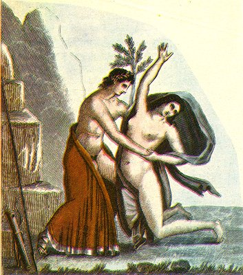

  
[Intangible Textual Heritage](../../index)  [Sacred
Sexuality](../index)  [Classics](../../cla/index)  [Index](index) 
[Previous](rmn49)  [Next](rmn51) 

------------------------------------------------------------------------

 

   
Plate XLIX.

 

p. 97

# Apollo and a Nymph

FRESCO FROM POMPEII.

PLATE XLIX.

IT is easy to recognise Apollo in the principal personage of this
painting; but it would be difficult to assign a name to the young woman
whom he is preparing to enjoy. It cannot be Daphne, for the god already
wears a crown of laurel. Moreover, the mythologists have attributed to
him such a number of mistresses, that it is impossible to ascertain
whether the painter intended here to represent Coron is the mother of
Æsculapius, Clymenes the daughter of the Ocean and the mother of
Phaethon, Clytie, Leucothea, or some other.

Near Apollo we perceive a bow and arrows with a javelin: the scene is
laid in a desert place.

The drawing of this fresco is, on the whole, bad; the limbs of the god's
fair companion are perfectly gigantic, and the faces also are utterly
devoid of expression. Nevertheless, the brightness of the colouring
constitutes it one of the most remarkable paintings recently discovered
at Pompeii.

------------------------------------------------------------------------

[Next: Plate L: Aeneas and Dido](rmn51)
