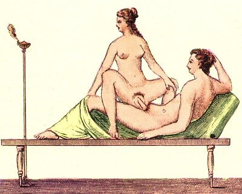

  
[Intangible Textual Heritage](../../index)  [Sacred
Sexuality](../index)  [Classics](../../cla/index)  [Index](index) 
[Previous](rmn51)  [Next](rmn53) 

------------------------------------------------------------------------

 

   
Plate LI.

 

p. 100

# Spinthria.

FRESCO FROM POMPEII.

PLATE LI.

ON a bed, of a shape equally simple and elegant, two young lovers are
abandoning themselves to an amorous combat. The lamp which is flickering
near them sufficiently shows that the painter has rashly betrayed one of
those mysteries that have so much charm in the shades of night. When the
importunate troop of cares that vex the day begin to rest, pleasure
awakes, and the pale glimmer of a lamp often lights up scenes of
happiness and intoxication in the alcove of an unfortunate man.

In this painting, of which the style is tolerably good, it may be
remarked that both the actors are turning their heads in the same
direction, and it is easy to perceive in their looks an expression of
surprise and fear: it may be guessed that an untimely witness is
approaching to interrupt them. [1](#fn_50) This
circumstance recalls to mind the lines in which Horace paints, the
happiness and tranquillity he enjoyed in the country:--

p. 101

"No terrors rise to interrupt my joys,  
No jealous husband, nor the fearful noise  
Of bursting doors, nor the loud hideous yelling  
Of barking dogs, that shakes the matron's dwelling.  
When the pale wanton leaps from off her bed,  
The conscious chamber-maid screams out her dread  
Of horrid tortures; loudly cries the wife,  
'My jointure's lost!'--I tremble for my life  
Unbutton'd, without shoes, I speed away,  
Lest in my person, purse, or fame, I pay,"

Horace, *Sat*., Bk. I, § 2 (transl. of the Rev. Philip Francis).

If the woman whom we see on this fresco is, in accordance with the
painter's idea, a courtezan, we must not be surprised at the expression
of fear which she manifests; for, then as now, these unfortunate women
were not only subjected to the most rigorous scrutiny in their own
houses, but were also a butt for the coarsest pleasantries of the young
libertines who scoured the streets during the night, or went in the
daytime to the temple of Venus, to amuse themselves at the expense of
the courtezans, by smearing with soot the faces of those who did not
please them. It is this custom to which Adelphasia alludes in the
*Carthaginian* of Plautus:--

"I could wish, sister, you were less foolish: do you flatter yourself
you are beautiful because your face has not been smeared with soot?"

The Romans made a distinction between courtezans (*lenæ*) and
prostitutes (*meretrices*). The former made it a rule not to lie with
any married man, and to remain faithful to the one who kept them as long
as the agreement stipulated between them lasted; and it is to be noted
that, for the most part, this agreement was a written one. The law
interposed in these kinds of contracts, and severely punished any
courtezan who had concluded the same bargain with two lovers.

p. 102

"Contrary to the decree of the law, you have received money from
several." [1](#fn_51)

"Diabolus, the son of Glaucus, has given in free gift to Cleeretes
twenty mines of silver, in order that Philenia \[his daughter, a
courtezan\] may pass with him. and with no one else soever, her days and
nights during this year." [2](#fn_52)

The courtezans only traded in their charms during the night, while the
prostitutes remained at their doors, both day and night, to attract
passers-by.

Both courtezans and prostitutes were compelled to have their names
scribed by the ædiles; they could only belong to the class of freed men,
or to that of women free by birth who were neither the widows,
daughters, or granddaughters of Roman knights. Their dress differed from
at of Roman ladies; they were clad in a short tunic, and a toga nearly
similar to that of the male sex. They were not allowed to wear either
gold or precious stones in public; and when they desired to deck
themselves, one of their slaves carried their ornaments to the place
they were going to, where they put them on and took them off before
leaving. They mostly chose for themselves patrons or patronesses on whom
they entirely depended. Those who belonged to slave-dealers paid a part
of their earnings to their master, who kept a register, which he
submitted to the inspection of the ædiles. Caligula was the first to
impose the payment of a tax on them.

The courtezans, kept in this state of bondage through the influence of
the Roman ladies, who did not blush at being jealous of them, took a
brilliant revenge during the reign of the infamous Heliogabalus. This
mad youth as even bold enough to enrol himself among them, and the
example found numerous imitators of both sexes. [3](#fn_53)

------------------------------------------------------------------------

### Footnotes

[100:1](rmn52.htm#fr_50) Fausta, the infamous
sister of the famous Lucullus, had espoused Milo, whom the murder of
Clodius and the speech of Cicero have rendered celebrated. Sallust, the
historian, was the lover, or rather one of the lovers, of this woman.
Milo, having surprised them in the very act, had a hundred stripes
administered to Sallust, and did not let him till he had extracted from
him a large sum of money.

[102:1](rmn52.htm#fr_51) *Truculentus*, Act iv.
sc. 2.

[102:2](rmn52.htm#fr_52) PLAUTUS, Asinarius, Act
iv. sc. 1.

[102:3](rmn52.htm#fr_53) SUETONIUS, *passim*,
PETRONIUS, cap. xl. TACITUS, *Annal*. TURNEL, *Advers*., p. 103 xvi. 19. C. LAURENT, *de Adult. et Meret*.
cap. ii. BRISSON, *Antiq. celest*. FERRAR, *de Re Vestiar*, lib. I.,
cap. iii. and xxiii. J. B. LEVEE and l'abbe LEMOUNJER, *Notes Arch. sur
le Theatre des Latins*, &c.

------------------------------------------------------------------------

[Next: Plate LII: Spinthria](rmn53)
