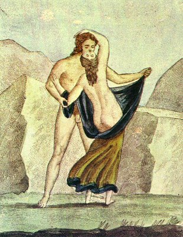

  
[Intangible Textual Heritage](../../index.md)  [Sacred
Sexuality](../index)  [Classics](../../cla/index)  [Index](index.md) 
[Previous](rmn53)  [Next](rmn55.md) 

------------------------------------------------------------------------

 

   
Plate LIII.

 

p. 105

# Spinthria

FRESCO FROM POMPEII.

PLATE LIII.

THE subject of this fresco is as ridiculous as the drawing is incorrect.
How could a man, whom it is not possible to confound with a rural
divinity, be thus in the open fields, in a complete state of nudity? or
would he have dreamt, in such a place, of putting his mistress in the
state, by removing her single garment? In this painting probability
receives too great a shock, added to which the woman is twisting her
neck in a horrible fashion to receive her lover's kisses.

These kind of obscene paintings (*Spinthriæ*) are frequently referred to
by Latin authors. Here are two examples taken at random:--

The hand that first in naked colours traced  
Groups of loose lovers on walls that once were chaste  
And full exposed, broad burning on the light  
The shapes and postures that abash the sight  
Made artless minds in crime's refinements wise,  
And flash'd enlightening vice on virgin eyes." [1](#fn_55.md)

"Looking up at a certain painting, in which was represented how Jove was
said once to have sent a golden shower into the bosom of Danae." [2](#fn_56.md)

------------------------------------------------------------------------

### Footnotes

[105:1](rmn54.htm#fr_55.md) PROPERTIUS, *Elegies*,
Book i. 6 (translated by Elton).

[105:2](rmn54.htm#fr_56.md) TERENCE, The Eunuch,
act iii., sc. 5.

------------------------------------------------------------------------

[Next: Plate LIV: Group of Animals](rmn55.md)
