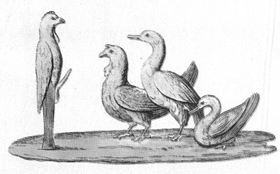

  
[Intangible Textual Heritage](../../index)  [Sacred
Sexuality](../index)  [Classics](../../cla/index)  [Index](index) 
[Previous](rmn54)  [Next](rmn56) 

------------------------------------------------------------------------

 

   
Plate LIV.

 

p. 106

# Group of Animals.

MOSAIC.

PLATE LIV.

A PRIAPUS-HERMES, in the form of a cock, is receiving the worship of
three birds--a turkey-cock, a goose, and a duck.

The artist's idea is not difficult to understand; it proceeds from the
principle that everything in nature does homage to the generative power,
animals as well as men, plants as well as animals.

The use of mosaics is too ancient to admit of our fixing its origin. The
most received opinion is that it was transmitted to the Romans by the
Greeks, who themselves received it from the Persians; but it was a long
time making its way, for it was not until about the reign of Augustus
that it became the fashion at Rome and began to spread in Italy. It soon
became popular; every proprietor was desirous of having in his villa a
saloon paved with mosaic; and it quickly passed from the saloon to the
dining-room, and from the country to the town, till at last nothing was
seen in the inside of the houses but mosaic pavement. It was introduced
everywhere, into public buildings, and especially into temples. The
Christians themselves adopted the use of it, and Italy possesses several
churches in which fine work of this class is to be found. Thus, there
may still be seen

p. 107

at Naples, in the cathedral itself, the chapel of St.. Restituta, built,
it is said, by Constantine the Great, entirely wainscoated with mosaic.
The little town of Mont Real, near Palermo, also possesses some
remarkable workmanship of this kind. The cathedral, a superb structure
erected by Duke Rogero, is paved with mosaic representing gigantic heads
of God the Father, Jesus Christ, the Virgin, the Saints, as well as
subjects taken from the Holy Scriptures. It may be remarked in passing
that in this same cathedral of Mont Real repose the remains of Saint
Louis, King of France. They were placed there by Charles of Anjou, on
the return of that unhappy Crusade, when the flower of the French army
perished under the walls of Tunis.

We have purposely mentioned the mosaics of the chapel of Saint Restituta
and the cathedral of Mont Real, because they are less known, though
quite as remarkable as those at Rome and the other principal cities of
Italy.

Antiquaries have not settled the entomology of the word mosaic. Some
derive it from μοῦσον, polished, it being a kind of work much laboured
and polished; others make it come from μοῦσα (muse), because it is a
work worthy of the Muses or inspired by them; and lastly, there are some
who suppose the origin of the word to be *musivum*, a delicate,
ingenious work.

Mosaics were used, among the Romans, either to cover floors and the
partitions of apartments or temples, or else to form pictures, furniture
ornaments, or jewels.

At first the art simply consisted in fashioning little stones into cubic
form, and arranging them on a surface of adhesive matter, while so
cö-ordinating the diverse colours as to form some design of arabesques,
fruit, flowers, or any other object.

One instance will suffice to give an idea of the immense profusion of

p. 108

work of this sort among the Romans. It is well known that the sea-coast
between Pozzoli, the ancient *Puteolanum*, and Mycene was formerly
covered with superb dwellings, where the contemporaries of Cicero came
to rest from town labours. These pompous abodes are now buried under the
waters of the sea, which has recovered, on that side of the
Mediterranean, the territory lost in other directions. Every day, for
many years past, the tide washes on the shore fragments of mosaic of a
hundred blended colours; and although the fishers of the place, and
especially the children, carefully collect and sell them to strangers,
the mine that furnishes them is still so rich, that the writer of this
book collected in one day, and in the space of a single hour, more than
he could carry away.

The second species of mosaic, that of pictures, furniture, and jewels,
consisted in giving diverse forms to a quantity of precious marbles of
different colours, so as to be able, on joining them together, to form a
regular design, or else it consisted in colouring little stones or glass
beads in order to form a description of painting out of them.

Glass beads were used in the more delicate work. When the artist had
soldered them together, so combining them as to obtain an exact
representation of the model laid before him, he delicately sawed the
bundle formed by the union of the beads, and thus procured, in a single
combination, a sufficient quantity of copies exactly like each other.

The mosaic forming the subject of this explanation is of the somewhat
rare kind called *monochromes*. It is well executed and in good
preservation.

------------------------------------------------------------------------

[Next: Plate LV: Pan and Syrinx](rmn56)
