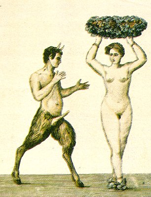

  
[Intangible Textual Heritage](../../index)  [Sacred
Sexuality](../index)  [Classics](../../cla/index)  [Index](index) 
[Previous](rmn55)  [Next](rmn57) 

------------------------------------------------------------------------

 

   
Plate LV.

 

p. 109

# Pan and Syrinx.

MOSAIC FROM THE MUSEUM OF NOJA. *Height, 13 8/25 inches*.

PLATE LV.

THIS mosaic, in which is retraced the adventure of Pan and Syrinx, is
unquestionably one of the finest pieces of the secret cabinet of the
Museum of Naples,

We have already had occasion to say that several mythographers have very
seriously called into question the reputation of chastity of the wife of
Ulysses. According to their account, Penelope accorded her favours to
every one of the numerous adorers who aspired to her hand and not
knowing to whom to give the honour of an illegitimate son of which she
was brought to bed, she named him Pan, from a Greek word, signifying
*all*; thus attributing it conjointly to, the whole amorous community.
Others suppose that Pan was the son of Penelope and Mercury. The
messenger of the gods, they say, being unable to triumph over the
chastity of the Queen of Ithaca, transformed himself into a he-goat, and
thus attained his end; that is to say; Penelope granted to the animal
what she had refused to the god. This was scarcely flattering to the
latter; but the divinities of paganism were not very delicate on this
point, and men received from them very bad examples. It is difficult
indeed, to conceive that a religion so immodest could so long have
resisted the progressive march of the philosophic

p. 110

spirits. It can only be explained by the reflection that the greater the
corruption of morals became among the heathen, the more they strove to
maintain a worship which not only excused the weakness of humanity but
which sanctified the most infamous debauchery.

From the loves of Mercury and Penelope, then, was born a child, half-man
and half-goat. This was Pan, who became the terror of the nymphs and
shepherdesses. One day this lascivious god met the lovely daughter of
the river Ladon, Syrinx, a nymph of Arcadia, and companion of Diana. She
was peaceably coming down Mount Lyceum, unwitting the fate that awaited
her; but at the approach of Pan, who manifested his desires in the most
unequivocal manner, she began to fly rapidly. Her strength, however, was
not equal to her virtue; she was nearly caught, and her defeat appeared
certain when Diana, whose aid she invoked in this grave peril, did not
abandon her, and the nymph was changed into a reed. The god, touched by
his misfortune, stopped for a long time before the well-loved plant,
whose foliage, caressed by the breeze, seemed to utter long groans. Pan,
desirous of perpetuating the recollection of this sad adventure, and of
rendering homage, at the same time, to the memory of the chaste nymph,
formed, from several pieces of the reed, a rustic flute, to which he
gave the name of Syrinx:

"Now while the lustful god, with speedy pace,  
First thought to strain her in a strict embrace,  
He fills his arms with reeds, new-rising on the place.  
And while he sighs, his ill-success to find,  
The tender canes were shaken by the wind,  
And breathed a mournful air, unheard before,  
That much surprising Pan, yet pleased him more.  
Admiring this new music, 'Thou,' he said,  
'Who canst not be the partner of my bed,  
At least shalt be the comfort of my mind: p.
111  
And often, often to my lips be join'd.'  
He form'd the reeds, proportion'd as they are,  
Unequal in their length, and wax'd with care,  
They still retain the name of his ungrateful fair. [1](#fn_57)

 

------------------------------------------------------------------------

### Footnotes

[111:1](rmn56.htm#fr_57) *Metamorphoses*, Book
I. (translated by Dryden).

------------------------------------------------------------------------

[Next: Plate LVI: Etruscan Vase](rmn57)
