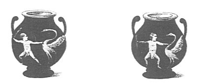

  
[Intangible Textual Heritage](../../index)  [Sacred
Sexuality](../index)  [Classics](../../cla/index)  [Index](index) 
[Previous](rmn57)  [Next](rmn59) 

------------------------------------------------------------------------

 

   
Plate LVII.

 

p. 117

# Hercules and the Stymphalic Birds.

PLATE LVII.

PAUSANIAS makes mention in his Arcadia of certain birds, which he
believes to be natives of Arabia, of the size of cranes, and the
appearance of storks. He adds that they sometimes came in large
quantities, and established themselves in Arcadia, on the shores of Lake
Stymphalus, whence they are called *Stymphalides*. Apollonius calls them
πλοϊδας, that is to say, *plungers* or *swimmers*, a circumstance which
proves that these birds, whatever fables may have been in vogue
concerning them, belong to the family of *imantopedes*. It appears that
these animals became more troublesome in the land of their adoption, and
committed great havoc there. Those who delivered the country from them
did it so great a service, that the imagination of poets seized hold of
stories which gratitude had already exaggerated. This chase against
birds, doubtless not very dangerous, became in their songs, and in the
minds of the people, one of the labours of Hercules. It is said that,
fleeing before this hero, they took shelter in an island of Pontus
Axenus, [1](#fn_59) called Aretia, from Ἄρης,
Mars, because the Amazons Otrera and Antiope had built a stone temple
there in honour of the god; thenceforth the stymphalides

p. 118

were called birds of Mars. Apollonius Rhodius speaks of them in these
terms:--

"The Mossynœcians next the country round  
Possess, with mountains and with forests crown'd.  
When these are past, an island bleak and bare  
Lies full in view, there guide your ship with care,  
And thence with care those noxious birds expel,  
Which on the desert shore unnumber'd dwell.  
Here form'd of solid stone, and seen from far,  
Stands the rough temple of the god of war.  
Two Amazonian queens, renown'd for arms,  
Had raised the fane, when stunn'd with war's alarms." [1](#fn_60)

A little further on he adds:--

"These nations past, with unremitting oar,  
They reach, Aretias, thy sea-girt shore.  
Then sunk the breezes with the closing day,  
When down the sky descending they survey  
A winged monster of enormous might,  
Which toward the ship precipitates her flight.  
Her wings she shook, and from her pinions flung  
A dart-like quill, which on Oïleus hung." [1](#fn_60)

Timagnetes, a scholiast on Apollonius, writes on this subject: "These
stymphalidian birds, whom Hercules drove away, had wings, beaks, and
claws of iron." He sometimes calls them σιδηρόπτερους (iron-winged),
sometimes σιδηρόνοχας (iron-clawed), and sometimes σιδηρόρυγχας
(iron-beaked).

Pliny says in his Natural History:--"Opposite to Pharnacea is
Chalceritis, to which the Greeks have given the name of Aria, and
consecrated it to Mars; here, they say, there were birds that used to
attack strangers with blows of their wings." [2](#fn_61)

------------------------------------------------------------------------

### Footnotes

[117:1](rmn58.htm#fr_59) *Pontus Axenus*,
inhospitable sea, afterwards, when the coast was settled by Grecian
colonies, called *Pontus Euxinus*, hospitable sea.

[118:1](rmn58.htm#fr_61) *Argonautics*, Book II.
(Fawkes's Translation).

[118:2](rmn58.htm#fr_62) Pliny's Natural
History, Book VI.. chap. 12.

------------------------------------------------------------------------

[Next: Plate LVIII: Bell-shaped Vase](rmn59)
