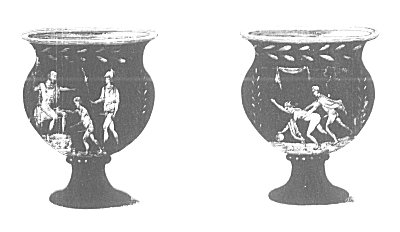

  
[Intangible Textual Heritage](../../index.md)  [Sacred
Sexuality](../index)  [Classics](../../cla/index)  [Index](index.md) 
[Previous](rmn58)  [Next](rmn60.md) 

------------------------------------------------------------------------

 

   
Plate LVIII

 

p. 119

# Bell-shaped Vase.

PLATE LVIII.

THIS vase is of the kind which the Neapolitans call *campana*, on
account of their shape, which has some resemblance to a bell.

On one side is represented a scene of the Dionysia or Bacchanalia. Three
men are taking part in them, each furnished with preposterous phalluses.
One of these personages is seated, and represents old Silenus: this is
the hierophant, the president of the festival. To the spectator's right
is a Bacchus covered with the chlamys, and with his head in a hairy
casque. Between these two divinities may be seen a little old man, who
draws near the hierophant, places one hand on his thigh, and prepares to
worship the attributes of the god.

The other side represents a Bacchic game. A young woman is stooping to
pick up the sphæra (a kind of ball) which she has dropped, but her
awkwardness is equivalent to a defeat, and her adversary approaches her
to exercise the rights of victory.

These two subjects are intermingled with foliage and with arabesques.

------------------------------------------------------------------------

[Next: Plate LIX: Bell-shaped Vase](rmn60.md)
